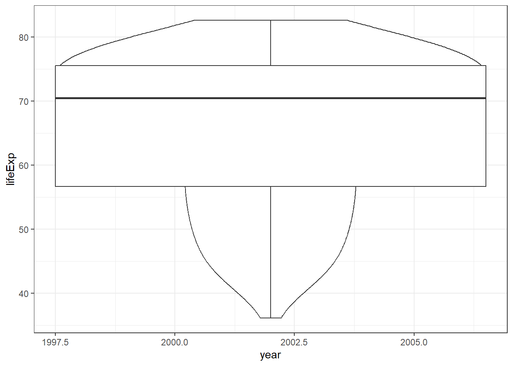

--- 
title: "Intro to Data Wrangling and Analysis Using R" # edit
#subtitle: "optional" 
author: "Emily Nordmann & Javan Carter" # edit
date: "2024-01-08"
site: bookdown::bookdown_site
documentclass: book
classoption: oneside # for PDFs
geometry: margin=1in # for PDFs
bibliography: [book.bib, packages.bib]
csl: include/apa.csl
link-citations: yes
description: | # edit
  The accompanying book for the *All of Us* Research Program Intro to R and Data Visualization course.
url: https://emilynordmann.github.io/AllOfUs-data-analysis # edit
github-repo: emilynordmann/AllOfUs-data-analysis # edit
cover-image: images/logos/logo.png # replace with your logo
apple-touch-icon: images/logos/apple-touch-icon.png # replace with your logo
apple-touch-icon-size: 180
---


# Introduction {-}

<div class="small_right"></div>

This course is designed to be completed over approximately three weeks. For the first two weeks, there are several chapters of this workbook to work through asynchronously with an accompanying walkthrough video and suggested reading list. The time it takes to work through each chapter will vary considerably depending on your previous experience with R and programming. 

For those who are still at the start of their journey with R, we estimate that each chapter may take 2-3 hours and that you will likely want or need to watch the walkthrough video in full. Those with more experience with programming will likely take less time and for you we have included links to further resources so that you can go beyond the core material provided in this course. To help your planning, please note that the chapters on data wrangling and data tidying will likely take more time than the chapters on data analysis.

In addition to the asynchronous content, there will be two live office hour sessions in Week 2 and 3. In these sessions, your instructors will answer questions about the content covered in this workbook and how to apply it to using the *All of Us* Researcher Workbench. Finally, to complete the course, there will be a 20-item multiple-choice quiz.

## Instructors

<div class="small_right"></div>

**Dr. Emily Nordmann** is a teaching-focused Senior Lecturer in the [School of Psychology and Neuroscience](https://www.gla.ac.uk/schools/psychologyneuroscience/) at the University of Glasgow. She teaches research methods, individual differences and data skills in R as well as acting as Deputy Director of Education. She is a vocal advocate of open science and open educational resources. As a member of the [PsyTeachR](https://psyteachr.github.io/) team she has authored several open-access data skills books and tutorials, and is also the Communications Chair of [EdArXiv](https://edarxiv.org/), the preprint sever for the education research community. She lives in Glasgow, Scotland with her wife Kathleen and her cat Khaleesi, who she named before the final season of Game of Thrones aired. 

<div class="small_right"></div>
     
**Dr. Javan K. Carter** is a bioinformaticist at RTI International. He researches genomic and transcriptomic data to understand genotype- phenotype correlation and genetic architecture of complex traits and diseases. Within RTI, he is the lead and co-lead informatics scientist for several projects and assists in a number of projects associated with various data types. He is also an evolutionary genomicist by training. He uses bash, JavaScript, and R as primary coding languages. He loves to teach and educate people on the wonders of computational biology and introduce people to coding for the first time!

## Progress Tracker {#progress}

This course is designed to be completed over approximately three weeks. To help you plan your time and to keep on track, we have provided a Progress Tracker checklist that details what you need to do and when you need to do it by.

* Download the Progress Tracker as a [Word document](course_materials/progress_tracker.docx)
* Download the Progress Tracker as a [PDF](course_materials/progress_tracker.pdf)

## Course Overview

This video gives an overview of the course syllabus and requirements. It is important that you watch this video before starting the course.

* Download the Course Overview [PowerPoint slides](course_materials/course_overview.pptx)

<iframe width="560" height="315" src="https://www.youtube.com/embed/UOPh8mWgqMc" title="YouTube video player" frameborder="0" allow="accelerometer; autoplay; clipboard-write; encrypted-media; gyroscope; picture-in-picture; web-share" allowfullscreen></iframe>

     

<!--chapter:end:index.Rmd-->

# Pre-requisites {#prerequisites}

## Skills

This course assumes that you are able to:

* Install and load packages
* Write code in RMarkdown by creating a new document with code chunks
* Use <code class='package'>tidyverse</code> functions to perform simple data wrangling tasks, calculate descriptive statistics, and produce data visualisations using `ggplot()`
* Recognize and use the pipe `%>%` function (although it's ok if you don't fully understand it at this point)

## Software

The course assumes that you have installed and have access to R and RStudio. Whilst you will use the *All of Us* Researcher Workbench to conduct analyses on the *All of Us* database, having access to a regular copy of R on your machine that you can use free-of-charge will be helpful for learning R. 

Installing R and RStudio is usually straightforward. The sections below explain how and [there is a helpful YouTube video here](https://www.youtube.com/watch?v=lVKMsaWju8w){target="_blank"}. If you run into difficulties (for example if you don't have admin rights to your machine), we recommend using [RStudio Cloud](https://rstudio.cloud/). RStudio Cloud has almost all of the same features as a local installation of R but runs in your browser. There are some differences with how you import and export data and manage projects between the cloud and a local installation, however, for the most part the differences are minimal. 

If you do not yet have R and RStudio installed, there are instructions below to guide you through the process.

## R and RStudio {#intro-rstudio}

R is a programming language that you will write code in and RStudio is an Integrated Development Environment (<a class='glossary' target='_blank' title='Integrated Development Environment: a program that serves as a text editor, file manager, and provides functions to help you read and write code. RStudio is an IDE for R.' href='https://psyteachr.github.io/glossary/i#ide'>IDE</a>) which makes working in  R easier. Think of it as knowing English and using a plain text editor like NotePad to write a book versus using a word processor like Microsoft Word. You could do it, but it would be much harder without things like spell-checking and formatting and you wouldn't be able to use some of the advanced features that Word has developed. In a similar way, you can use R without R Studio (sometimes referred to as "Base R") but we wouldn't recommend it. RStudio serves as a text editor, file manager, spreadsheet viewer, and more. The key thing to remember is that although you will do all of your work using RStudio for this course, you are actually using two pieces of software which means that from time-to-time, both of them may have separate updates.

## Installing Base R

[Install base R](https://cran.rstudio.com/){target="_blank"}. Choose the download link for your operating system (Linux, Mac OS X, or Windows).

If you have a Mac, install the latest release from the newest `R-x.x.x.pkg` link (or a legacy version if you have an older operating system). You may also need to install [XQuartz](http://xquartz.macosforge.org/){target="_blank"} to be able to use some visualisation packages.

If you are installing the Windows version, choose the "[base](https://cran.rstudio.com/bin/windows/base/)" subdirectory and click on the download link at the top of the page. 

If you are using Linux, choose your specific operating system and follow the installation instructions.

## Installing RStudio

Go to [rstudio.com](https://www.rstudio.com/products/rstudio/download/#download){target="_blank"} and download the RStudio Desktop (Open Source License) version for your operating system under the list titled **Installers for Supported Platforms**.

## Installing RTools

If you are using Windows, after you install R, you should also install [RTools](https://cran.rstudio.com/bin/windows/Rtools/){target="_blank"}; use the "recommended" version highlighted near the top of the list. RTools is used for installing and loading some packages. You can get started without installing RTools, but if you're having problems with installing and loading some packages, this should be the first thing you try.

RTools will require you to put it "on the PATH". The instructions for this can seem a bit vague - the easiest way to do it is to open RStudio, run the below code in the console:


```r
write('PATH="${RTOOLS40_HOME}\\usr\\bin;${PATH}"', file = "~/.Renviron", append = TRUE)
```

Once you've done that, restart R by clicking `Session - Restart R` and then run the below code in the console which should give you the path to your RTools installation:


```r
Sys.which("make")
```

```
##                               make 
## "C:\\rtools43\\usr\\bin\\make.exe"
```


## RStudio Settings {#rstudio-settings}

There are a few settings you should fix immediately after updating RStudio. Go to **`Global Options...`** under the **`Tools`** menu (&#8984;,), and in the General tab, uncheck the box that says **`Restore .RData into workspace at startup`**.  If you keep things around in your workspace, things will get messy, and unexpected things will happen. You should always start with a clear workspace. This also means that you never want to save your workspace when you exit, so set this to **`Never`**. The only thing you want to save are your scripts.

You may also want to change the appearance of your code. Different fonts and themes can sometimes help with visual difficulties or [dyslexia](https://datacarpentry.org/blog/2017/09/coding-and-dyslexia){target="_blank"}. 

<div class="figure" style="text-align: center">

<p class="caption">(\#fig:settings-general)RStudio General and Appearance settings</p>
</div>

You may also want to change the settings in the Code tab. For example, some people prefer two spaces instead of tabs for their code, or like to be able to see the <a class='glossary' target='_blank' title='Spaces, tabs and line breaks' href='https://psyteachr.github.io/glossary/w#whitespace'>whitespace</a> characters. But these are all a matter of personal preference.

<div class="figure" style="text-align: center">

<p class="caption">(\#fig:settings-code)RStudio Code settings</p>
</div>

## Installing LaTeX

You can install the LaTeX typesetting system to produce PDF reports from RStudio. Without this additional installation, you will be able to produce reports in HTML but not PDF. To generate PDF reports, you will additionally need to install <code class='package'>tinytex</code> [@R-tinytex] and run the following code:


```r
# run this in the console
install.packages("tinytex")
tinytex::install_tinytex()
```

Please note that producing PDF reports is not necessary to learn R and complete this course, so if you have trouble with this step, you can skip it and return when you are more comfortable with R (if you decide that PDF reports would be useful).

## Updating R, RStudio, and packages {#updating-r}

From time-to-time, updated versions of R, RStudio, and the packages you use (e.g., ggplot) will become available. Remember that each of these are separate, so they each have a different process and come with different considerations. We recommend updating to the latest version before you start a new project. We definitely do not recommend updating in the middle of a project or in the middle of semester and we bring this advice to you based on personal experience and pain.

## Updating RStudio

RStudio is the easiest component to update. Typically, updates to RStudio won't affect your code, instead they add in new features, like spell-check or upgrades to what RStudio can do. There's usually very little downside to updating RStudio and it's easy to do.

Click `Help - Check for updates`

<div class="figure" style="text-align: center">

<p class="caption">(\#fig:img-updaterstudio)Updating RStudio</p>
</div>

If an update is available, it will prompt you to download it and you can install it as usual.

## Updating R

Finally, you may also wish to update R itself. The key thing to be aware of is that when you update R, if you just download the latest version from the website, you will lose all your packages. 

### Windows

The easiest way to update R on Windows and not cause yourself a huge headache is to use the `installr` package. When you use the `updateR()` function, a series of dialogue boxes will appear. These should be fairly self-explanatory but there is a [full step-by-step guide available](https://www.r-statistics.com/2015/06/a-step-by-step-screenshots-tutorial-for-upgrading-r-on-windows/) for how to use `installr`, the important bit is to select "Yes" when it asked if you would like to copy your packages from the older version of R.


```r
# Install the installr package
install.packages("installr")

# Run the update function
installR::updateR()
```

### Mac

For a Mac, you can use the <code class='package'><a href='https://github.com/AndreaCirilloAC/updateR' target='_blank'>updateR</a></code> package. You'll need to install this from GitHub. You will be asked to type your system password (that you use to log into your computer) in the console pane. If relevant, it will ask you if you want to restore your packages for a new major version.


```r
# install from github
devtools::install_github("AndreaCirilloAC/updateR")

# update your R version, you will need your system password
updateR::updateR()
```

## Updating packages

Package developers will occasionally release updates to their packages. This is typically to add in new functions to the package, or to fix or amend existing functions. **Be aware that some package updates may cause your previous code to stop working**. This does not tend to happen with minor updates to packages, but occasionally with major updates, you can have serious issues if the developer has made fundamental changes to how the code works. For this reason, we recommend updating all your packages once at the beginning of each academic year (or semester) - don't do it before an assessment or deadline just in case!

To update an individual package, the easiest way is to use the `install.packages()` function, as this always installs the most recent version of the package.


```r
install.packages("tidyverse")
```

To update multiple packages, or indeed all packages, RStudio provides helpful tools. Click `Tools - Check for Package Updates`. A dialogue box will appear and you can select the packages you wish to update. Be aware that if you select all packages, this may take some time and you will be unable to use R whilst the process completes.

<div class="figure" style="text-align: center">

<p class="caption">(\#fig:img-updateall)Updating packages with RStudio</p>
</div>


## Troubleshooting {#package-install-troubleshooting}

Occasionally, you might have a few problem packages that seemingly refuse to update or install. For Emily, `rlang` and `vctrs` cause no end of trouble. These aren't packages that you will likely ever explicitly load, but they're required beneath the surface for R to do things like knit your Markdown files etc.

### Non-zero exit status

If you try to update a package and get an error message that says something like `Warning in install.packages : installation of package ‘vctrs’ had non-zero exit status` or perhaps `Error in loadNamespace(i, c(lib.loc, .libPaths()), versionCheck = vI[[i]]) :  namespace 'rlang' 0.4.9 is being loaded, but >= 0.4.10 is required` one solution we have found is to manually uninstall the package, restart R, and then install the package new, rather than trying to update an existing version. The `installr` package also has a useful function for uninstalling packages.


```r
# Load installr
library(installr)

# Uninstall the problem package
uninstall.packages("package_name")

# Then restart R using session - restart R
# Then install the package fresh

install.packages("package")
```

### Cannot open file

You may get the following error after trying to install any packages at all:

> Error in install packages : Cannot open file 'C:/.....': Permission denied

This usually indicates a permissions problem with writing to the default library (the folder that packages are kept in). Sometimes this means that you need to install R and RStudio as administrator or run it as administrator. 

One other fix may be to change the library location using the following code (check in "C:/Program Files/R" for what version you should have instead of "R-3.5.2"):


```r
# change the library path
.libPaths(c("C:/Program Files/R/R-3.5.2/library"))
```

If that works and you can install packages, set this library path permanently:

1. Install the <code class='package'>usethis</code> package
2. Run `usethis::edit_r_profile()` in the console; it will open up a blank file
3. Paste into the file (your version of): `.libPaths(c("C:/Program Files/R/R-3.5.2/library"))`
4. Save and close the file
5. Restart R for changes to take effect

The code in your .Rprofile will now run every time you start up R. 

### RStudio Cloud

We recommend having a local installation of R and RStudio, not least because it means you don't need an active internet connection to use it. However, if you're having difficulty installing R, Rstudio, or in the next chapter, packages, we strongly recommend using [RStudio Cloud](https://rstudio.cloud/) which runs in your browser. For the purposes of this course, there will be very little difference between learning on a local installation and using the cloud. What matters is that you get up and running and feel comfortable with the set-up, so if you're having installation issues, take a break, use RStudio Cloud instead, and return to installation at a later point.


<!--chapter:end:01-prerequisites.Rmd-->


# Data Wrangling {#wrangle}

## Intended Learning Outcomes {#ilo-wrangle}

By the end of this chapter you should be able to:

* Select and filter data for relevance
* Create new columns and edit existing ones
* Handle missing data

## Walkthrough video {#walkthrough-wrangle}

We encourage you to read the workbook and attempt each step on your own before watching the video as this will help consolidate your learning (it may feel harder but making mistakes is informative and will help you learn more in the long-run).

<iframe width="560" height="315" src="https://www.youtube.com/embed/8vvLmz6sCFQ" title="YouTube video player" frameborder="0" allow="accelerometer; autoplay; clipboard-write; encrypted-media; gyroscope; picture-in-picture; web-share" allowfullscreen></iframe>

## Set-up {#setup-wrangle}

Create a new project for this course and then do the following:

* Create and save a new R Markdown document named `chapter_2.Rmd`, get rid of the default template text from line 11 onwards.
* Add the below code to the set-up chunk and then run the code to load the packages and data.You may need to install the packages if you don't have them installed already.
* Download the [Data transformation cheat sheet](https://raw.githubusercontent.com/rstudio/cheatsheets/main/data-transformation.pdf)


```r
library(tidyverse)   
library(medicaldata)
```

```
## Warning: package 'medicaldata' was built under R version 4.3.2
```

```r
data("opt")
data("polyps")
```

## Wrangling functions

Data wrangling refers to the process of cleaning, transforming, and restructuring your data to get it into the format you need for analysis and it's something you will spend an awful lot of time doing. It's worth highlighting that in this chapter we're going to cover  common functions and common uses of said functions. However, <code class='package'>dplyr</code> (and packages beyond it) has a huge number of additional wrangling functions and each function has many different arguments. Essentially, if you think you should be able to wrangle your data in a particular way that we haven't explicitly shown you, you almost certainly can, it might just take a bit of Googling to find out how. 

We're going to use the `polyps` and `opt` datasets. You can learn more about these datasets by using the help function:


```r
?medicaldata::opt
?medicaldata::polyps
```

### Select

You can select a subset of the columns (variables) in a table to make it easier to view or to prepare a table for display. You can also select columns in a new order.

#### By name or index

You can select columns by name or number (which is sometimes referred to as the column index). Selecting by number can be useful when the column names are long or complicated. The `opt` dataset has a huge number of variables (171 in total) and it's likely that you might not need all of these.


```r
# select columns by name
opt_select <- opt %>% select(Clinic, Age, Education) 

# select columns by number
opt_select <- opt %>% select(2, 3, 10) 
```

You can select each column individually, separated by commas but you can also select all columns from one to another by separating them with a colon. The colon notation can be much faster because you don't need to type out each individual variable name, but make sure that you know what order your columns are in and always check the output to make sure you have selected what you intended.


```r
# select columns individually
opt_multiple <- opt %>% select(PID, Clinic, Group, Age)

# select columns with colon
opt_multiple <- opt %>% select(PID:Age)
```

You can rename columns at the same time as selecting them by setting `new_name = old_col`. 


```r
opt_rename <- opt %>% select(PID, Location = Clinic, Black:Hisp)

head(opt_rename, 2)
```

<div class="kable-table">

<table>
 <thead>
  <tr>
   <th style="text-align:right;"> PID </th>
   <th style="text-align:left;"> Location </th>
   <th style="text-align:left;"> Black </th>
   <th style="text-align:left;"> White </th>
   <th style="text-align:left;"> Nat.Am </th>
   <th style="text-align:left;"> Asian </th>
   <th style="text-align:left;"> Hisp </th>
  </tr>
 </thead>
<tbody>
  <tr>
   <td style="text-align:right;"> 100034 </td>
   <td style="text-align:left;"> NY </td>
   <td style="text-align:left;"> Yes </td>
   <td style="text-align:left;"> No </td>
   <td style="text-align:left;"> No </td>
   <td style="text-align:left;"> No </td>
   <td style="text-align:left;">  </td>
  </tr>
  <tr>
   <td style="text-align:right;"> 100042 </td>
   <td style="text-align:left;"> NY </td>
   <td style="text-align:left;"> Yes </td>
   <td style="text-align:left;"> No </td>
   <td style="text-align:left;"> No </td>
   <td style="text-align:left;"> No </td>
   <td style="text-align:left;">  </td>
  </tr>
</tbody>
</table>

</div>

#### De-selecting columns

You can select columns either by telling R which ones you want to keep as in the previous examples, or by specifying which ones you want to exclude by using a minus symbol to de-select columns. You can also use the colon notation to de-select columns, but to do so you need to put parentheses around the span first, e.g., `-(Black:Hisp)`, not `-Black:Hisp`.


```r
# de-select individual columns
opt_deselect <- opt_rename %>% select(-Location)

# de-select a range of columns
opt_deselect2 <- opt_rename %>% select(-(Black:Hisp))
```

#### Select helpers

Finally, you can select columns based on criteria about the column names, for example:

| function | definition |
|----------|------------|
| `starts_with()` | select columns that start with a character string|
| `ends_with()` | select columns that end with a character string |
| `contains()` | select columns that contain a character string |


### Filter

Whilst `select()` chooses the columns you want to retain, `filter()` chooses the rows to retain by matching row or column criteria.

You can filter by a single criterion. This criterion can be rows where a certain column's value matches a character value (e.g., "NY") or a number (e.g., 20). It can also be the result of a logical equation (e.g., keep all rows with a specific column value larger than a certain value). The criterion is checked for each row, and if the result is FALSE, the row is removed. You can reverse equations by specifying `!=` where `!` means "not".


```r
# select all rows where clinic equals NY
opt %>% filter(Clinic == "NY")

# select all rows where Age is exactly equal to 20
opt %>% filter(Age == 20)

# select all rows where Age was more than 20
opt %>% filter(Age > 20)

# everything but NY
opt %>% filter(Clinic != "NY")
```

::: {.warning data-latex=""}
Remember to use `==` and not `=` to check if two things are equivalent. A single `=` assigns the right-hand value to the left-hand variable (much like the `<-` operator).
:::


::: {.try data-latex=""}
Which IDs are kept from the table below?

<div class="kable-table">

<table>
 <thead>
  <tr>
   <th style="text-align:right;"> id </th>
   <th style="text-align:left;"> grade </th>
   <th style="text-align:right;"> score </th>
  </tr>
 </thead>
<tbody>
  <tr>
   <td style="text-align:right;"> 1 </td>
   <td style="text-align:left;"> A </td>
   <td style="text-align:right;"> 95 </td>
  </tr>
  <tr>
   <td style="text-align:right;"> 2 </td>
   <td style="text-align:left;"> A </td>
   <td style="text-align:right;"> 91 </td>
  </tr>
  <tr>
   <td style="text-align:right;"> 3 </td>
   <td style="text-align:left;"> C </td>
   <td style="text-align:right;"> 76 </td>
  </tr>
  <tr>
   <td style="text-align:right;"> 4 </td>
   <td style="text-align:left;"> B </td>
   <td style="text-align:right;"> 84 </td>
  </tr>
</tbody>
</table>

</div>

* `demo %>% filter(score < 80)`
    <select class='webex-select'><option value='blank'></option><option value='x'>1, 2</option><option value='x'>2</option><option value='answer'>3</option><option value='x'>3, 4</option></select>
* `demo %>% filter(grade == "A")`
    <select class='webex-select'><option value='blank'></option><option value='answer'>1, 2</option><option value='x'>2</option><option value='x'>3</option><option value='x'>3, 4</option></select>
* `demo %>% filter(grade != "A")`
    <select class='webex-select'><option value='blank'></option><option value='x'>1, 2</option><option value='x'>2</option><option value='x'>3</option><option value='answer'>3, 4</option></select>
* `demo %>% filter(score == 91)`
    <select class='webex-select'><option value='blank'></option><option value='x'>1, 2</option><option value='answer'>2</option><option value='x'>3</option><option value='x'>3, 4</option></select>
    

:::

You can also select on multiple criteria by separating them by commas (rows will be kept if they match *all* criteria). Additionally, you can use `&` ("and") and `|` ("or") to create complex criteria.


```r
# patients with a BMI equal to or above 30 AND who have diabetes
bmi_diabetes <- opt %>% 
  filter(
    Diabetes == "Yes",
    BMI >= 30
  )

# the same as above, using & instead of a comma
bmi_diabetes <- opt %>% 
  filter(
    Diabetes == "Yes" &
    BMI >= 30
  )

# patients with a BMI above or equal to 30 OR who have diabetes
diabetes_either <- opt %>% 
  filter(
    Diabetes == "Yes" |
    BMI >= 30
  )
```

If you want the filter to retain multiple specific values in the same variable, the <a class='glossary' target='_blank' title='A binary operator (%in%) that returns a logical vector indicating if there is a match or not for its left operand.' href='https://psyteachr.github.io/glossary/m#match-operator'>match operator</a> (`%in%`) should be used rather than `|` (or). The `!` can also be used in combination here, but it is placed before the variable name.


```r
# retain any rows where Clinic is NY or MN or KY, and where Black equals yes
opt %>%
  filter(Clinic %in% c("NY", "MN", "KY"),
         Black == "Yes")

# retain any rows where the region is not NY or MN or KY, and where Black does not equal Yes
opt %>%
  filter(!Clinic %in% c("NY", "MN", "KY"),
         Black != "Yes")
```

<a class='glossary' target='_blank' title='A symbol that performs some mathematical or comparative process. ' href='https://psyteachr.github.io/glossary/o#operator'>Operator</a>	|Name   |is TRUE if and only if
-----------|----------------------|---------------------------------
`A < B`    |less than 	          |A is less than B
`A <= B`   |less than or equal    |A is less than or equal to B
`A > B`    |greater than 	        |A is greater than B
`A >= B`   |greater than or equal |A is greater than or equal to B
`A == B`   |equivalence 	        |A exactly equals B
`A != B`   |not equal 	          |A does not exactly equal B
`A %in% B` |in 	                  |A is an element of vector B

::: {.warning data-latex=""}
`filter()` is incredibly powerful and can allow you to select very specific subsets of data. But, it is also quite dangerous because when you start combining multiple criteria and operators, it's very easy to accidentally specify something slightly different than what you intended. **Always check your output**. If you have a small dataset, then you can eyeball it to see if it looks right. With a larger dataset, you may wish to compute summary statistics or count the number of groups/observations in each variable to verify your filter is correct. There is no level of expertise in coding that can substitute knowing and checking your data. 
:::

### Arrange

You can sort your dataset using `arrange()`. You will find yourself needing to sort data in R much less than you do in Excel, since you don't need to have rows next to each other in order to, for example, calculate group means. But `arrange()` can be useful when preparing data for display in tables. `arrange()` works on character data where it will sort alphabetically, as well as numeric data where the default is ascending order (smallest to largest). Reverse the order using `desc()`.


```r
# arranging the table 
# first by sex in alphabetical order
# then by "baseline" in descending order
polyps %>%
  arrange(sex, desc(baseline)) 
```

<div class="kable-table">

<table>
 <thead>
  <tr>
   <th style="text-align:left;"> participant_id </th>
   <th style="text-align:left;"> sex </th>
   <th style="text-align:right;"> age </th>
   <th style="text-align:right;"> baseline </th>
   <th style="text-align:left;"> treatment </th>
   <th style="text-align:right;"> number3m </th>
   <th style="text-align:right;"> number12m </th>
  </tr>
 </thead>
<tbody>
  <tr>
   <td style="text-align:left;"> 002 </td>
   <td style="text-align:left;"> female </td>
   <td style="text-align:right;"> 20 </td>
   <td style="text-align:right;"> 77 </td>
   <td style="text-align:left;"> placebo </td>
   <td style="text-align:right;"> 67 </td>
   <td style="text-align:right;"> 63 </td>
  </tr>
  <tr>
   <td style="text-align:left;"> 017 </td>
   <td style="text-align:left;"> female </td>
   <td style="text-align:right;"> 22 </td>
   <td style="text-align:right;"> 54 </td>
   <td style="text-align:left;"> placebo </td>
   <td style="text-align:right;"> 45 </td>
   <td style="text-align:right;"> 46 </td>
  </tr>
  <tr>
   <td style="text-align:left;"> 006 </td>
   <td style="text-align:left;"> female </td>
   <td style="text-align:right;"> 13 </td>
   <td style="text-align:right;"> 35 </td>
   <td style="text-align:left;"> placebo </td>
   <td style="text-align:right;"> 31 </td>
   <td style="text-align:right;"> 61 </td>
  </tr>
  <tr>
   <td style="text-align:left;"> 021 </td>
   <td style="text-align:left;"> female </td>
   <td style="text-align:right;"> 22 </td>
   <td style="text-align:right;"> 20 </td>
   <td style="text-align:left;"> sulindac </td>
   <td style="text-align:right;"> 5 </td>
   <td style="text-align:right;"> 1 </td>
  </tr>
  <tr>
   <td style="text-align:left;"> 007 </td>
   <td style="text-align:left;"> female </td>
   <td style="text-align:right;"> 23 </td>
   <td style="text-align:right;"> 11 </td>
   <td style="text-align:left;"> sulindac </td>
   <td style="text-align:right;"> 6 </td>
   <td style="text-align:right;"> 1 </td>
  </tr>
  <tr>
   <td style="text-align:left;"> 020 </td>
   <td style="text-align:left;"> female </td>
   <td style="text-align:right;"> 23 </td>
   <td style="text-align:right;"> 10 </td>
   <td style="text-align:left;"> sulindac </td>
   <td style="text-align:right;"> 6 </td>
   <td style="text-align:right;"> 3 </td>
  </tr>
  <tr>
   <td style="text-align:left;"> 012 </td>
   <td style="text-align:left;"> female </td>
   <td style="text-align:right;"> 23 </td>
   <td style="text-align:right;"> 8 </td>
   <td style="text-align:left;"> sulindac </td>
   <td style="text-align:right;"> 1 </td>
   <td style="text-align:right;"> 3 </td>
  </tr>
  <tr>
   <td style="text-align:left;"> 001 </td>
   <td style="text-align:left;"> female </td>
   <td style="text-align:right;"> 17 </td>
   <td style="text-align:right;"> 7 </td>
   <td style="text-align:left;"> sulindac </td>
   <td style="text-align:right;"> 6 </td>
   <td style="text-align:right;"> NA </td>
  </tr>
  <tr>
   <td style="text-align:left;"> 004 </td>
   <td style="text-align:left;"> female </td>
   <td style="text-align:right;"> 18 </td>
   <td style="text-align:right;"> 5 </td>
   <td style="text-align:left;"> placebo </td>
   <td style="text-align:right;"> 5 </td>
   <td style="text-align:right;"> 28 </td>
  </tr>
  <tr>
   <td style="text-align:left;"> 010 </td>
   <td style="text-align:left;"> male </td>
   <td style="text-align:right;"> 19 </td>
   <td style="text-align:right;"> 318 </td>
   <td style="text-align:left;"> placebo </td>
   <td style="text-align:right;"> 347 </td>
   <td style="text-align:right;"> 44 </td>
  </tr>
  <tr>
   <td style="text-align:left;"> 011 </td>
   <td style="text-align:left;"> male </td>
   <td style="text-align:right;"> 17 </td>
   <td style="text-align:right;"> 160 </td>
   <td style="text-align:left;"> sulindac </td>
   <td style="text-align:right;"> 142 </td>
   <td style="text-align:right;"> 25 </td>
  </tr>
  <tr>
   <td style="text-align:left;"> 016 </td>
   <td style="text-align:left;"> male </td>
   <td style="text-align:right;"> 23 </td>
   <td style="text-align:right;"> 34 </td>
   <td style="text-align:left;"> sulindac </td>
   <td style="text-align:right;"> 27 </td>
   <td style="text-align:right;"> 33 </td>
  </tr>
  <tr>
   <td style="text-align:left;"> 019 </td>
   <td style="text-align:left;"> male </td>
   <td style="text-align:right;"> 34 </td>
   <td style="text-align:right;"> 30 </td>
   <td style="text-align:left;"> placebo </td>
   <td style="text-align:right;"> 30 </td>
   <td style="text-align:right;"> 50 </td>
  </tr>
  <tr>
   <td style="text-align:left;"> 015 </td>
   <td style="text-align:left;"> male </td>
   <td style="text-align:right;"> 27 </td>
   <td style="text-align:right;"> 24 </td>
   <td style="text-align:left;"> placebo </td>
   <td style="text-align:right;"> 26 </td>
   <td style="text-align:right;"> 40 </td>
  </tr>
  <tr>
   <td style="text-align:left;"> 005 </td>
   <td style="text-align:left;"> male </td>
   <td style="text-align:right;"> 22 </td>
   <td style="text-align:right;"> 23 </td>
   <td style="text-align:left;"> sulindac </td>
   <td style="text-align:right;"> 16 </td>
   <td style="text-align:right;"> 17 </td>
  </tr>
  <tr>
   <td style="text-align:left;"> 013 </td>
   <td style="text-align:left;"> male </td>
   <td style="text-align:right;"> 22 </td>
   <td style="text-align:right;"> 20 </td>
   <td style="text-align:left;"> placebo </td>
   <td style="text-align:right;"> 16 </td>
   <td style="text-align:right;"> 28 </td>
  </tr>
  <tr>
   <td style="text-align:left;"> 018 </td>
   <td style="text-align:left;"> male </td>
   <td style="text-align:right;"> 13 </td>
   <td style="text-align:right;"> 16 </td>
   <td style="text-align:left;"> sulindac </td>
   <td style="text-align:right;"> 10 </td>
   <td style="text-align:right;"> NA </td>
  </tr>
  <tr>
   <td style="text-align:left;"> 008 </td>
   <td style="text-align:left;"> male </td>
   <td style="text-align:right;"> 34 </td>
   <td style="text-align:right;"> 12 </td>
   <td style="text-align:left;"> placebo </td>
   <td style="text-align:right;"> 20 </td>
   <td style="text-align:right;"> 7 </td>
  </tr>
  <tr>
   <td style="text-align:left;"> 022 </td>
   <td style="text-align:left;"> male </td>
   <td style="text-align:right;"> 42 </td>
   <td style="text-align:right;"> 12 </td>
   <td style="text-align:left;"> sulindac </td>
   <td style="text-align:right;"> 8 </td>
   <td style="text-align:right;"> 4 </td>
  </tr>
  <tr>
   <td style="text-align:left;"> 014 </td>
   <td style="text-align:left;"> male </td>
   <td style="text-align:right;"> 30 </td>
   <td style="text-align:right;"> 11 </td>
   <td style="text-align:left;"> placebo </td>
   <td style="text-align:right;"> 20 </td>
   <td style="text-align:right;"> 10 </td>
  </tr>
  <tr>
   <td style="text-align:left;"> 003 </td>
   <td style="text-align:left;"> male </td>
   <td style="text-align:right;"> 16 </td>
   <td style="text-align:right;"> 7 </td>
   <td style="text-align:left;"> sulindac </td>
   <td style="text-align:right;"> 4 </td>
   <td style="text-align:right;"> 2 </td>
  </tr>
  <tr>
   <td style="text-align:left;"> 009 </td>
   <td style="text-align:left;"> male </td>
   <td style="text-align:right;"> 50 </td>
   <td style="text-align:right;"> 7 </td>
   <td style="text-align:left;"> placebo </td>
   <td style="text-align:right;"> 7 </td>
   <td style="text-align:right;"> 15 </td>
  </tr>
</tbody>
</table>

</div>


### Mutate

The function `mutate()` allows you to add new columns or change existing ones by overwriting them by using the syntax `new_column = operation`.  You can add more than one column in the same mutate function by separating the columns with a comma. Once you make a new column, you can use it in further column definitions. 

For example, the `polyps` dataset contains data on the number of polyps at baseline, after 3 months of treatment, and then after 12 months of treatment. We can create `treatment1` and `treatment2` to tell us the improvement in the number of polyps between these two treatment milestones (a negative number would be a good thing, as it means fewer polyps than at baseline), and then use the new variables to create `total`.

If you look at the dataset, you'll see that `total` contains some `NAs` (missing values), we'll come back to this soon.


```r
polyps2 <- polyps %>%
  mutate(
    treatment1 = number3m - baseline ,
    treatment2 = number12m - number3m,
    total = treatment1 + treatment2,
    treatment  = paste(treatment , "condition")
  )
```

`mutate()` can also be used in conjunction with other functions and Boolean operators. For example, we can add another column to `polyps2` that states whether any improvement in the number of polyps was seen or overwrite our `treatment` variable as a factor. Just like when we used <a class='glossary' target='_blank' title='An expression that evaluates to TRUE or FALSE.' href='https://psyteachr.github.io/glossary/b#boolean-expression'>Boolean expressions</a> with filter, it will evaluate the equation and return TRUE or FALSE depending on whether the observation meets the criteria.


```r
polyps2 <- polyps2 %>%
  mutate(improvement = total < 0,
         treatment = as.factor(treatment))
```

::: {.warning data-latex=""}
You can overwrite a column by giving a new column the same name as the old column (see `treatment`) above. Make sure that you mean to do this and that you aren't trying to use the old column value after you redefine it.
:::

You can also use `case_when()` to specify what values to return, rather than defaulting to TRUE or FALSE:


```r
polyps3 <- polyps2 %>%
  mutate(improvement = case_when(total > 0 ~ "Decline",
                                 total == 0 ~ "No change",
                                 total < 0 ~ "Improvement"))
```

Use it to recode values:


```r
# create a column of categories depending on number of polyps

polyps4 <- polyps3 %>%
  mutate(category = case_when(baseline <= 10 ~ "Low",
                              baseline > 10 & baseline <= 30 ~ "Medium",
                              baseline > 30 ~ "High"))
```

And combine different criteria:


```r
# patients are categorized as high if they have a high number of polyps if they are male and under 25

polyps5 <- polyps4 %>%
  mutate(risk = case_when(category == "High" ~ "High risk",
                          sex == "Male" & age < 25 ~ "High risk",
                          TRUE ~ "Not high risk")) # set all other values to "no bonus"
```

Just like `filter()`, `mutate()` is incredibly powerful and the scope of what you can create is far beyond what we can cover in this book. 

## Descriptive statistics

### Count

A useful and simple function is `count()`. `count()` will return the number of unique values of one or more variables - it's most likely you'd use this with a categorical/factor variable but it will also work with numeric data. You can count the total number of observations in a dataset:


```r
# total number of observations (rows) in the dataset
polyps5 %>%
  count()
```

<div class="kable-table">

<table>
 <thead>
  <tr>
   <th style="text-align:right;"> n </th>
  </tr>
 </thead>
<tbody>
  <tr>
   <td style="text-align:right;"> 22 </td>
  </tr>
</tbody>
</table>

</div>

Or the number of observations by a grouping variable:


```r
# total number in each treatment condition
polyps5 %>%
  count(treatment)
```

<div class="kable-table">

<table>
 <thead>
  <tr>
   <th style="text-align:left;"> treatment </th>
   <th style="text-align:right;"> n </th>
  </tr>
 </thead>
<tbody>
  <tr>
   <td style="text-align:left;"> placebo condition </td>
   <td style="text-align:right;"> 11 </td>
  </tr>
  <tr>
   <td style="text-align:left;"> sulindac condition </td>
   <td style="text-align:right;"> 11 </td>
  </tr>
</tbody>
</table>

</div>

You can also use count with multiple grouping variables. For example, we could look at the number of male and female participants (it's not specified but I assume this is sex assigned at birth) in each treatment condition. Note that the order you specify the variables will affect the layout of the resulting table (I can never visualize which order I need to specify the variables in - my best advice is to run the code, look at the output, and edit if needed).

This code produces the number of male and female patients in each treatment


```r
polyps5 %>%
  count(treatment, sex)
```

<div class="kable-table">

<table>
 <thead>
  <tr>
   <th style="text-align:left;"> treatment </th>
   <th style="text-align:left;"> sex </th>
   <th style="text-align:right;"> n </th>
  </tr>
 </thead>
<tbody>
  <tr>
   <td style="text-align:left;"> placebo condition </td>
   <td style="text-align:left;"> female </td>
   <td style="text-align:right;"> 4 </td>
  </tr>
  <tr>
   <td style="text-align:left;"> placebo condition </td>
   <td style="text-align:left;"> male </td>
   <td style="text-align:right;"> 7 </td>
  </tr>
  <tr>
   <td style="text-align:left;"> sulindac condition </td>
   <td style="text-align:left;"> female </td>
   <td style="text-align:right;"> 5 </td>
  </tr>
  <tr>
   <td style="text-align:left;"> sulindac condition </td>
   <td style="text-align:left;"> male </td>
   <td style="text-align:right;"> 6 </td>
  </tr>
</tbody>
</table>

</div>

Whilst this code produced the number in each treatment condition by sex assigned at birth:


```r
polyps5 %>%
  count(sex, treatment)
```

<div class="kable-table">

<table>
 <thead>
  <tr>
   <th style="text-align:left;"> sex </th>
   <th style="text-align:left;"> treatment </th>
   <th style="text-align:right;"> n </th>
  </tr>
 </thead>
<tbody>
  <tr>
   <td style="text-align:left;"> female </td>
   <td style="text-align:left;"> placebo condition </td>
   <td style="text-align:right;"> 4 </td>
  </tr>
  <tr>
   <td style="text-align:left;"> female </td>
   <td style="text-align:left;"> sulindac condition </td>
   <td style="text-align:right;"> 5 </td>
  </tr>
  <tr>
   <td style="text-align:left;"> male </td>
   <td style="text-align:left;"> placebo condition </td>
   <td style="text-align:right;"> 7 </td>
  </tr>
  <tr>
   <td style="text-align:left;"> male </td>
   <td style="text-align:left;"> sulindac condition </td>
   <td style="text-align:right;"> 6 </td>
  </tr>
</tbody>
</table>

</div>

### summarize {#dplyr-summarize}

`summarize()` applies summary functions to an entire table (or groups, as you'll see in the next section). However, before we go much further we will need to deal with those pesky missing values.

Let's say we want to determine the mean, median, min and max number of polyps after treatment. The function `summarize()` allows us to create a table where the column names will be the left-hand value (.e.g, `mean_polyps`) and the values will be the result of the operation on the right-hand side (e.g., take the `mean()` of the variable `total`).

The problem is that our dataset has a few missing values which produces a table full of `NA`s:


```r
polyps5 %>%
  summarize(
    mean_polyps = mean(total),
    median_polyps = median(total),
    min_polyps = min(total),
    max_polyps = max(total)
  )
```

<div class="kable-table">

<table>
 <thead>
  <tr>
   <th style="text-align:right;"> mean_polyps </th>
   <th style="text-align:right;"> median_polyps </th>
   <th style="text-align:right;"> min_polyps </th>
   <th style="text-align:right;"> max_polyps </th>
  </tr>
 </thead>
<tbody>
  <tr>
   <td style="text-align:right;"> NA </td>
   <td style="text-align:right;"> NA </td>
   <td style="text-align:right;"> NA </td>
   <td style="text-align:right;"> NA </td>
  </tr>
</tbody>
</table>

</div>

Whilst it can seem unintuitive that R won't return a number, it makes logical sense - the average of 100 and "I don't know" isn't 100, it's "I don't know". There's a few ways we can deal with this and this is where understanding your data and knowing what is missing and why is crucial.

### Missing values

First, let's get some stats on exactly how much missing data we have - we're going to go back to using the original `polyps` dataset we loaded in rather than the later ones we've created as it's the original missing data that is the cause of our problems.

* `is.na()` evaluates whether the value in the cell is an `NA` so the below simply adds up how many values return an `NA` in each column.


```r
polyps %>%
  summarize(
    missing_baseline = sum(is.na(baseline)),
    missing_3m = sum(is.na(number3m)),
    missing_12m = sum(is.na(number12m))
  )
```

<div class="kable-table">

<table>
 <thead>
  <tr>
   <th style="text-align:right;"> missing_baseline </th>
   <th style="text-align:right;"> missing_3m </th>
   <th style="text-align:right;"> missing_12m </th>
  </tr>
 </thead>
<tbody>
  <tr>
   <td style="text-align:right;"> 0 </td>
   <td style="text-align:right;"> 0 </td>
   <td style="text-align:right;"> 2 </td>
  </tr>
</tbody>
</table>

</div>

There's actually only two missing values in the 12 month column but that's enough to have caused us big problems down the line. When we calculated `treatment`, `treatment2`, and `total` we simply added or subtracted these variables from each other, ignoring the missing values which have been replicated in any new variable that used them:


```r
polyps5 %>%
    summarize(
    missing_treatment1 = sum(is.na(treatment1)),
    missing_treatment2 = sum(is.na(treatment2)),
    missing_total = sum(is.na(total))
  )
```

<div class="kable-table">

<table>
 <thead>
  <tr>
   <th style="text-align:right;"> missing_treatment1 </th>
   <th style="text-align:right;"> missing_treatment2 </th>
   <th style="text-align:right;"> missing_total </th>
  </tr>
 </thead>
<tbody>
  <tr>
   <td style="text-align:right;"> 0 </td>
   <td style="text-align:right;"> 2 </td>
   <td style="text-align:right;"> 2 </td>
  </tr>
</tbody>
</table>

</div>

There's three options for dealing with this. One option is to only use a complete dataset and remove any rows that have `NA` using the `drop_na()` function. The new dataset `polyps6` only has 20 observations as we have dropped the two participants that had missing data in the `number12m` column:


```r
polyps6 <- polyps %>%
  drop_na(number12m) %>%
  mutate(treatment1 = number3m - baseline ,
    treatment2 = number12m - number3m,
    total = treatment1 + treatment2)

polyps6 %>%
  summarize(
    mean_polyps = mean(total),
    median_polyps = median(total),
    min_polyps = min(total),
    max_polyps = max(total)
  )
```

<div class="kable-table">

<table>
 <thead>
  <tr>
   <th style="text-align:right;"> mean_polyps </th>
   <th style="text-align:right;"> median_polyps </th>
   <th style="text-align:right;"> min_polyps </th>
   <th style="text-align:right;"> max_polyps </th>
  </tr>
 </thead>
<tbody>
  <tr>
   <td style="text-align:right;"> -19.85 </td>
   <td style="text-align:right;"> -5 </td>
   <td style="text-align:right;"> -274 </td>
   <td style="text-align:right;"> 26 </td>
  </tr>
</tbody>
</table>

</div>

A second option is to tell R to ignore the missing values in its calculations. We'll use the `polyps5` dataset that we first created that has the missing values but this time when we run `summarize()`, we add in `na.rm = TRUE` which means "remove the NAs from the calculation". A useful addition to `summarize()` if you're going to use `na.rm = TRUE` is to call `n = n()` which essentially does the same thing as `count()` and tells you how many observations were used in the calculation and helps ensure we don't accidentally calculate summary data with lots of missing observations without realising it:


```r
polyps6 %>%
  summarize(
    mean_polyps = mean(total, na.rm = TRUE),
    median_polyps = median(total, na.rm = TRUE),
    min_polyps = min(total, na.rm = TRUE),
    max_polyps = max(total, na.rm = TRUE),
    n = n()
  )
```

<div class="kable-table">

<table>
 <thead>
  <tr>
   <th style="text-align:right;"> mean_polyps </th>
   <th style="text-align:right;"> median_polyps </th>
   <th style="text-align:right;"> min_polyps </th>
   <th style="text-align:right;"> max_polyps </th>
   <th style="text-align:right;"> n </th>
  </tr>
 </thead>
<tbody>
  <tr>
   <td style="text-align:right;"> -19.85 </td>
   <td style="text-align:right;"> -5 </td>
   <td style="text-align:right;"> -274 </td>
   <td style="text-align:right;"> 26 </td>
   <td style="text-align:right;"> 20 </td>
  </tr>
</tbody>
</table>

</div>


Finally, we could also replace the `NA` values with another value. For example, in some datasets it might be appropriate to replace missing data with 0 or with the mean. Neither of these are actually appropriate for this dataset but we'll show you the code for how to do it anyway:


```r
# replace NAs with 0
polyps7 <- polyps %>%
  mutate(number12m = replace_na(number12m, 0))%>%
  mutate(treatment1 = number3m - baseline ,
    treatment2 = number12m - number3m,
    total = treatment1 + treatment2)

# replace NAs with the mean of the 12m column
polyps8 <- polyps %>%
  mutate(number12m = replace_na(number12m, mean(number12m, na.rm = TRUE)))%>%
  mutate(treatment1 = number3m - baseline ,
    treatment2 = number12m - number3m,
    total = treatment1 + treatment2)
```

Missing data can be quite difficult to deal with depending on how it is represented. As always, no amount of coding expertise can make up for not understanding the structure and idiosyncrasies of your data. 

### Group By {#dplyr-groupby}

We've already used `group_by()` a few times but it's worth introducing it formally. `group_by()` groups the dataset and whatever function is then performed on that dataset will be done separately by each level of the grouping variable. `group_by()` makes it very easy to look at different combinations of variables:


```r
# by one grouping variable (sex)

polyps5 %>%
  group_by(sex) %>%
  summarize(mean = mean(total, na.rm = TRUE))

# by two grouping variables

polyps5 %>%
  group_by(sex, treatment) %>%
  summarize(mean = mean(total, na.rm = TRUE))

# order of the variables affects the layout of the table produced

polyps5 %>%
  group_by(treatment, sex) %>%
  summarize(mean = mean(total, na.rm = TRUE))
```

You can also use `group_by()` in combination with other functions. For example, `slice_max()` returns the top N rows, ordered by a specific variable. In this example, we return the three patients with the largest reduction in polyps.


```r
# return top 3 sales
polyps5 %>%
  slice_max(n = 3, order_by = desc(total))
```

<div class="kable-table">

<table>
 <thead>
  <tr>
   <th style="text-align:left;"> participant_id </th>
   <th style="text-align:left;"> sex </th>
   <th style="text-align:right;"> age </th>
   <th style="text-align:right;"> baseline </th>
   <th style="text-align:left;"> treatment </th>
   <th style="text-align:right;"> number3m </th>
   <th style="text-align:right;"> number12m </th>
   <th style="text-align:right;"> treatment1 </th>
   <th style="text-align:right;"> treatment2 </th>
   <th style="text-align:right;"> total </th>
   <th style="text-align:left;"> improvement </th>
   <th style="text-align:left;"> category </th>
   <th style="text-align:left;"> risk </th>
  </tr>
 </thead>
<tbody>
  <tr>
   <td style="text-align:left;"> 010 </td>
   <td style="text-align:left;"> male </td>
   <td style="text-align:right;"> 19 </td>
   <td style="text-align:right;"> 318 </td>
   <td style="text-align:left;"> placebo condition </td>
   <td style="text-align:right;"> 347 </td>
   <td style="text-align:right;"> 44 </td>
   <td style="text-align:right;"> 29 </td>
   <td style="text-align:right;"> -303 </td>
   <td style="text-align:right;"> -274 </td>
   <td style="text-align:left;"> Improvement </td>
   <td style="text-align:left;"> High </td>
   <td style="text-align:left;"> High risk </td>
  </tr>
  <tr>
   <td style="text-align:left;"> 011 </td>
   <td style="text-align:left;"> male </td>
   <td style="text-align:right;"> 17 </td>
   <td style="text-align:right;"> 160 </td>
   <td style="text-align:left;"> sulindac condition </td>
   <td style="text-align:right;"> 142 </td>
   <td style="text-align:right;"> 25 </td>
   <td style="text-align:right;"> -18 </td>
   <td style="text-align:right;"> -117 </td>
   <td style="text-align:right;"> -135 </td>
   <td style="text-align:left;"> Improvement </td>
   <td style="text-align:left;"> High </td>
   <td style="text-align:left;"> High risk </td>
  </tr>
  <tr>
   <td style="text-align:left;"> 021 </td>
   <td style="text-align:left;"> female </td>
   <td style="text-align:right;"> 22 </td>
   <td style="text-align:right;"> 20 </td>
   <td style="text-align:left;"> sulindac condition </td>
   <td style="text-align:right;"> 5 </td>
   <td style="text-align:right;"> 1 </td>
   <td style="text-align:right;"> -15 </td>
   <td style="text-align:right;"> -4 </td>
   <td style="text-align:right;"> -19 </td>
   <td style="text-align:left;"> Improvement </td>
   <td style="text-align:left;"> Medium </td>
   <td style="text-align:left;"> Not high risk </td>
  </tr>
</tbody>
</table>

</div>

But this can be combined with `group_by()` to return the largest reductions for each treatment:


```r
# return top sale for each region
polyps5 %>%
  group_by(treatment) %>%
  slice_max(n = 3, order_by = desc(total))
```

<div class="kable-table">

<table>
 <thead>
  <tr>
   <th style="text-align:left;"> participant_id </th>
   <th style="text-align:left;"> sex </th>
   <th style="text-align:right;"> age </th>
   <th style="text-align:right;"> baseline </th>
   <th style="text-align:left;"> treatment </th>
   <th style="text-align:right;"> number3m </th>
   <th style="text-align:right;"> number12m </th>
   <th style="text-align:right;"> treatment1 </th>
   <th style="text-align:right;"> treatment2 </th>
   <th style="text-align:right;"> total </th>
   <th style="text-align:left;"> improvement </th>
   <th style="text-align:left;"> category </th>
   <th style="text-align:left;"> risk </th>
  </tr>
 </thead>
<tbody>
  <tr>
   <td style="text-align:left;"> 010 </td>
   <td style="text-align:left;"> male </td>
   <td style="text-align:right;"> 19 </td>
   <td style="text-align:right;"> 318 </td>
   <td style="text-align:left;"> placebo condition </td>
   <td style="text-align:right;"> 347 </td>
   <td style="text-align:right;"> 44 </td>
   <td style="text-align:right;"> 29 </td>
   <td style="text-align:right;"> -303 </td>
   <td style="text-align:right;"> -274 </td>
   <td style="text-align:left;"> Improvement </td>
   <td style="text-align:left;"> High </td>
   <td style="text-align:left;"> High risk </td>
  </tr>
  <tr>
   <td style="text-align:left;"> 002 </td>
   <td style="text-align:left;"> female </td>
   <td style="text-align:right;"> 20 </td>
   <td style="text-align:right;"> 77 </td>
   <td style="text-align:left;"> placebo condition </td>
   <td style="text-align:right;"> 67 </td>
   <td style="text-align:right;"> 63 </td>
   <td style="text-align:right;"> -10 </td>
   <td style="text-align:right;"> -4 </td>
   <td style="text-align:right;"> -14 </td>
   <td style="text-align:left;"> Improvement </td>
   <td style="text-align:left;"> High </td>
   <td style="text-align:left;"> High risk </td>
  </tr>
  <tr>
   <td style="text-align:left;"> 017 </td>
   <td style="text-align:left;"> female </td>
   <td style="text-align:right;"> 22 </td>
   <td style="text-align:right;"> 54 </td>
   <td style="text-align:left;"> placebo condition </td>
   <td style="text-align:right;"> 45 </td>
   <td style="text-align:right;"> 46 </td>
   <td style="text-align:right;"> -9 </td>
   <td style="text-align:right;"> 1 </td>
   <td style="text-align:right;"> -8 </td>
   <td style="text-align:left;"> Improvement </td>
   <td style="text-align:left;"> High </td>
   <td style="text-align:left;"> High risk </td>
  </tr>
  <tr>
   <td style="text-align:left;"> 011 </td>
   <td style="text-align:left;"> male </td>
   <td style="text-align:right;"> 17 </td>
   <td style="text-align:right;"> 160 </td>
   <td style="text-align:left;"> sulindac condition </td>
   <td style="text-align:right;"> 142 </td>
   <td style="text-align:right;"> 25 </td>
   <td style="text-align:right;"> -18 </td>
   <td style="text-align:right;"> -117 </td>
   <td style="text-align:right;"> -135 </td>
   <td style="text-align:left;"> Improvement </td>
   <td style="text-align:left;"> High </td>
   <td style="text-align:left;"> High risk </td>
  </tr>
  <tr>
   <td style="text-align:left;"> 021 </td>
   <td style="text-align:left;"> female </td>
   <td style="text-align:right;"> 22 </td>
   <td style="text-align:right;"> 20 </td>
   <td style="text-align:left;"> sulindac condition </td>
   <td style="text-align:right;"> 5 </td>
   <td style="text-align:right;"> 1 </td>
   <td style="text-align:right;"> -15 </td>
   <td style="text-align:right;"> -4 </td>
   <td style="text-align:right;"> -19 </td>
   <td style="text-align:left;"> Improvement </td>
   <td style="text-align:left;"> Medium </td>
   <td style="text-align:left;"> Not high risk </td>
  </tr>
  <tr>
   <td style="text-align:left;"> 007 </td>
   <td style="text-align:left;"> female </td>
   <td style="text-align:right;"> 23 </td>
   <td style="text-align:right;"> 11 </td>
   <td style="text-align:left;"> sulindac condition </td>
   <td style="text-align:right;"> 6 </td>
   <td style="text-align:right;"> 1 </td>
   <td style="text-align:right;"> -5 </td>
   <td style="text-align:right;"> -5 </td>
   <td style="text-align:right;"> -10 </td>
   <td style="text-align:left;"> Improvement </td>
   <td style="text-align:left;"> Medium </td>
   <td style="text-align:left;"> Not high risk </td>
  </tr>
</tbody>
</table>

</div>

## Complications

### Rounding

For the purposes of this exercise we're going to switch back to the `opt` gum disease dataset as we need some data in decimal form. 

First, let's just round one variable to one decimal place.`BL.PD.avg` is the whole-mouth average pocket depth at baseline (mm).


```r
opt2 <- opt %>%
  select(BL.PD.avg) %>%
  mutate(BL.PD.avg.1 = round(BL.PD.avg, 1), # round to one decimal place
         BL.PD.avg.whole = round(BL.PD.avg)) # round to whole number
```

Looks fairly simple, but, there's a quirk of rounding in R that's important to know about. Let's filter the values to those that are 2.5, 3.5 and 4.5 and then round those values to a whole number:


```r
opt3 <- opt2 %>%
  filter(BL.PD.avg.1 %in% c(1.5, 2.5, 3.5, 4.5)) %>%
  mutate(BL.PD.avg.whole = round(BL.PD.avg.1))
```

If you look through the values you will spot that 2.5 has rounded down to 2, 3.5 has rounded up to 4, and 4.5 has rounded down to 4. This may seem like a mistake, but R rounds .5 to the nearest even number, rather than always up, like you were probably taught in school. This prevents overestimation biases, since x.5 is *exactly* halfway between x and x+1, so there is no reason it should always round up.


```r
round(0.5)
round(1.5)
```

```
## [1] 0
## [1] 2
```

However, this might throw a monkey wrench into your own systems. For example, at the University of Glasgow, the policy is to round up for course marks at x.5. One solution is to define your own version of `round()` (modified from [Andrew Landgraf's blog](http://andrewlandgraf.com/2012/06/15/rounding-in-r/){target="_blank"}). Put it in a hidden code block at the top of your script, with a clear warning that this is changing the way `round()` normally works. You don't need to understand how this function works, just how to use it.

when you run this code, a new section will appear in the environment pane labelled "Functions". In addition to using functions from packages, you can also make your own. It's not something we are going to go into detail on in this course, but it's useful to know the functionality exists.


```r
#!!!!!! redefining round so 5s round up !!!!!! 
round <- function(x, digits = 0) {
  posneg = sign(x)
  z = abs(x)*10^digits
  z = z + 0.5 + sqrt(.Machine$double.eps)
  z = trunc(z)
  z = z/10^digits
  z*posneg
}
```

Now `round()` should work as you'd expect.


```r
round(0.5)
round(1.5)
```

```
## [1] 1
## [1] 2
```

Just remove your version if you want R to go back to the original method. Remember that you have to define the new round method in any script that uses it, and run the definition code before you use it interactively. You can check your Environment pane to see whether `round` is listed under "Functions".


```r
# remove new round() method
rm(round)
```

## Exercise

To help consolidate what you've learned in this chapter, use a dataset of your own that you're familiar with and replicate the functions we've gone through in this chapter. Additionally, try and identifying other steps in your data cleaning and wrangling process that you typically need to perform and see if you can find the necessary functions or arguments needed to do so. If you're looking for help online, you may find it useful to append "r dplyr" to any search, for example, "rename a column r dplyr" as this will be more likely to return results that use the tidyverse style of code we have used in this course.

## Glossary {#glossary-wrangle}

<table class="table" style="margin-left: auto; margin-right: auto;">
 <thead>
  <tr>
   <th style="text-align:left;"> term </th>
   <th style="text-align:left;"> definition </th>
  </tr>
 </thead>
<tbody>
  <tr>
   <td style="text-align:left;"> [boolean expression](https://psyteachr.github.io/glossary/b.html#boolean-expression){class="glossary" target="_blank"} </td>
   <td style="text-align:left;"> An expression that evaluates to TRUE or FALSE. </td>
  </tr>
  <tr>
   <td style="text-align:left;"> [match operator](https://psyteachr.github.io/glossary/m.html#match-operator){class="glossary" target="_blank"} </td>
   <td style="text-align:left;"> A binary operator (%in%) that returns a logical vector indicating if there is a match or not for its left operand. </td>
  </tr>
  <tr>
   <td style="text-align:left;"> [operator](https://psyteachr.github.io/glossary/o.html#operator){class="glossary" target="_blank"} </td>
   <td style="text-align:left;"> A symbol that performs some mathematical or comparative process. </td>
  </tr>
</tbody>
</table>


## Further resources {#resources-wrangle}

* [Data transformation cheat sheet](https://raw.githubusercontent.com/rstudio/cheatsheets/main/data-transformation.pdf)
* [Chapter 5: Data Transformation ](http://r4ds.had.co.nz/transform.html) in *R for Data Science*
* [Chapter 19: Functions](https://r4ds.had.co.nz/functions.html) in *R for Data Science*
* [Introduction to stringr](https://stringr.tidyverse.org/articles/stringr.html)


<!--chapter:end:02-wrangle.Rmd-->

# Data Tidying {#tidy}

## Intended Learning Outcomes {#ilo-tidy}

By the end of this chapter you should be able to:

-   Reshape data between long and wide formats
-   Use pipes to chain together functions

## Walkthrough video {#walkthrough-tidy}

We encourage you to read the workbook and attempt each step on your own before watching the video as this will help consolidate your learning (it may feel harder but making mistakes is informative and will help you learn more in the long-run).

<iframe width="560" height="315" src="https://www.youtube.com/embed/EdyzbHWMl-o" title="YouTube video player" frameborder="0" allow="accelerometer; autoplay; clipboard-write; encrypted-media; gyroscope; picture-in-picture; web-share" allowfullscreen></iframe>

## Set-up {#setup-tidy}

-   Create and save a new R Markdown document named `chapter_3.Rmd`, get rid of the default template text from line 11 onwards.
-   Add the below code to the set-up chunk and then run the code to load the packages and data.You may need to install the packages if you don't have them installed already.


```r
library(tidyverse) 
library(medicaldata)
```

```
## Warning: package 'medicaldata' was built under R version 4.3.2
```

```r
data("polyps")
data("theoph")
data("laryngoscope")
```

Download the [Data tidying cheat sheet](https://raw.githubusercontent.com/rstudio/cheatsheets/main/tidyr.pdf).

## Data Structures

The data you work with will likely come in many different formats and structures. Some of these structures may be driven by how the software you use outputs the data, but data structures may also differ because of human intervention or attempts at organisation, some of which may not be particularly helpful.

Data cleaning and tidying will likely be the most time consuming and difficult task you perform. Whilst you can create code recipes for analyses and visualisations, as Hadley Whickham puts it, ["every messy dataset is messy in its own way"](https://vita.had.co.nz/papers/tidy-data.pdf), which means that you will often have to solve new problems that are specific to the dataset. Additionally, moving between data structures that are intuitive to read by humans and those that are useful for a computer requires a conceptual shift that only comes with practice.

This is all a verbose way of saying that what lies ahead in this chapter is unlikely to sink in on the first attempt and you will need to practice with different examples (preferably with data you know well) before you truly feel comfortable with it.

First, some terminology.

An <a class='glossary' target='_blank' title='All of the data about a single trial or question.' href='https://psyteachr.github.io/glossary/o#observation'>observation</a> is all the information about a single "thing" in a single condition, such as at one point in time. These things can be patients, sales, participants, feedback questionnaires, or really anything. Observations should have a way to identify them, such as a unique ID or a unique combination of values like ID and time-point

A <a class='glossary' target='_blank' title='(coding): A word that identifies and stores the value of some data for later use; (stats): An attribute or characteristic of an observation that you can measure, count, or describe' href='https://psyteachr.github.io/glossary/v#variable'>variable</a> is one type of information about the observation. For example, if observation is a participant, the variables you might have about the participant are the participant ID, the participant's sex and age, which condition of the experiment they were in, and their score.

A <a class='glossary' target='_blank' title='A single number or piece of data.' href='https://psyteachr.github.io/glossary/v#value'>value</a> is the data for one variable for one observation. For example, the value of the age variable from the observation of a participant might be `23`.

::: {.try data-latex=""}
The dataset `theoph` that you loaded in during set-up is from a study looking at anti-asthma medication. There are 12 participants who were given a dose of the medication and whose plasma was tested at 11 different time points (you can read the full details by running the help documentation `?theoph`). Have a look at this dataset and then answer the following questions:

-   What is `Time`? <select class='webex-select'><option value='blank'></option><option value='x'>Observation</option><option value='answer'>Variable</option><option value='x'>Value</option></select>
-   How many observations are there in this dataset? <input class='webex-solveme nospaces' size='3' data-answer='["132"]'/>
-   What is `79.6`? <select class='webex-select'><option value='blank'></option><option value='x'>Observation</option><option value='x'>Variable</option><option value='answer'>Value</option></select>


<div class='webex-solution'><button>Explain these answers</button>


-   `Time` is a type of information in the dataset. There are five variables, `Subject`, `Wt`, `Dose`, `Time` and `conc`.
-   There are 132 observations, 11 for each of 12 participants for each of the different time points.
-   `79.6` is a value because it is a single data point for one variable for one observation.


</div>

:::

## Reshaping Data

Data tables can be in <a class='glossary' target='_blank' title='A data format where all of the observations about one subject are in the same row' href='https://psyteachr.github.io/glossary/w#wide'>wide</a> format or <a class='glossary' target='_blank' title='A data format where each observation is on a separate row' href='https://psyteachr.github.io/glossary/l#long'>long</a> format (or a mix of the two). Wide data are where all the observations about one thing are in the same row, while long data are where each observation is on a separate row. You often need to convert between these formats to do different types of summaries or visualisation. You may have done something similar using pivot tables in Excel.

<div class="figure" style="text-align: center">

<p class="caption">(\#fig:img-pivot-table)Converting between wide and long formats using pivot tables in Excel.</p>
</div>

### Wide-format data

The `polyps` dataset we've used in the previous chapter is an example of a wide-form dataset. All the observations about each participant are in the same row. Each participant has data from three time-points (`baseline`, `number3m`, `number12m`) which are stored in three separate columns

<div class="kable-table">

<table>
 <thead>
  <tr>
   <th style="text-align:left;"> participant_id </th>
   <th style="text-align:left;"> sex </th>
   <th style="text-align:right;"> age </th>
   <th style="text-align:right;"> baseline </th>
   <th style="text-align:left;"> treatment </th>
   <th style="text-align:right;"> number3m </th>
   <th style="text-align:right;"> number12m </th>
  </tr>
 </thead>
<tbody>
  <tr>
   <td style="text-align:left;"> 001 </td>
   <td style="text-align:left;"> female </td>
   <td style="text-align:right;"> 17 </td>
   <td style="text-align:right;"> 7 </td>
   <td style="text-align:left;"> sulindac </td>
   <td style="text-align:right;"> 6 </td>
   <td style="text-align:right;"> NA </td>
  </tr>
  <tr>
   <td style="text-align:left;"> 002 </td>
   <td style="text-align:left;"> female </td>
   <td style="text-align:right;"> 20 </td>
   <td style="text-align:right;"> 77 </td>
   <td style="text-align:left;"> placebo </td>
   <td style="text-align:right;"> 67 </td>
   <td style="text-align:right;"> 63 </td>
  </tr>
  <tr>
   <td style="text-align:left;"> 003 </td>
   <td style="text-align:left;"> male </td>
   <td style="text-align:right;"> 16 </td>
   <td style="text-align:right;"> 7 </td>
   <td style="text-align:left;"> sulindac </td>
   <td style="text-align:right;"> 4 </td>
   <td style="text-align:right;"> 2 </td>
  </tr>
  <tr>
   <td style="text-align:left;"> 004 </td>
   <td style="text-align:left;"> female </td>
   <td style="text-align:right;"> 18 </td>
   <td style="text-align:right;"> 5 </td>
   <td style="text-align:left;"> placebo </td>
   <td style="text-align:right;"> 5 </td>
   <td style="text-align:right;"> 28 </td>
  </tr>
  <tr>
   <td style="text-align:left;"> 005 </td>
   <td style="text-align:left;"> male </td>
   <td style="text-align:right;"> 22 </td>
   <td style="text-align:right;"> 23 </td>
   <td style="text-align:left;"> sulindac </td>
   <td style="text-align:right;"> 16 </td>
   <td style="text-align:right;"> 17 </td>
  </tr>
  <tr>
   <td style="text-align:left;"> 006 </td>
   <td style="text-align:left;"> female </td>
   <td style="text-align:right;"> 13 </td>
   <td style="text-align:right;"> 35 </td>
   <td style="text-align:left;"> placebo </td>
   <td style="text-align:right;"> 31 </td>
   <td style="text-align:right;"> 61 </td>
  </tr>
</tbody>
</table>

</div>

::: {.try data-latex=""}
Whilst wide-form data is easy to read, it sometimes obfuscates how many variables you actually have in the dataset because the observations are spread over columns. Have a look at the `polyps` dataset and think about how many variables there are thinking about variables as a type of information, rather than as a column:

-   How many variables (types of information) are there in the `polyps` dataset? <input class='webex-solveme nospaces' size='1' data-answer='["6"]'/>


<div class='webex-solution'><button>Explain this answer</button>


There are six variables. Four of them are relatively straightforward: `participant_id`, `sex`, `age`, and `treatment`. The final two are where it gets more complicated. The three columns `baseline`, `number3m`, and `number12m` actually represent two bits of information, the number of polyps (let's call this `polyps_n`), at each time-point (`timepoint`).


</div>

:::

### Tidy data

[^03-intro-to-viz-1]: Just because a table is long doesn't mean it is tidy (see examples [here](https://kiwidamien.github.io/what-is-tidy-data.html)) but they're often used synonymously which we're going to adopt for the purposes of this chapter.

Whilst wide-form data is intuitive for humans to read and enter data into, it can also be a little difficult to work with in R. Instead, we often need to use "<a class='glossary' target='_blank' title='A format for data that maps the meaning onto the structure.' href='https://psyteachr.github.io/glossary/t#tidy-data'>tidy data</a> in long-form [^03-intro-to-viz-1], which is data in a format that makes it easier to combine data from different tables, create summary tables, and visualise your data.

-   Each observation must have its own row
-   Each variable must have its own column
-   Each value must have its own cell

We've already seen an example of tidy data - the `theoph` dataset and the easy way to spot this is that there are multiple rows of data for the same `Subject` rather than all observations being spread out across columns in a single row:

<div class="kable-table">

<table>
 <thead>
  <tr>
   <th style="text-align:left;"> Subject </th>
   <th style="text-align:right;"> Wt </th>
   <th style="text-align:right;"> Dose </th>
   <th style="text-align:right;"> Time </th>
   <th style="text-align:right;"> conc </th>
  </tr>
 </thead>
<tbody>
  <tr>
   <td style="text-align:left;"> 1 </td>
   <td style="text-align:right;"> 79.6 </td>
   <td style="text-align:right;"> 4.02 </td>
   <td style="text-align:right;"> 0.00 </td>
   <td style="text-align:right;"> 0.74 </td>
  </tr>
  <tr>
   <td style="text-align:left;"> 1 </td>
   <td style="text-align:right;"> 79.6 </td>
   <td style="text-align:right;"> 4.02 </td>
   <td style="text-align:right;"> 0.25 </td>
   <td style="text-align:right;"> 2.84 </td>
  </tr>
  <tr>
   <td style="text-align:left;"> 1 </td>
   <td style="text-align:right;"> 79.6 </td>
   <td style="text-align:right;"> 4.02 </td>
   <td style="text-align:right;"> 0.57 </td>
   <td style="text-align:right;"> 6.57 </td>
  </tr>
  <tr>
   <td style="text-align:left;"> 1 </td>
   <td style="text-align:right;"> 79.6 </td>
   <td style="text-align:right;"> 4.02 </td>
   <td style="text-align:right;"> 1.12 </td>
   <td style="text-align:right;"> 10.50 </td>
  </tr>
  <tr>
   <td style="text-align:left;"> 1 </td>
   <td style="text-align:right;"> 79.6 </td>
   <td style="text-align:right;"> 4.02 </td>
   <td style="text-align:right;"> 2.02 </td>
   <td style="text-align:right;"> 9.66 </td>
  </tr>
  <tr>
   <td style="text-align:left;"> 1 </td>
   <td style="text-align:right;"> 79.6 </td>
   <td style="text-align:right;"> 4.02 </td>
   <td style="text-align:right;"> 3.82 </td>
   <td style="text-align:right;"> 8.58 </td>
  </tr>
</tbody>
</table>

</div>

The tidy version of the `polyps` dataset would look like this:

<div class="kable-table">

<table>
 <thead>
  <tr>
   <th style="text-align:left;"> participant_id </th>
   <th style="text-align:left;"> sex </th>
   <th style="text-align:right;"> age </th>
   <th style="text-align:left;"> treatment </th>
   <th style="text-align:left;"> time </th>
   <th style="text-align:right;"> polyps_n </th>
  </tr>
 </thead>
<tbody>
  <tr>
   <td style="text-align:left;"> 001 </td>
   <td style="text-align:left;"> female </td>
   <td style="text-align:right;"> 17 </td>
   <td style="text-align:left;"> sulindac </td>
   <td style="text-align:left;"> baseline </td>
   <td style="text-align:right;"> 7 </td>
  </tr>
  <tr>
   <td style="text-align:left;"> 001 </td>
   <td style="text-align:left;"> female </td>
   <td style="text-align:right;"> 17 </td>
   <td style="text-align:left;"> sulindac </td>
   <td style="text-align:left;"> number3m </td>
   <td style="text-align:right;"> 6 </td>
  </tr>
  <tr>
   <td style="text-align:left;"> 001 </td>
   <td style="text-align:left;"> female </td>
   <td style="text-align:right;"> 17 </td>
   <td style="text-align:left;"> sulindac </td>
   <td style="text-align:left;"> number12m </td>
   <td style="text-align:right;"> NA </td>
  </tr>
  <tr>
   <td style="text-align:left;"> 002 </td>
   <td style="text-align:left;"> female </td>
   <td style="text-align:right;"> 20 </td>
   <td style="text-align:left;"> placebo </td>
   <td style="text-align:left;"> baseline </td>
   <td style="text-align:right;"> 77 </td>
  </tr>
  <tr>
   <td style="text-align:left;"> 002 </td>
   <td style="text-align:left;"> female </td>
   <td style="text-align:right;"> 20 </td>
   <td style="text-align:left;"> placebo </td>
   <td style="text-align:left;"> number3m </td>
   <td style="text-align:right;"> 67 </td>
  </tr>
  <tr>
   <td style="text-align:left;"> 002 </td>
   <td style="text-align:left;"> female </td>
   <td style="text-align:right;"> 20 </td>
   <td style="text-align:left;"> placebo </td>
   <td style="text-align:left;"> number12m </td>
   <td style="text-align:right;"> 63 </td>
  </tr>
</tbody>
</table>

</div>

-   There are now six variables (columns) because there are six different types of information we have for each observation: the participant id, sex, age, treatment condition, time point of the measurement, and the measurement itself (number of polyps).
-   Each row is a participant's polyp measurement at a particular time-point.

The pivot functions allow you to transform a data table from wide to long or long to wide.

### Wide to long

The function `pivot_longer()` converts a wide data table to a longer format by converting the headers from specified columns into the values of new columns, and combining the values of those columns into a new condensed column.

This function has several arguments:

-   `cols`: the columns you want to make long; you can refer to them by their names, like `` c("baseline", "number3m", "number12m") `` or by their numbers, like `c(4, 6, 7)`
-   `names_to`: what you want to call the new columns that the `cols` column header names will go into
-   `values_to`: what you want to call the new column that contains the values in the `cols`

With the pivot functions, it can be easier to show than tell - run the below code and then compare `polyps` with `polyps_tidy` and the pivot code and try to map each argument to what has changed.


```r
polyps_tidy <- polyps %>%
  pivot_longer(cols = c("baseline", "number3m", "number12m"), # columns to make long 
               names_to = "time", # new column name for headers
               values_to = "polyps_n") # new column name for values
```

The long-form dataset makes it possible to use tidyverse functions to flexibly summarize and visualise our dataset. For example, with the wide-form dataset, in order to calculate the mean number of polyps at each time-point, we would need to specify the calculation for each time-point individually:


```r
polyps %>%
  summarize(mean_baseline = mean(baseline),
            mean_3m = mean(number3m),
            mean_12m = mean(number12m, na.rm = TRUE))
```

<div class="kable-table">

<table>
 <thead>
  <tr>
   <th style="text-align:right;"> mean_baseline </th>
   <th style="text-align:right;"> mean_3m </th>
   <th style="text-align:right;"> mean_12m </th>
  </tr>
 </thead>
<tbody>
  <tr>
   <td style="text-align:right;"> 40.95455 </td>
   <td style="text-align:right;"> 38.40909 </td>
   <td style="text-align:right;"> 24.05 </td>
  </tr>
</tbody>
</table>

</div>


However, with the tidy version, not only does the code become more concise (and therefore less error-prone) but it also means that if additional time-points were added to the same dataset, the code doesn't need to change: it will return the calculation of all groups.


```r
polyps_tidy %>%
  group_by(time) %>%
  summarize(mean = mean(polyps_n, na.rm = TRUE))
```

<div class="kable-table">

<table>
 <thead>
  <tr>
   <th style="text-align:left;"> time </th>
   <th style="text-align:right;"> mean </th>
  </tr>
 </thead>
<tbody>
  <tr>
   <td style="text-align:left;"> baseline </td>
   <td style="text-align:right;"> 40.95455 </td>
  </tr>
  <tr>
   <td style="text-align:left;"> number12m </td>
   <td style="text-align:right;"> 24.05000 </td>
  </tr>
  <tr>
   <td style="text-align:left;"> number3m </td>
   <td style="text-align:right;"> 38.40909 </td>
  </tr>
</tbody>
</table>

</div>

An added benefit is that tidy datasets work very well with <code class='package'>ggplot</code> (the below plot would be quite tricky to create with the wide-form dataset):


```r
ggplot(polyps_tidy, aes(x = polyps_n, fill = time)) +
  geom_histogram(show.legend = F, colour = "black") +
  facet_wrap(~time, nrow = 3) +
  scale_fill_viridis_d(option = "E") +
  theme_minimal()
```


::: {.info data-latex=""}
For those of you who are experimental researchers, you may find it easier to remember that each IV and DV should have its own column, rather than a column for each level of the IV.
:::


### Long to wide

Whilst long-form data is practically essential for working in R (particularly if you rely heavily on the tidyverse), there are times when you need a wide-form dataset. If your original dataset was in long-form, we can also go from long to wide format using the `pivot_wider()` function. 

-   `id_cols`: the column(s) that uniquely identify each new row
-   `names_from`: the column(s) that contain your new column headers, the variable you want to spread wider
-   `values_from`: the column that contains the values for the new columns

Again, it's easier to show than tell so run this code and then compare `polyps_tidy` with `polys_wide` (which should look like the original `polyps` dataset).


```r
polyps_wide <- polyps_tidy %>%
  pivot_wider(
  id_cols = c("participant_id", "sex", "age", "treatment"), # identifying column(s)
  names_from = time, # the new column names
  values_from = polyps_n # the new column values
)
```

<div class="kable-table">

<table>
 <thead>
  <tr>
   <th style="text-align:left;"> participant_id </th>
   <th style="text-align:left;"> sex </th>
   <th style="text-align:right;"> age </th>
   <th style="text-align:left;"> treatment </th>
   <th style="text-align:right;"> baseline </th>
   <th style="text-align:right;"> number3m </th>
   <th style="text-align:right;"> number12m </th>
  </tr>
 </thead>
<tbody>
  <tr>
   <td style="text-align:left;"> 001 </td>
   <td style="text-align:left;"> female </td>
   <td style="text-align:right;"> 17 </td>
   <td style="text-align:left;"> sulindac </td>
   <td style="text-align:right;"> 7 </td>
   <td style="text-align:right;"> 6 </td>
   <td style="text-align:right;"> NA </td>
  </tr>
  <tr>
   <td style="text-align:left;"> 002 </td>
   <td style="text-align:left;"> female </td>
   <td style="text-align:right;"> 20 </td>
   <td style="text-align:left;"> placebo </td>
   <td style="text-align:right;"> 77 </td>
   <td style="text-align:right;"> 67 </td>
   <td style="text-align:right;"> 63 </td>
  </tr>
  <tr>
   <td style="text-align:left;"> 003 </td>
   <td style="text-align:left;"> male </td>
   <td style="text-align:right;"> 16 </td>
   <td style="text-align:left;"> sulindac </td>
   <td style="text-align:right;"> 7 </td>
   <td style="text-align:right;"> 4 </td>
   <td style="text-align:right;"> 2 </td>
  </tr>
  <tr>
   <td style="text-align:left;"> 004 </td>
   <td style="text-align:left;"> female </td>
   <td style="text-align:right;"> 18 </td>
   <td style="text-align:left;"> placebo </td>
   <td style="text-align:right;"> 5 </td>
   <td style="text-align:right;"> 5 </td>
   <td style="text-align:right;"> 28 </td>
  </tr>
  <tr>
   <td style="text-align:left;"> 005 </td>
   <td style="text-align:left;"> male </td>
   <td style="text-align:right;"> 22 </td>
   <td style="text-align:left;"> sulindac </td>
   <td style="text-align:right;"> 23 </td>
   <td style="text-align:right;"> 16 </td>
   <td style="text-align:right;"> 17 </td>
  </tr>
  <tr>
   <td style="text-align:left;"> 006 </td>
   <td style="text-align:left;"> female </td>
   <td style="text-align:right;"> 13 </td>
   <td style="text-align:left;"> placebo </td>
   <td style="text-align:right;"> 35 </td>
   <td style="text-align:right;"> 31 </td>
   <td style="text-align:right;"> 61 </td>
  </tr>
</tbody>
</table>

</div>

An example of when wide-format data is required is if you needed to create a scatterplot or conduct a correlation between two levels of a grouping variable so and so you need the data in separate columns:


```r
polyps_wide %>%
  filter(baseline < 200) %>% # remove the outliers
  ggplot(aes(x = baseline, y = number12m, colour = treatment)) +
  geom_point() +
  geom_smooth(method = "lm")
```


## Multi-step tidying {#multistep}

Restructuring data between wide and long-form is arguably one of the most difficult tasks you will need to do whilst coding, because the nature of the problem depends not only on the design of your study but on the idiosyncrasies of the dataset organisation, and the interaction between the two. So, let's run through another example, this time with a slightly more complicated dataset that will require us to create intermediate objects.

For this example, we're going to use the `laryngoscope` dataset about intubation methods - I'd recommend reviewing the help documentation to familiarize yourself with the variables before you go any further (`?laryngoscope`). This dataset is quite large so we're going to reduce the number of variables to just those we need for this example:


```r
laryn_subset <- laryngoscope %>%
  select(age, gender, Randomization:attempt3_S_F)
```

### Adding ID variables

This dataset doesn't originally have any participant ID codes. This is likely because it's in wide-form so we know which data points relate to which participant because they're all on the same row, however, when we start pulling apart and putting the data back together, it can prevent a number of issues to ensure you have a clear ID column for which observations all belong to the same thing.

To add on an ID number, we'll use `mutate()` to create a column where the ID number equals the row number. We'll also move it to be the first column of the dataset using `select()` and `everything()` which then selects the `id` column, and then everything else in the dataset.


```r
laryn_subset <- laryn_subset %>%
  mutate(id = row_number()) %>%
  select(id, everything())
```

### Untidy long-form

Let's think about the variables we have in this dataset now. First, the uncomplicated ones:

- `id`, `age`, `gender`, `Randomization`

We then have eight columns with different information about the intubation attempts. Whilst there are eight columns, there are really four different types of information, or variables:

- `attempt` the attempt number of the intubation, 1-3
- `time` the intubation attempt time in seconds
- `success` whether the intubation attempt was successful
- `method` the method used for the intubation attempt

Let's try the code we used to transform the previous, simpler dataset:


```r
laryn_tidy1 <- laryn_subset %>%
  pivot_longer(cols = starts_with("attempt"), #tidy all variables that start with "attempt"
               names_to = "variable", 
               values_to = "score")
```


```r
head(laryn_tidy1)
```

<div class="kable-table">

<table>
 <thead>
  <tr>
   <th style="text-align:right;"> id </th>
   <th style="text-align:right;"> age </th>
   <th style="text-align:right;"> gender </th>
   <th style="text-align:right;"> Randomization </th>
   <th style="text-align:left;"> variable </th>
   <th style="text-align:right;"> score </th>
  </tr>
 </thead>
<tbody>
  <tr>
   <td style="text-align:right;"> 1 </td>
   <td style="text-align:right;"> 51 </td>
   <td style="text-align:right;"> 0 </td>
   <td style="text-align:right;"> 0 </td>
   <td style="text-align:left;"> attempt1_time </td>
   <td style="text-align:right;"> 29 </td>
  </tr>
  <tr>
   <td style="text-align:right;"> 1 </td>
   <td style="text-align:right;"> 51 </td>
   <td style="text-align:right;"> 0 </td>
   <td style="text-align:right;"> 0 </td>
   <td style="text-align:left;"> attempt1_S_F </td>
   <td style="text-align:right;"> 1 </td>
  </tr>
  <tr>
   <td style="text-align:right;"> 1 </td>
   <td style="text-align:right;"> 51 </td>
   <td style="text-align:right;"> 0 </td>
   <td style="text-align:right;"> 0 </td>
   <td style="text-align:left;"> attempt2_time </td>
   <td style="text-align:right;"> NA </td>
  </tr>
  <tr>
   <td style="text-align:right;"> 1 </td>
   <td style="text-align:right;"> 51 </td>
   <td style="text-align:right;"> 0 </td>
   <td style="text-align:right;"> 0 </td>
   <td style="text-align:left;"> attempt2_assigned_method </td>
   <td style="text-align:right;"> NA </td>
  </tr>
  <tr>
   <td style="text-align:right;"> 1 </td>
   <td style="text-align:right;"> 51 </td>
   <td style="text-align:right;"> 0 </td>
   <td style="text-align:right;"> 0 </td>
   <td style="text-align:left;"> attempt2_S_F </td>
   <td style="text-align:right;"> NA </td>
  </tr>
  <tr>
   <td style="text-align:right;"> 1 </td>
   <td style="text-align:right;"> 51 </td>
   <td style="text-align:right;"> 0 </td>
   <td style="text-align:right;"> 0 </td>
   <td style="text-align:left;"> attempt3_time </td>
   <td style="text-align:right;"> NA </td>
  </tr>
</tbody>
</table>

</div>

This isn't right - we've got multiple different types of information in both the `variable` and `score` columns.  First, let's separate out the attempt from the measurement. This is somewhat straightforward in that the information about which attempt it is is always to the left of the first underscore in the variable name (e.g., `attempt1_time`), so we can use the argument `names_sep` to tell R to split the column at the underscore and put the data from each side into two columns named `attempt` and `measurement`.

If you do have control over your data, this is a key reason why consistent naming conventions are super important. If you have consistent and meaningful uses of capital letters, underscores, and periods in your variable names, you can then use this information to manipulate your data frames far more easily. The `laryn` dataset has used underscores to separate the names bits of information (e.g., `attempt1_time`) but has also used them as generic spaces (e.g., `attempt2_assignment_method`).

What this means is that when we tidy the dataset with the `names_sep` argument, we'll get a warning message:


```r
laryn_tidy2 <- laryn_subset %>%
  pivot_longer(cols = c(attempt1_time:attempt3_S_F),
               names_sep = "_",
               names_to = c("attempt", "measurement"), 
               values_to = "score")
```

```
## Warning: Expected 2 pieces. Additional pieces discarded in 5 rows [2, 4, 5, 7,
## 8].
```

Because we have asked R to separate the variables by an underscore and have only given it two column names, it has discarded the information that comes after the second underscore. This doesn't actually make a great deal of difference to this dataset, the labeling is still relatively meaningful:

<div class="kable-table">

<table>
 <thead>
  <tr>
   <th style="text-align:right;"> id </th>
   <th style="text-align:right;"> age </th>
   <th style="text-align:right;"> gender </th>
   <th style="text-align:right;"> Randomization </th>
   <th style="text-align:left;"> attempt </th>
   <th style="text-align:left;"> measurement </th>
   <th style="text-align:right;"> score </th>
  </tr>
 </thead>
<tbody>
  <tr>
   <td style="text-align:right;"> 1 </td>
   <td style="text-align:right;"> 51 </td>
   <td style="text-align:right;"> 0 </td>
   <td style="text-align:right;"> 0 </td>
   <td style="text-align:left;"> attempt1 </td>
   <td style="text-align:left;"> time </td>
   <td style="text-align:right;"> 29 </td>
  </tr>
  <tr>
   <td style="text-align:right;"> 1 </td>
   <td style="text-align:right;"> 51 </td>
   <td style="text-align:right;"> 0 </td>
   <td style="text-align:right;"> 0 </td>
   <td style="text-align:left;"> attempt1 </td>
   <td style="text-align:left;"> S </td>
   <td style="text-align:right;"> 1 </td>
  </tr>
  <tr>
   <td style="text-align:right;"> 1 </td>
   <td style="text-align:right;"> 51 </td>
   <td style="text-align:right;"> 0 </td>
   <td style="text-align:right;"> 0 </td>
   <td style="text-align:left;"> attempt2 </td>
   <td style="text-align:left;"> time </td>
   <td style="text-align:right;"> NA </td>
  </tr>
  <tr>
   <td style="text-align:right;"> 1 </td>
   <td style="text-align:right;"> 51 </td>
   <td style="text-align:right;"> 0 </td>
   <td style="text-align:right;"> 0 </td>
   <td style="text-align:left;"> attempt2 </td>
   <td style="text-align:left;"> assigned </td>
   <td style="text-align:right;"> NA </td>
  </tr>
  <tr>
   <td style="text-align:right;"> 1 </td>
   <td style="text-align:right;"> 51 </td>
   <td style="text-align:right;"> 0 </td>
   <td style="text-align:right;"> 0 </td>
   <td style="text-align:left;"> attempt2 </td>
   <td style="text-align:left;"> S </td>
   <td style="text-align:right;"> NA </td>
  </tr>
  <tr>
   <td style="text-align:right;"> 1 </td>
   <td style="text-align:right;"> 51 </td>
   <td style="text-align:right;"> 0 </td>
   <td style="text-align:right;"> 0 </td>
   <td style="text-align:left;"> attempt3 </td>
   <td style="text-align:left;"> time </td>
   <td style="text-align:right;"> NA </td>
  </tr>
</tbody>
</table>

</div>

However, if you'd like more precise control over your separation, you can use the `names_pattern` argument. `(.*?)_(.*)` uses two groups of data where the first group is everything until the first underscore `((.*?))` in the column name and the second group is everything after the underscore following the first group `((.*))` (Thank you to [Stack Overflow](https://stackoverflow.com/questions/64150083/using-pivot-longer-in-tidyr-with-a-complex-separator) for this solution!).


```r
laryn_tidy3 <- laryn_subset %>%
  pivot_longer(cols = c(attempt1_time:attempt3_S_F),
               names_pattern = '(.*?)_(.*)',
               names_to = c("attempt", "measurement"), 
               values_to = "score")
```

<div class="kable-table">

<table>
 <thead>
  <tr>
   <th style="text-align:right;"> id </th>
   <th style="text-align:right;"> age </th>
   <th style="text-align:right;"> gender </th>
   <th style="text-align:right;"> Randomization </th>
   <th style="text-align:left;"> attempt </th>
   <th style="text-align:left;"> measurement </th>
   <th style="text-align:right;"> score </th>
  </tr>
 </thead>
<tbody>
  <tr>
   <td style="text-align:right;"> 1 </td>
   <td style="text-align:right;"> 51 </td>
   <td style="text-align:right;"> 0 </td>
   <td style="text-align:right;"> 0 </td>
   <td style="text-align:left;"> attempt1 </td>
   <td style="text-align:left;"> time </td>
   <td style="text-align:right;"> 29 </td>
  </tr>
  <tr>
   <td style="text-align:right;"> 1 </td>
   <td style="text-align:right;"> 51 </td>
   <td style="text-align:right;"> 0 </td>
   <td style="text-align:right;"> 0 </td>
   <td style="text-align:left;"> attempt1 </td>
   <td style="text-align:left;"> S_F </td>
   <td style="text-align:right;"> 1 </td>
  </tr>
  <tr>
   <td style="text-align:right;"> 1 </td>
   <td style="text-align:right;"> 51 </td>
   <td style="text-align:right;"> 0 </td>
   <td style="text-align:right;"> 0 </td>
   <td style="text-align:left;"> attempt2 </td>
   <td style="text-align:left;"> time </td>
   <td style="text-align:right;"> NA </td>
  </tr>
  <tr>
   <td style="text-align:right;"> 1 </td>
   <td style="text-align:right;"> 51 </td>
   <td style="text-align:right;"> 0 </td>
   <td style="text-align:right;"> 0 </td>
   <td style="text-align:left;"> attempt2 </td>
   <td style="text-align:left;"> assigned_method </td>
   <td style="text-align:right;"> NA </td>
  </tr>
  <tr>
   <td style="text-align:right;"> 1 </td>
   <td style="text-align:right;"> 51 </td>
   <td style="text-align:right;"> 0 </td>
   <td style="text-align:right;"> 0 </td>
   <td style="text-align:left;"> attempt2 </td>
   <td style="text-align:left;"> S_F </td>
   <td style="text-align:right;"> NA </td>
  </tr>
  <tr>
   <td style="text-align:right;"> 1 </td>
   <td style="text-align:right;"> 51 </td>
   <td style="text-align:right;"> 0 </td>
   <td style="text-align:right;"> 0 </td>
   <td style="text-align:left;"> attempt3 </td>
   <td style="text-align:left;"> time </td>
   <td style="text-align:right;"> NA </td>
  </tr>
</tbody>
</table>

</div>

### Spreading variables to create tidy data

This still isn't quite right because whilst we have sorted out the names, the `score` variable contains three different types of measurement (the intubation time, whether it was a success or failure, and the assignment method). Instead we need an additional step where we spread these measurements across different variables:


```r
laryn_tidy4 <- laryn_tidy3 %>%
  pivot_wider(id_cols = c("id", "age", "gender", "Randomization", "attempt"),
              names_from = "measurement", 
              values_from = "score")
```

::: {.info data-latex=""}
Technically, you can skip setting the `id_cols` argument, because all of the columns apart from the `names_from` column and the `values_from` column identify the observation (e.g., each observation is identified by the unique combination of `id`, `age`, `gender` etc). You only have to set the `id_cols` argument when this is not the case although it can be a useful exercise to help ensure you understand the structure of your data.
:::

### Correcting factors

Finally, we can also tidy up some of the categorical variables: `gender`, `Randomization` and `S_F` are represented as numerical data but they're actually categories. We could just tell R that this data is a factor and leave the values as they are:


```r
str(laryn_tidy4)

laryn_tidy5 <- laryn_tidy4 %>%
  mutate(gender = as.factor(gender),
         Randomization = as.factor(Randomization),
         S_F = as.factor(S_F))

str(laryn_tidy5)
```


But we might as well take the opportunity to make our dataset more readable. The great thing about working in R is that you don't have to have everything coded numerically as you would in e.g., SPSS. Instead, we can use text labels which means we don't have to remember what 0 and 1 means.


```r
laryn_tidy6 <- laryn_tidy4 %>%
  mutate(gender = factor(gender, 
                         levels = c(0,1),
                         labels = c("female", "male")),
    Randomization = factor(Randomization, 
                                levels = c(0,1), 
                                labels = c("Standard", "AWS")),
         S_F = factor(S_F, 
                      levels = c(0,1), 
                      labels = c("failure", "success")))

str(laryn_tidy6)
```


Now the data are finally in tidy format we can use our tidyverse functions to easily summarize and visualize by different variables.For example, we can calculate the average intubation time for each attempt:


```r
laryn_tidy6 %>%
  group_by(attempt) %>%
  summarize(mean_time =mean(time, na.rm = TRUE))
```

<div class="kable-table">

<table>
 <thead>
  <tr>
   <th style="text-align:left;"> attempt </th>
   <th style="text-align:right;"> mean_time </th>
  </tr>
 </thead>
<tbody>
  <tr>
   <td style="text-align:left;"> attempt1 </td>
   <td style="text-align:right;"> 33.40909 </td>
  </tr>
  <tr>
   <td style="text-align:left;"> attempt2 </td>
   <td style="text-align:right;"> 42.90000 </td>
  </tr>
  <tr>
   <td style="text-align:left;"> attempt3 </td>
   <td style="text-align:right;"> 21.33333 </td>
  </tr>
</tbody>
</table>

</div>

Or we could visualize the numberof success and failures on each attempt:


```r
laryn_tidy6 %>%
  filter(!is.na(S_F)) %>% # remove NAs from plot
  ggplot(aes(x = S_F)) +
  geom_bar() +
  facet_wrap(~ attempt)
```


## Pipes {#pipes}

::: {style="width: 200px; float: right;"}

:::

We've used pipes `%>%` throughout this course but this type of data processing is where they really start to shine, as they can significantly reduce the amount of code you write.

As a recap, a pipe takes the result of the previous function and sends it to the next function as its first argument, which means that you do not need to create intermediate objects. Below is all the code we've used in this chapter, and in the process we created multiple objects. This can get very confusing in longer scripts.


```r
# read in data
data("laryngoscope")

# select subset of data
laryn_subset <- laryngoscope %>%
  select(age, gender, Randomization:attempt3_S_F)

# add ID column
laryn_subset <- laryn_subset %>%
  mutate(id = row_number()) %>%
  select(id, everything())

# create untidy long-form data
laryn_tidy3 <- laryn_subset %>%
  pivot_longer(cols = c(attempt1_time:attempt3_S_F),
               names_pattern = '(.*?)_(.*)',
               names_to = c("attempt", "measurement"), 
               values_to = "score")

# finalise tidy data by spreading variables
laryn_tidy4 <- laryn_tidy3 %>%
  pivot_wider(id_cols = c("id", "age", "gender", "Randomization", "attempt"),
              names_from = "measurement", 
              values_from = "score")


# correct factors
laryn_tidy6 <- laryn_tidy4 %>%
  mutate(gender = factor(gender, 
                         levels = c(0,1),
                         labels = c("female", "male")),
    Randomization = factor(Randomization, 
                                levels = c(0,1), 
                                labels = c("Standard", "AWS")),
         S_F = factor(S_F, 
                      levels = c(0,1), 
                      labels = c("failure", "success")))
```

::: {.warning data-latex=""}
You *can* give each object the same name and keep replacing the old data object with the new one at each step. This will keep your environment clean, but it makes debugging code much harder.
:::

For longer series of steps like the one above, using pipes can eliminate many intermediate objects. This also makes it easier to add an intermediate step to your process without having to think of a new table name and edit the table input to the next step (which is really easy to accidentally miss).


```r
data("laryngoscope")

laryn_tidy <-  laryngoscope %>%
  select(age, gender, Randomization:attempt3_S_F) %>%
  mutate(id = row_number()) %>%
  select(id, everything()) %>%
  pivot_longer(cols = c(attempt1_time:attempt3_S_F),
               names_pattern = '(.*?)_(.*)',
               names_to = c("attempt", "measurement"), 
               values_to = "score") %>%
  pivot_wider(id_cols = c("id", "age", "gender", "Randomization", "attempt"),
              names_from = "measurement", 
              values_from = "score")%>%
  mutate(gender = factor(gender, 
                         levels = c(0,1),
                         labels = c("female", "male")),
    Randomization = factor(Randomization, 
                                levels = c(0,1), 
                                labels = c("Standard", "AWS")),
         S_F = factor(S_F, 
                      levels = c(0,1), 
                      labels = c("failure", "success")))
```

You can read the code above like this:

1. Start with the dataset `laryngoscope` **and then**

2. Select the columns we're interested in with `select()` **and then**

3. Add on an ID column with `mutate()` **and then**

4. Move the ID column to the start of the dataset with `select()` **and then**

5. Reshape the data longer with `pivot_longer()` **and then**

6.  Reshape the data wider with `pivot_wider()` **and then**

7. Set categorical variables to factors using `mutate()` and `factor()` and update the text labels.

Don't feel like you always need to get all of your data wrangling code into a single pipeline. You should make intermediate objects whenever you need to break up your code because it's getting too complicated or if you need to debug something.

::: {.info data-latex=""}
You can debug a pipe by highlighting from the beginning to just before the pipe you want to stop at. Try this by highlighting from `laryn_tidy <-` to the end of the `pivot_longer` function (just before the next pipe) and typing command-enter (mac) or control-enter (PC). What does `laryn_tidy` look like now?
:::

## Exercises

As noted, reshaping data is one of the most difficult tasks to learn because every dataset is different. To help you practice, here are a few more examples that you can work through on your own.

-   In the set-up code chunk, load the <code class='package'>tidyverse</code> then load the two data files in using `read_csv()` and name the objects `wide1` and `wide2`


```r
library(tidyverse)
wide1 <- read_csv("https://psyteachr.github.io/ads-v1/data/wide_exercise-1.csv")
wide2 <- read_csv("https://psyteachr.github.io/ads-v1/data/wide_exercise-2.csv")
```

The two datasets represent simulated data from a patient satisfaction survey. We'll do them one at a time, as they differ in complexity.

### Survey 1

`wide1` has data from 50 patients who were asked five questions about their most recent experience at a health centre. The results from this questionnaire are typically reported as a single overall satisfaction score, which is calculated by taking the mean of the five responses. Additionally, the survey also records whether the patient was attending the clinic for the first time, or as a repeat patient.

-   Use your method of choice to look at the dataset and familiarise yourself with its structure and data.


<div class='webex-solution'><button>Solution</button>


You can click on the object to view it in the viewing pane or you could use any of the following:


```r
str(wide1)
summary(wide1)
head(wide1)
```


</div>


As noted, it's important to think through what your tidied data should look like. Often, the problem with data wrangling in R isn't actually the code, it's a lack of understanding of the data that's being worked on.

1.  How many **variables** should the long-form version of `wide` have? <input class='webex-solveme nospaces' size='1' data-answer='["4"]'/>
2.  How many **observations** should the long-form version of `wide1` have? <input class='webex-solveme nospaces' size='3' data-answer='["250"]'/>


<div class='webex-solution'><button>Explain these answers</button>


1.  There should be four variables, as there are 4 types of data: patient id, whether they are a repeat patient, the question they were asked, and their response.
2.  There will be 250 observations or rows of data because each patient will have 5 rows of data (one per question) and there are 50 patients (50 \* 5 = 250).


</div>


### Tidy 1

Transform `wide1` to long-form using `pivot_longer()` and store it in an object named `tidy1`


<div class='webex-solution'><button>Solution</button>

```r
tidy1 <- wide1 %>%
  pivot_longer(cols = q1:q5,
               names_to = "question", 
               values_to = "response")
```


</div>

### Survey 2

`wide2` also has data from 50 patients, however, there are now two measures included in the questionnaire. There are still five questions that relate to satisfaction, but there are also five questions that relate to whether the patient would recommend the medical practice to a friend. Both measures are typically reported by calculating an overall mean for each of the five items.

-   Use your method of choice to look at the dataset and familiarize yourself with its structure and data.

This is not as simple as the first exercise because there's actually two potential ways you might tidy this data, depending on what you want to do with it and how you conceptualize the two different measurements. It's important to recognize that many of your coding problems will not have just one solution.

#### Tidy 2a

For the first option, we're going to treat the "satisfaction" and "recommendation" measurements as two categories of the same variable. This will be a fully long-form data set with five variables `id`, `repeat_patient`, `question` (the question number), `category` (whether it's `sat` or `rec`), and `response` (the numerical rating).

-   How many **observations** should the fully long-form version of `wide2` have? <input class='webex-solveme nospaces' size='3' data-answer='["500"]'/>


<div class='webex-solution'><button>Explain this answer</button>


There will be 500 rows of data because each participant will have 10 rows: 5 for the satisfaction questions and five for the recommendation questions.


</div>


Transform `wide2` to full long-form using `pivot_longer()` and store it in an object named `tidy2a`.


<div class='webex-solution'><button>Hint 1</button>


`data %>% pivot_longer()`


</div>


<div class='webex-solution'><button>Hint 2</button>


`names_to  = c("col1", "col2")`


</div>


<div class='webex-solution'><button>Solution</button>

```r
tidy2a <- wide2 %>%
  pivot_longer(cols = q1_sat:q5_rec,
               names_to = c("question", "category"), 
               names_sep = "_",
               values_to = "response")
```


</div>

#### Tidy 2b

The second option is to treat the satisfaction and recommendation scores as two distinct variables. This only makes sense if the satisfaction and recommendation scores for each question number are related to each other (e.g., q1 is about the same thing for both questions), making them part of the same observation.

This version should also have five variables, but it won't be fully long-form, it'll be a slight mix of the two that we're going to call "semi-long". The variables in the semi-long version will be `id`, `repeat`, `question` (the question number), `sat` (the response for the satisfaction question), and `rec` (the response for the recommendation question).

-   How many **observations** should the semi-long version of `wide2` have? <input class='webex-solveme nospaces' size='3' data-answer='["250"]'/>


<div class='webex-solution'><button>Explain this answer</button>


There will be 250 rows of data because, just like `tidy1`, each participant will have 5 rows, one for each of the five questions. The different responses to the satisfaction and recommendation questions are in different variables.


</div>


This will take multiple steps - you can create different objects or use a pipeline.


<div class='webex-solution'><button>Hint 1</button>


You can reuse the code from `tidy2a`, you just need to add on an extra line that makes the data slightly wider.


</div>


<div class='webex-solution'><button>Hint 2</button>


`data %>% pivot_longer() %>% pivot_wider()`


</div>


<div class='webex-solution'><button>Solution</button>

```r
tidy2b <- wide2 %>%
  pivot_longer(cols = q1_sat:q5_rec,
               names_to = c("question", "category"), 
               names_sep = "_",
               values_to = "response") %>%
  pivot_wider(names_from = "category", values_from = "response")
```


</div>

### Analysis and visualisation

Using `group_by()` and `summarize()`, calculate the mean score for each participant for both satisfaction and recommendation. Do this for both versions of the dataset so that you can see how the structure of the dataset changes the approach you need to take.


<div class='webex-solution'><button>Solution</button>

```r
tidy2a %>%
  group_by(id, category) %>%
  summarize(mean = mean(response))

tidy2b %>%
  group_by(id) %>%
  summarize(mean_satisfaction = mean(sat),
            mean_rec = mean(rec))
```


</div>

Replicate the following:

#### Plot 1

Scatterplot showing the relationship between satisfaction and recommendation scores, by whether the patient is a repeat patient.


<div class='webex-solution'><button>Hint</button>


`geom_jitter()`


</div>


<div class='webex-solution'><button>Solution</button>

```r
ggplot(tidy2b, aes(x = sat, y = rec, colour = repeat_patient)) +
  geom_jitter() +
  geom_smooth(method = "lm") +
  labs(x = "Satisfaction score", y = "Recommendation score", title = "Satisfaction and recommendation scores") +
  theme_minimal()
```


</div>

#### Plot 2

Boxplots showing satisfaction and recommends scores for new and repeat patients separately.


<div class='webex-solution'><button>Solution</button>

```r
ggplot(tidy2a, aes(x = repeat_patient, y = response, fill = repeat_patient)) +
  geom_boxplot(show.legend = FALSE) +
  facet_wrap(~category)+
  theme_bw() +
  scale_fill_brewer(palette = "Dark2")
```


</div>

#### Plot 3

Histogram showing the distribution of all responses, across questions and categories.


<div class='webex-solution'><button>Solution</button>

```r
ggplot(tidy2a, aes(x = response)) +
  geom_histogram(binwidth = 1, colour = "black", fill = "Grey") +
  labs(x = "Responses across all questions and categories") +
  theme_bw()
```


</div>

### Your data

If you have a wide-form dataset of your own, try and tidy it into long-form and if you get stuck or you just want to check your solution, post it on the All of Us Research Academy Help and Discussion forum - just remember to be careful about sharing confidential data if it's your own dataset.

If your head hurts a bit at this point, rest assured it's absolutely normal. As we said at the start, reshaping and tidying data is a conceptual leap and there's no shortcut to the fact it just takes a bit of time and practice with different data sets - you will get there eventually!

## Glossary {#glossary-tidy}

<table class="table" style="margin-left: auto; margin-right: auto;">
 <thead>
  <tr>
   <th style="text-align:left;"> term </th>
   <th style="text-align:left;"> definition </th>
  </tr>
 </thead>
<tbody>
  <tr>
   <td style="text-align:left;"> [long](https://psyteachr.github.io/glossary/l.html#long){class="glossary" target="_blank"} </td>
   <td style="text-align:left;"> A data format where each observation is on a separate row </td>
  </tr>
  <tr>
   <td style="text-align:left;"> [observation](https://psyteachr.github.io/glossary/o.html#observation){class="glossary" target="_blank"} </td>
   <td style="text-align:left;"> All of the data about a single trial or question. </td>
  </tr>
  <tr>
   <td style="text-align:left;"> [tidy data](https://psyteachr.github.io/glossary/t.html#tidy-data){class="glossary" target="_blank"} </td>
   <td style="text-align:left;"> A format for data that maps the meaning onto the structure. </td>
  </tr>
  <tr>
   <td style="text-align:left;"> [value](https://psyteachr.github.io/glossary/v.html#value){class="glossary" target="_blank"} </td>
   <td style="text-align:left;"> A single number or piece of data. </td>
  </tr>
  <tr>
   <td style="text-align:left;"> [variable](https://psyteachr.github.io/glossary/v.html#variable){class="glossary" target="_blank"} </td>
   <td style="text-align:left;"> (coding): A word that identifies and stores the value of some data for later use; (stats): An attribute or characteristic of an observation that you can measure, count, or describe </td>
  </tr>
  <tr>
   <td style="text-align:left;"> [wide](https://psyteachr.github.io/glossary/w.html#wide){class="glossary" target="_blank"} </td>
   <td style="text-align:left;"> A data format where all of the observations about one subject are in the same row </td>
  </tr>
</tbody>
</table>


## Further resources {#resources-tidy}

-   [Data tidying cheat sheet](https://raw.githubusercontent.com/rstudio/cheatsheets/main/tidyr.pdf)
-   [Tidy Data](http://vita.had.co.nz/papers/tidy-data.html)
-   [Chapter 12: Tidy Data](http://r4ds.had.co.nz/tidy-data.html) in *R for Data Science*
-   [Chapter 18: Pipes](http://r4ds.had.co.nz/pipes.html) in *R for Data Science*

<!--chapter:end:03-tidying.Rmd-->


# Live Office Hour 1

## Schedule and Zoom link

* The first live office hour session will take place on Thursday 18th January at 3-4pm EST via [Zoom](https://uofglasgow.zoom.us/j/85258521368) (Meeting ID: 852 5852 1368).  
* The waiting room will be enabled. Please ensure that your Zoom name is set to the name that you used to register with the *All of Us* Researcher Academy otherwise you may not be allowed entry to the session.

## Content

Live office hours are primarily an opportunity for you to ask questions to the instructors, get support with any problems you have been having, or request additional information on any aspect of the course so far.

* Emily will lead a Q&A session on material covered in the workbook from Week 1 
* Javan will lead a Q&A session on how the skills you have learned transfer to the *All of Us* Researcher Workbench. 

## Pre-requisites

* Before joining the office hour, please ensure that you have worked through all the material from Week 1 - consult the Progress Tracker if you're not sure what you need to do.
* You can ask questions on the day, but you can also complete the [Q&A form](https://forms.gle/4WXn5UCcaUmcjdfW7) in advance to let your instructors know what you would like the session to focus on.

<!--chapter:end:04-office-hour-1.Rmd-->


# Comparing Means {#analysis1}

## Intended Learning Outcomes {#ilo-analysis}

By the end of this chapter you should be able to:

* Perform one-sample, independent, and paired-samples t-tests
* Perform one-way and factorial ANOVAs with post-hoc comparisons
* Perform non-parametric two-group comparisons

The following two chapters will give you a whistle-stop tour of some basic and common statistical tests and how to perform them in R. Importantly, this isn't a statistics course, it's a programming course, so we're not going to go into detail about the theory behind each statistical test and when and why to use them. We've included links to number of excellent statistic resources in the Further Resources section if you'd like to do a deeper dive.

These chapters will likely cause you less trouble than those on data wrangling and tidying and that's because when it comes to R (or any programming language really), analyzing your data is generally much easier than getting the data in the right format for that analysis. For that reason, this chapter will also contain a little bit of wrangling and tidying to help consolidate the links between those tasks and the analyses that might need them. 

## Walkthrough video {#walkthrough-analysis}

We encourage you to read the workbook and attempt each step on your own before watching the video as this will help consolidate your learning (it may feel harder but making mistakes is informative and will help you learn more in the long-run).

<iframe width="560" height="315" src="https://www.youtube.com/embed/tw_vf7s9yJA" title="YouTube video player" frameborder="0" allow="accelerometer; autoplay; clipboard-write; encrypted-media; gyroscope; picture-in-picture; web-share" allowfullscreen></iframe>

## Set-up {#setup-analysis1}

* Create and save a new R Markdown document named `chapter_5.Rmd`, get rid of the default template text from line 11 onwards.
* Add the below code to the set-up chunk and then run the code to load the packages and data.You may need to install the packages if you don't have them installed already.


```r
library(tidyverse)   
library(broom)
library(afex)
library(emmeans)
library(gapminder)
```

```
## Warning: package 'gapminder' was built under R version 4.3.2
```

```r
library(medicaldata)
```

```
## Warning: package 'medicaldata' was built under R version 4.3.2
```

```r
data("polyps")
data("gapminder")
data("laryngoscope")
```

## Comparing two means

We're going to use the `polyps` dataset to run a number of different t-tests. You may find it useful to familiarize yourself with the dataset before proceeding further. As a first step, we'll create a new variable `reduction` which is the difference in the number of polyps at baseline compared to 12 months after treatment began - a higher number reflects a greater reduction in polpys (i.e., a positive number is a good thing). Additionally, to avoid any issues, we're also just going to use a complete dataset, so we only include participants who have data for all time-points.


```r
polyps <- polyps %>%
  drop_na(number12m) %>% # drop missing values
  mutate(reduction = baseline - number12m)
```

### One-sample t-test

We can perform a one-sample t-test on the new `reduction` variable to determine whether the reduction in polyps after treatment is significantly different to zero.

First, let's visualize the data using a simple boxplot. Because we've only got one, we set the x variable to `x = ""`.


```r
ggplot(polyps, aes(x = "", y = reduction)) +
  geom_boxplot() +
  labs(x = NULL, y = "Reduction in polyps")
```


This visualization makes it clear there are a couple of outliers in the data. There's arguments for whether you should retain or remove these values; we won't get into the theoretical weeds, we'll just show you the code for each option.

- `mu` is the true value of the mean, i.e., the value you want to compare your data to
- `alternative` specifies the direction of the alternative hypothesis, you can choose between `two.sided`, `greater`, or `less`. We'll set this test to `greater` because it would be reasonable to hypothesize that the reduction in polyps after treatment should be more than zero.
- the function `tidy()` comes from the <code class='package'>broom</code> package and takes the somewhat messy output produced by the base R functions and tidies it into a table which is easier to work with.
- `conf.high` will be displayed as `Inf` because we have specified a one-tailed test.


```r
# keep the outliers, i.e., use the full dataset as is
t.test(x = polyps$reduction,
       mu = 0,
       alternative = "greater")%>%
  tidy()
```

<div class="kable-table">

<table>
 <thead>
  <tr>
   <th style="text-align:right;"> estimate </th>
   <th style="text-align:right;"> statistic </th>
   <th style="text-align:right;"> p.value </th>
   <th style="text-align:right;"> parameter </th>
   <th style="text-align:right;"> conf.low </th>
   <th style="text-align:right;"> conf.high </th>
   <th style="text-align:left;"> method </th>
   <th style="text-align:left;"> alternative </th>
  </tr>
 </thead>
<tbody>
  <tr>
   <td style="text-align:right;"> 19.85 </td>
   <td style="text-align:right;"> 1.301766 </td>
   <td style="text-align:right;"> 0.1042795 </td>
   <td style="text-align:right;"> 19 </td>
   <td style="text-align:right;"> -6.516709 </td>
   <td style="text-align:right;"> Inf </td>
   <td style="text-align:left;"> One Sample t-test </td>
   <td style="text-align:left;"> greater </td>
  </tr>
</tbody>
</table>

</div>


```r
# remove the outliers

polyps_outliers <- polyps %>%
  filter(reduction < 100) # keep only those values less than 100

t.test(x = polyps_outliers$reduction, 
       mu = 0,
       alternative = "greater")%>%
  tidy()
```

<div class="kable-table">

<table>
 <thead>
  <tr>
   <th style="text-align:right;"> estimate </th>
   <th style="text-align:right;"> statistic </th>
   <th style="text-align:right;"> p.value </th>
   <th style="text-align:right;"> parameter </th>
   <th style="text-align:right;"> conf.low </th>
   <th style="text-align:right;"> conf.high </th>
   <th style="text-align:left;"> method </th>
   <th style="text-align:left;"> alternative </th>
  </tr>
 </thead>
<tbody>
  <tr>
   <td style="text-align:right;"> -0.6666667 </td>
   <td style="text-align:right;"> -0.2155182 </td>
   <td style="text-align:right;"> 0.5840361 </td>
   <td style="text-align:right;"> 17 </td>
   <td style="text-align:right;"> -6.047827 </td>
   <td style="text-align:right;"> Inf </td>
   <td style="text-align:left;"> One Sample t-test </td>
   <td style="text-align:left;"> greater </td>
  </tr>
</tbody>
</table>

</div>


There's no significant difference in the number of polyps after treatment according to this test, but of course, we've included the data from both the control and treatment group in this analysis.

You can use the function `do()` combined with `group_by()` to perform this test on different groups. For example, we can run the one-sample t-test on both `treatment` groups separately and if we do this we see that the reduction in polyps is significantly different to zero but only for the sulindac condition.


```r
polyps_outliers %>% 
  group_by(treatment) %>%
  do(                               
    t.test(.$reduction, # the . replaces the name of the dataset because we've used a pipe
           mu = 0,
           alternative = "greater") %>%  
      tidy()                        
  )
```

<div class="kable-table">

<table>
 <thead>
  <tr>
   <th style="text-align:left;"> treatment </th>
   <th style="text-align:right;"> estimate </th>
   <th style="text-align:right;"> statistic </th>
   <th style="text-align:right;"> p.value </th>
   <th style="text-align:right;"> parameter </th>
   <th style="text-align:right;"> conf.low </th>
   <th style="text-align:right;"> conf.high </th>
   <th style="text-align:left;"> method </th>
   <th style="text-align:left;"> alternative </th>
  </tr>
 </thead>
<tbody>
  <tr>
   <td style="text-align:left;"> placebo </td>
   <td style="text-align:right;"> -7.300 </td>
   <td style="text-align:right;"> -1.659234 </td>
   <td style="text-align:right;"> 0.9342791 </td>
   <td style="text-align:right;"> 9 </td>
   <td style="text-align:right;"> -15.365002 </td>
   <td style="text-align:right;"> Inf </td>
   <td style="text-align:left;"> One Sample t-test </td>
   <td style="text-align:left;"> greater </td>
  </tr>
  <tr>
   <td style="text-align:left;"> sulindac </td>
   <td style="text-align:right;"> 7.625 </td>
   <td style="text-align:right;"> 4.077034 </td>
   <td style="text-align:right;"> 0.0023536 </td>
   <td style="text-align:right;"> 7 </td>
   <td style="text-align:right;"> 4.081698 </td>
   <td style="text-align:right;"> Inf </td>
   <td style="text-align:left;"> One Sample t-test </td>
   <td style="text-align:left;"> greater </td>
  </tr>
</tbody>
</table>

</div>


### Independent samples t-test

The same `t.test()` function can be used to perform other types of t-tests, we just need to include different arguments. In this example, we conduct an independent t-test to determine whether the reduction in polyps is significantly different between the two groups.

First, we'll visualize this difference using a violin-boxplot (try running this plot with the original dataset `polyps` to see what a difference removing the outliers makes):


```r
ggplot(polyps_outliers, aes(x = treatment, y = reduction)) +
  geom_violin() +
  geom_boxplot(width = .2) +
  geom_jitter(alpha = .7, width = .1, aes(colour = treatment)) +
  theme_minimal() +
  guides(color = "none")
```


Now we'll run the t-test, again using `t.test()`:

- There are two different ways of specifying your variables, you can use the `object$variable` notation or specify the dataset. It is entirely personal preference which one you use.
- `alternative` = "greater" is the alternative that x has a larger mean than y. x is the first level of your grouping variable and y is the second. In this case, placebo is the first group and sulindac is the second, so if we hypothesize that our treatment group will have a higher reduction than the placebo group, we actually need to specify `less`, because that's the hypothesis that our first group will have a lower mean than our second group. This regularly breaks my brain.
- `var.equal` is whether the variances of the two groups are equal. If set to TRUE, the test performed will be the standard Student's independent t-test. If set to FALSE (the default in R which is not the case in all stats programs), it will run a Welch t-test (see [this paper by Delacre et al.](https://www.rips-irsp.com/articles/10.5334/irsp.82/) that argues why the Welch test should be the default)


```r
# specify data set 
t.test(reduction ~ treatment, 
       data = polyps_outliers,
       alternative = "less",
       var.equal = TRUE) %>% 
  tidy()

# call variables
t.test(polyps_outliers$reduction ~ polyps_outliers$treatment, 
       alternative = "less",
       var.equal = TRUE) %>% 
  tidy()
```

<div class="kable-table">

<table>
 <thead>
  <tr>
   <th style="text-align:right;"> estimate </th>
   <th style="text-align:right;"> estimate1 </th>
   <th style="text-align:right;"> estimate2 </th>
   <th style="text-align:right;"> statistic </th>
   <th style="text-align:right;"> p.value </th>
   <th style="text-align:right;"> parameter </th>
   <th style="text-align:right;"> conf.low </th>
   <th style="text-align:right;"> conf.high </th>
   <th style="text-align:left;"> method </th>
   <th style="text-align:left;"> alternative </th>
  </tr>
 </thead>
<tbody>
  <tr>
   <td style="text-align:right;"> -14.925 </td>
   <td style="text-align:right;"> -7.3 </td>
   <td style="text-align:right;"> 7.625 </td>
   <td style="text-align:right;"> -2.858966 </td>
   <td style="text-align:right;"> 0.005684 </td>
   <td style="text-align:right;"> 16 </td>
   <td style="text-align:right;"> -Inf </td>
   <td style="text-align:right;"> -5.810756 </td>
   <td style="text-align:left;"> Two Sample t-test </td>
   <td style="text-align:left;"> less </td>
  </tr>
</tbody>
</table>

</div><div class="kable-table">

<table>
 <thead>
  <tr>
   <th style="text-align:right;"> estimate </th>
   <th style="text-align:right;"> estimate1 </th>
   <th style="text-align:right;"> estimate2 </th>
   <th style="text-align:right;"> statistic </th>
   <th style="text-align:right;"> p.value </th>
   <th style="text-align:right;"> parameter </th>
   <th style="text-align:right;"> conf.low </th>
   <th style="text-align:right;"> conf.high </th>
   <th style="text-align:left;"> method </th>
   <th style="text-align:left;"> alternative </th>
  </tr>
 </thead>
<tbody>
  <tr>
   <td style="text-align:right;"> -14.925 </td>
   <td style="text-align:right;"> -7.3 </td>
   <td style="text-align:right;"> 7.625 </td>
   <td style="text-align:right;"> -2.858966 </td>
   <td style="text-align:right;"> 0.005684 </td>
   <td style="text-align:right;"> 16 </td>
   <td style="text-align:right;"> -Inf </td>
   <td style="text-align:right;"> -5.810756 </td>
   <td style="text-align:left;"> Two Sample t-test </td>
   <td style="text-align:left;"> less </td>
  </tr>
</tbody>
</table>

</div>

### Paired-samples t-test

The paired-samples t-test throws up our first real need for data wrangling. Let's take a quick detour and use the `gampinder` dataset (again take a moment to familiarize yourself with the dataset using the help documentation). The `gapminder` dataset is in tidy format: each country has multiple rows of data, one for each year in the dataset. This means that it is easy to conduct a paired-samples t-test. For example, could compare life expectancy between 1997 and 2007.

As always, let's visualize it first:


```r
gapminder %>%
  filter(year %in% c(1997, 2007)) %>% # just pull out the two years we're interested in
  ggplot(aes(x = year, y = lifeExp)) +
  geom_violin() +
  geom_boxplot(width = .2)
```

```
## Warning: Continuous x aesthetic
## ℹ did you forget `aes(group = ...)`?
```



Well that doesn't look right does it. The issue here is that year is coded as a numeric variable and we've tried to create a plot that requires a categorical variable on the x-axis. In order to get out plot to work, we need to change year to a factor:


```r
gapminder <- gapminder %>%
  mutate(year = as.factor(year))
```

That's better. 


```r
gapminder %>%
  filter(year %in% c(1997, 2007)) %>% 
  ggplot(aes(x = year, y = lifeExp)) +
  geom_violin() +
  geom_boxplot(width = .2)
```


Now we can run the t-test to look at life expectancy between 1997 and 2007 collapsing across all countries:


```r
gapminder %>%
  filter(year %in% c(1997, 2007)) %>% 
  t.test(lifeExp ~ year, 
         data = ., # the . replaces the dataset because we've piped in the data
         paired = TRUE) %>%
  tidy()
```

<div class="kable-table">

<table>
 <thead>
  <tr>
   <th style="text-align:right;"> estimate </th>
   <th style="text-align:right;"> statistic </th>
   <th style="text-align:right;"> p.value </th>
   <th style="text-align:right;"> parameter </th>
   <th style="text-align:right;"> conf.low </th>
   <th style="text-align:right;"> conf.high </th>
   <th style="text-align:left;"> method </th>
   <th style="text-align:left;"> alternative </th>
  </tr>
 </thead>
<tbody>
  <tr>
   <td style="text-align:right;"> -1.992746 </td>
   <td style="text-align:right;"> -8.195187 </td>
   <td style="text-align:right;"> 0 </td>
   <td style="text-align:right;"> 141 </td>
   <td style="text-align:right;"> -2.473458 </td>
   <td style="text-align:right;"> -1.512035 </td>
   <td style="text-align:left;"> Paired t-test </td>
   <td style="text-align:left;"> two.sided </td>
  </tr>
</tbody>
</table>

</div>

Or use `group_by()` and `do()` to split it by continent:


```r
gapminder %>%
  filter(year %in% c(1997, 2007)) %>% 
  group_by(continent) %>%
  do(                               
    t.test(lifeExp ~ year, 
           data = .,
           alternative = "less",
           paired = TRUE) %>%  
      tidy()                        
  )
```

<div class="kable-table">

<table>
 <thead>
  <tr>
   <th style="text-align:left;"> continent </th>
   <th style="text-align:right;"> estimate </th>
   <th style="text-align:right;"> statistic </th>
   <th style="text-align:right;"> p.value </th>
   <th style="text-align:right;"> parameter </th>
   <th style="text-align:right;"> conf.low </th>
   <th style="text-align:right;"> conf.high </th>
   <th style="text-align:left;"> method </th>
   <th style="text-align:left;"> alternative </th>
  </tr>
 </thead>
<tbody>
  <tr>
   <td style="text-align:left;"> Africa </td>
   <td style="text-align:right;"> -1.207769 </td>
   <td style="text-align:right;"> -1.922156 </td>
   <td style="text-align:right;"> 0.0300905 </td>
   <td style="text-align:right;"> 51 </td>
   <td style="text-align:right;"> -Inf </td>
   <td style="text-align:right;"> -0.1551191 </td>
   <td style="text-align:left;"> Paired t-test </td>
   <td style="text-align:left;"> less </td>
  </tr>
  <tr>
   <td style="text-align:left;"> Americas </td>
   <td style="text-align:right;"> -2.457640 </td>
   <td style="text-align:right;"> -11.815866 </td>
   <td style="text-align:right;"> 0.0000000 </td>
   <td style="text-align:right;"> 24 </td>
   <td style="text-align:right;"> -Inf </td>
   <td style="text-align:right;"> -2.1017852 </td>
   <td style="text-align:left;"> Paired t-test </td>
   <td style="text-align:left;"> less </td>
  </tr>
  <tr>
   <td style="text-align:left;"> Asia </td>
   <td style="text-align:right;"> -2.707970 </td>
   <td style="text-align:right;"> -14.035916 </td>
   <td style="text-align:right;"> 0.0000000 </td>
   <td style="text-align:right;"> 32 </td>
   <td style="text-align:right;"> -Inf </td>
   <td style="text-align:right;"> -2.3811653 </td>
   <td style="text-align:left;"> Paired t-test </td>
   <td style="text-align:left;"> less </td>
  </tr>
  <tr>
   <td style="text-align:left;"> Europe </td>
   <td style="text-align:right;"> -2.143433 </td>
   <td style="text-align:right;"> -15.844473 </td>
   <td style="text-align:right;"> 0.0000000 </td>
   <td style="text-align:right;"> 29 </td>
   <td style="text-align:right;"> -Inf </td>
   <td style="text-align:right;"> -1.9135762 </td>
   <td style="text-align:left;"> Paired t-test </td>
   <td style="text-align:left;"> less </td>
  </tr>
  <tr>
   <td style="text-align:left;"> Oceania </td>
   <td style="text-align:right;"> -2.529500 </td>
   <td style="text-align:right;"> -20.317269 </td>
   <td style="text-align:right;"> 0.0156543 </td>
   <td style="text-align:right;"> 1 </td>
   <td style="text-align:right;"> -Inf </td>
   <td style="text-align:right;"> -1.7434379 </td>
   <td style="text-align:left;"> Paired t-test </td>
   <td style="text-align:left;"> less </td>
  </tr>
</tbody>
</table>

</div>

Because we've run multiple tests, we might also want to add on a column that has p-values corrected for multiple comparisons, and tidy up the table whilst we're at it.

- We use `select()` to just retain the columns we want, and rename a few of them at the same time.
- `mutate()` adds on a new column using the function `p.adjust` to calculate an adjusted p-value. You can specify multiple different methods - full details via the [help documentation](https://stat.ethz.ch/R-manual/R-devel/library/stats/html/p.adjust.html). Importantly, in order for this to work, you have to include `ungroup()` first, otherwise `p.adjust` will be performed by groups (i.e., it won't consider them all at once, which is the entire point).


```r
gapminder %>%
  filter(year %in% c(1997, 2007)) %>% 
  group_by(continent) %>%
  do(                               
    t.test(lifeExp ~ year, 
           data = .,
           paired = TRUE) %>%  
      tidy()                        
  ) %>%
  select(continent, 
         "lifeExp_diff" = estimate,
         p.value,
         "df" = parameter,
         conf.low, 
         conf.high) %>%
  ungroup() %>%
  mutate(p.adjusted = p.adjust(p.value, method = "bonferroni"))
```

<div class="kable-table">

<table>
 <thead>
  <tr>
   <th style="text-align:left;"> continent </th>
   <th style="text-align:right;"> lifeExp_diff </th>
   <th style="text-align:right;"> p.value </th>
   <th style="text-align:right;"> df </th>
   <th style="text-align:right;"> conf.low </th>
   <th style="text-align:right;"> conf.high </th>
   <th style="text-align:right;"> p.adjusted </th>
  </tr>
 </thead>
<tbody>
  <tr>
   <td style="text-align:left;"> Africa </td>
   <td style="text-align:right;"> -1.207769 </td>
   <td style="text-align:right;"> 0.0601809 </td>
   <td style="text-align:right;"> 51 </td>
   <td style="text-align:right;"> -2.469216 </td>
   <td style="text-align:right;"> 0.0536778 </td>
   <td style="text-align:right;"> 0.3009047 </td>
  </tr>
  <tr>
   <td style="text-align:left;"> Americas </td>
   <td style="text-align:right;"> -2.457640 </td>
   <td style="text-align:right;"> 0.0000000 </td>
   <td style="text-align:right;"> 24 </td>
   <td style="text-align:right;"> -2.886920 </td>
   <td style="text-align:right;"> -2.0283596 </td>
   <td style="text-align:right;"> 0.0000000 </td>
  </tr>
  <tr>
   <td style="text-align:left;"> Asia </td>
   <td style="text-align:right;"> -2.707970 </td>
   <td style="text-align:right;"> 0.0000000 </td>
   <td style="text-align:right;"> 32 </td>
   <td style="text-align:right;"> -3.100958 </td>
   <td style="text-align:right;"> -2.3149812 </td>
   <td style="text-align:right;"> 0.0000000 </td>
  </tr>
  <tr>
   <td style="text-align:left;"> Europe </td>
   <td style="text-align:right;"> -2.143433 </td>
   <td style="text-align:right;"> 0.0000000 </td>
   <td style="text-align:right;"> 29 </td>
   <td style="text-align:right;"> -2.420111 </td>
   <td style="text-align:right;"> -1.8667556 </td>
   <td style="text-align:right;"> 0.0000000 </td>
  </tr>
  <tr>
   <td style="text-align:left;"> Oceania </td>
   <td style="text-align:right;"> -2.529500 </td>
   <td style="text-align:right;"> 0.0313087 </td>
   <td style="text-align:right;"> 1 </td>
   <td style="text-align:right;"> -4.111422 </td>
   <td style="text-align:right;"> -0.9475775 </td>
   <td style="text-align:right;"> 0.1565433 </td>
  </tr>
</tbody>
</table>

</div>

Now we've seen how the paired-samples test works,let's return to the `polyps` dataset. The problem is that this dataset is wide-form and in order to run the test we need the grouping variable (time point) in one column and the measurement (number of polyps in a separate column). Therefore, in order to run the t-test, we will first need to tidy the dataset as we did in chapter 3.


```r
polyps_tidy <- polyps_outliers %>%
  pivot_longer(cols = c("baseline", "number3m", "number12m"), # columns to make long 
               names_to = "time", # new column name for headers
               values_to = "polyps_n") # new column name for values
```

We can then run the paired t-test on the tidied data. It will take time and practice with different datasets to learn when and where you need to reshape data for analysis but you will get there!


```r
polyps_tidy %>%
  filter(time %in% c("baseline", "number12m")) %>%
  t.test(polyps_n ~ time, data = ., paired = TRUE) %>%
  tidy()
```

<div class="kable-table">

<table>
 <thead>
  <tr>
   <th style="text-align:right;"> estimate </th>
   <th style="text-align:right;"> statistic </th>
   <th style="text-align:right;"> p.value </th>
   <th style="text-align:right;"> parameter </th>
   <th style="text-align:right;"> conf.low </th>
   <th style="text-align:right;"> conf.high </th>
   <th style="text-align:left;"> method </th>
   <th style="text-align:left;"> alternative </th>
  </tr>
 </thead>
<tbody>
  <tr>
   <td style="text-align:right;"> -0.6666667 </td>
   <td style="text-align:right;"> -0.2155182 </td>
   <td style="text-align:right;"> 0.8319279 </td>
   <td style="text-align:right;"> 17 </td>
   <td style="text-align:right;"> -7.193001 </td>
   <td style="text-align:right;"> 5.859668 </td>
   <td style="text-align:left;"> Paired t-test </td>
   <td style="text-align:left;"> two.sided </td>
  </tr>
</tbody>
</table>

</div>


## Comparing more than two means

We often have more than two means to compare. One approach is to use Analysis of Variance (ANOVA) techniques. There are numerous ways to perform ANOVA in R, in this course, we're going to use the <code class='package'>afex</code> package but just be aware that if you Google for help, you might see different approaches.

### One-way ANOVA

Let's use the `gapminder` dataset to look at life expectancy by continent in 2007. First, we'll create an object that just has the data we need and visualize it.


```r
# filter the data to just 2007 values
gapminder_2007 <- gapminder %>%
  filter(year == 2007)

# visualize with a boxplot
ggplot(gapminder_2007, aes(x = continent, y = lifeExp, fill = continent)) +
  geom_boxplot(alpha = .6) +
  scale_fill_viridis_d(option = "E") +
  guides(fill = "none") +
  theme_minimal() 
```


It looks like there should be a significant difference with these groups. To run the ANOVA, we use the `aov_ez()` function from the `afex` package. 


```r
lifeExp_anova <- aov_ez(id = "country", #unique identifier in this case, country name
       dv = "lifeExp",
       between = "continent",
       es = "pes", # desired effect size, set to partial eta squared
       type = 3, # type of sums of squares to use
       include_aov = TRUE, # set to true to allow post hoc-comparisons
       data = gapminder_2007) 
```

```
## Contrasts set to contr.sum for the following variables: continent
```

Just like with the t-tests, we can use `tidy()` to make the output easier to work with.

Run the below code to transform the output. Don't worry about the warning message, it is just telling you it doesn't know how to automatically rename the columns so it will keep the original names.


```r
lifeExp_anova$anova_table %>% tidy()
```

```
## Warning in tidy.anova(.): The following column names in ANOVA output were not
## recognized or transformed: num.Df, den.Df, MSE, ges
```

<div class="kable-table">

<table>
 <thead>
  <tr>
   <th style="text-align:left;"> term </th>
   <th style="text-align:right;"> num.Df </th>
   <th style="text-align:right;"> den.Df </th>
   <th style="text-align:right;"> MSE </th>
   <th style="text-align:right;"> statistic </th>
   <th style="text-align:right;"> ges </th>
   <th style="text-align:right;"> p.value </th>
  </tr>
 </thead>
<tbody>
  <tr>
   <td style="text-align:left;"> continent </td>
   <td style="text-align:right;"> 4 </td>
   <td style="text-align:right;"> 137 </td>
   <td style="text-align:right;"> 54.68012 </td>
   <td style="text-align:right;"> 59.714 </td>
   <td style="text-align:right;"> 0.6354987 </td>
   <td style="text-align:right;"> 0 </td>
  </tr>
</tbody>
</table>

</div>

To run post-hoc tests on the groups, we use the `emmeans` function from the `emmeans` package. This function computes all possible pairwise comparison t-tests and applies a correction to the p-value.


```r
# calculate the comparisons
posthoc <-emmeans(lifeExp_anova, pairwise ~ continent, adjust = "bonferroni")

# pull out the table of comparisons and tidy it up into a table
posthoc_contrasts <- posthoc$contrasts %>% tidy()
```

<div class="kable-table">

<table>
 <thead>
  <tr>
   <th style="text-align:left;"> term </th>
   <th style="text-align:left;"> contrast </th>
   <th style="text-align:right;"> null.value </th>
   <th style="text-align:right;"> estimate </th>
   <th style="text-align:right;"> std.error </th>
   <th style="text-align:right;"> df </th>
   <th style="text-align:right;"> statistic </th>
   <th style="text-align:right;"> adj.p.value </th>
  </tr>
 </thead>
<tbody>
  <tr>
   <td style="text-align:left;"> continent </td>
   <td style="text-align:left;"> Africa - Americas </td>
   <td style="text-align:right;"> 0 </td>
   <td style="text-align:right;"> -18.802081 </td>
   <td style="text-align:right;"> 1.799652 </td>
   <td style="text-align:right;"> 137 </td>
   <td style="text-align:right;"> -10.4476233 </td>
   <td style="text-align:right;"> 0.0000000 </td>
  </tr>
  <tr>
   <td style="text-align:left;"> continent </td>
   <td style="text-align:left;"> Africa - Asia </td>
   <td style="text-align:right;"> 0 </td>
   <td style="text-align:right;"> -15.922446 </td>
   <td style="text-align:right;"> 1.645756 </td>
   <td style="text-align:right;"> 137 </td>
   <td style="text-align:right;"> -9.6748498 </td>
   <td style="text-align:right;"> 0.0000000 </td>
  </tr>
  <tr>
   <td style="text-align:left;"> continent </td>
   <td style="text-align:left;"> Africa - Europe </td>
   <td style="text-align:right;"> 0 </td>
   <td style="text-align:right;"> -22.842561 </td>
   <td style="text-align:right;"> 1.695350 </td>
   <td style="text-align:right;"> 137 </td>
   <td style="text-align:right;"> -13.4736554 </td>
   <td style="text-align:right;"> 0.0000000 </td>
  </tr>
  <tr>
   <td style="text-align:left;"> continent </td>
   <td style="text-align:left;"> Africa - Oceania </td>
   <td style="text-align:right;"> 0 </td>
   <td style="text-align:right;"> -25.913462 </td>
   <td style="text-align:right;"> 5.328377 </td>
   <td style="text-align:right;"> 137 </td>
   <td style="text-align:right;"> -4.8632935 </td>
   <td style="text-align:right;"> 0.0000312 </td>
  </tr>
  <tr>
   <td style="text-align:left;"> continent </td>
   <td style="text-align:left;"> Americas - Asia </td>
   <td style="text-align:right;"> 0 </td>
   <td style="text-align:right;"> 2.879635 </td>
   <td style="text-align:right;"> 1.960658 </td>
   <td style="text-align:right;"> 137 </td>
   <td style="text-align:right;"> 1.4687088 </td>
   <td style="text-align:right;"> 1.0000000 </td>
  </tr>
  <tr>
   <td style="text-align:left;"> continent </td>
   <td style="text-align:left;"> Americas - Europe </td>
   <td style="text-align:right;"> 0 </td>
   <td style="text-align:right;"> -4.040480 </td>
   <td style="text-align:right;"> 2.002467 </td>
   <td style="text-align:right;"> 137 </td>
   <td style="text-align:right;"> -2.0177507 </td>
   <td style="text-align:right;"> 0.4557009 </td>
  </tr>
  <tr>
   <td style="text-align:left;"> continent </td>
   <td style="text-align:left;"> Americas - Oceania </td>
   <td style="text-align:right;"> 0 </td>
   <td style="text-align:right;"> -7.111380 </td>
   <td style="text-align:right;"> 5.433900 </td>
   <td style="text-align:right;"> 137 </td>
   <td style="text-align:right;"> -1.3087065 </td>
   <td style="text-align:right;"> 1.0000000 </td>
  </tr>
  <tr>
   <td style="text-align:left;"> continent </td>
   <td style="text-align:left;"> Asia - Europe </td>
   <td style="text-align:right;"> 0 </td>
   <td style="text-align:right;"> -6.920115 </td>
   <td style="text-align:right;"> 1.865380 </td>
   <td style="text-align:right;"> 137 </td>
   <td style="text-align:right;"> -3.7097607 </td>
   <td style="text-align:right;"> 0.0030058 </td>
  </tr>
  <tr>
   <td style="text-align:left;"> continent </td>
   <td style="text-align:left;"> Asia - Oceania </td>
   <td style="text-align:right;"> 0 </td>
   <td style="text-align:right;"> -9.991015 </td>
   <td style="text-align:right;"> 5.384889 </td>
   <td style="text-align:right;"> 137 </td>
   <td style="text-align:right;"> -1.8553798 </td>
   <td style="text-align:right;"> 0.6569106 </td>
  </tr>
  <tr>
   <td style="text-align:left;"> continent </td>
   <td style="text-align:left;"> Europe - Oceania </td>
   <td style="text-align:right;"> 0 </td>
   <td style="text-align:right;"> -3.070900 </td>
   <td style="text-align:right;"> 5.400253 </td>
   <td style="text-align:right;"> 137 </td>
   <td style="text-align:right;"> -0.5686585 </td>
   <td style="text-align:right;"> 1.0000000 </td>
  </tr>
</tbody>
</table>

</div>


### Factorial ANOVA

Factorial ANOVAs can also be specified using the same functions. For example, in the `gapminder` dataset we could run a mixed two-way ANOVA looking at life expectancy by continent and by year. Again we start by creating an object with the data we need and visualizing it:


```r
# create a subset of the data with filter
gapminder_noughties <- gapminder %>%
  filter(year %in% c(2002, 2007))

# visualize the data

ggplot(gapminder_noughties, aes(x = continent, y = lifeExp, color = year, group = year)) +
  geom_jitter(alpha = .2, width = .1) +
  stat_summary(geom = "point", fun = "mean", size = 2) +
  stat_summary(geom = "line", fun = "mean") +
  theme_minimal() +
  scale_colour_brewer(palette = "Dark2")
```


And then we run the ANOVA. The code is much the same as the one-way variant with the addition of the `within` argument to represent our repeated-measures variable. If we had multiple between or within subject variables, you would specify these as `between = c("var1", "var2")`.


```r
lifeExp_year <- aov_ez(id = "country", 
       dv = "lifeExp",
       between = "continent",
       within = "year",
       es = "pes", # desired effect size, set to partial eta squared
       type = 3, # type of sums of squares to use
       include_aov = TRUE, # set to true to allow post hoc-comparisons
       data = gapminder_noughties) 
```

```
## Contrasts set to contr.sum for the following variables: continent
```

```r
lifeExp_year$anova_table %>% tidy()
```

```
## Warning in tidy.anova(.): The following column names in ANOVA output were not
## recognized or transformed: num.Df, den.Df, MSE, ges
```

<div class="kable-table">

<table>
 <thead>
  <tr>
   <th style="text-align:left;"> term </th>
   <th style="text-align:right;"> num.Df </th>
   <th style="text-align:right;"> den.Df </th>
   <th style="text-align:right;"> MSE </th>
   <th style="text-align:right;"> statistic </th>
   <th style="text-align:right;"> ges </th>
   <th style="text-align:right;"> p.value </th>
  </tr>
 </thead>
<tbody>
  <tr>
   <td style="text-align:left;"> continent </td>
   <td style="text-align:right;"> 4 </td>
   <td style="text-align:right;"> 137 </td>
   <td style="text-align:right;"> 110.5629222 </td>
   <td style="text-align:right;"> 60.11622 </td>
   <td style="text-align:right;"> 0.6358851 </td>
   <td style="text-align:right;"> 0.000000 </td>
  </tr>
  <tr>
   <td style="text-align:left;"> year </td>
   <td style="text-align:right;"> 1 </td>
   <td style="text-align:right;"> 137 </td>
   <td style="text-align:right;"> 0.5591717 </td>
   <td style="text-align:right;"> 53.22558 </td>
   <td style="text-align:right;"> 0.0019512 </td>
   <td style="text-align:right;"> 0.000000 </td>
  </tr>
  <tr>
   <td style="text-align:left;"> continent:year </td>
   <td style="text-align:right;"> 4 </td>
   <td style="text-align:right;"> 137 </td>
   <td style="text-align:right;"> 0.5591717 </td>
   <td style="text-align:right;"> 1.60383 </td>
   <td style="text-align:right;"> 0.0002356 </td>
   <td style="text-align:right;"> 0.176822 </td>
  </tr>
</tbody>
</table>

</div>

The interaction isn't significant although the main effects are so again we can run post-hoc tests to find where the differences are (let's ignore that we already know this from the one-way ANOVA we just did):


```r
# perform contrasts for the main effect of year
posthoc_year <- emmeans(lifeExp_year, 
                             pairwise ~ year, 
                             adjust = "bonferroni")

contrasts_year <- posthoc_year$contrasts %>%
  tidy()

# perform contrasts for the main effect of continent
posthoc_continent <- emmeans(lifeExp_year, 
                             pairwise ~ continent, 
                             adjust = "bonferroni")

contrasts_continent <- posthoc_continent$contrasts %>%
  tidy()
```

Whilst it's not strictly appropriate given the interaction wasn't significant, if you wanted to look at all pairwise comparisons for the interaction effect, you use the notation `pairwise ~ IV1 | IV2`:


```r
# run the tests
posthoc_factorial <- emmeans(lifeExp_year, 
                             pairwise ~ year| continent, 
                             adjust = "bonferroni")

# tidy up the output of the tests
contrasts_factorial <- posthoc_factorial$contrasts %>%
  tidy()
```

Note that because there are two factors, we could also reverse the order of the IVs. Above, we get the results contrasting 2002 and 2007 for each continent. Instead, we could look at the difference between continents in each year.

Run the below code and look at the output of contrast_factorial and contrasts_factorial2 carefully making sure you understand how to interpret the results. You will find it useful to refer to the interaction plot we made earlier.


```r
# run the tests
posthoc_reversed <- emmeans(lifeExp_year, 
                             pairwise ~ continent| year, 
                             adjust = "bonferroni")

# tidy up the output of the tests
contrasts_reversed <- posthoc_reversed$contrasts %>%
  tidy()
```

## Non-parametric options

Finally, you may also need to compare groups where the data are non-parametric. This might be because they violate an assumption of normality or linearity, or it could be that you're working with ordinal data from, for example, Likert scales. 

In the `polyps` dataset, one option (not a particularly sophisticated option I'll admit but it will suffice for showing the code) might be to conduct a Wilcoxon Rank Sum test (also known as a Mann-Whitney U test) on the `reduction` variable so that the data are transformed into ranks.


```r
wilcox.test(reduction ~ treatment, 
            data = polyps) %>% 
  tidy()
```

```
## Warning in wilcox.test.default(x = DATA[[1L]], y = DATA[[2L]], ...): cannot
## compute exact p-value with ties
```

<div class="kable-table">

<table>
 <thead>
  <tr>
   <th style="text-align:right;"> statistic </th>
   <th style="text-align:right;"> p.value </th>
   <th style="text-align:left;"> method </th>
   <th style="text-align:left;"> alternative </th>
  </tr>
 </thead>
<tbody>
  <tr>
   <td style="text-align:right;"> 24 </td>
   <td style="text-align:right;"> 0.0568632 </td>
   <td style="text-align:left;"> Wilcoxon rank sum test with continuity correction </td>
   <td style="text-align:left;"> two.sided </td>
  </tr>
</tbody>
</table>

</div>

Performing this test will produce a warning about not being able to compute exact p-values when there are ties in the data (that is, more than one data point has the same rank) and instead an approximation is being used. If you'd like a deep dive into the maths behind this, you might find this [Stack Overflow thread](https://stats.stackexchange.com/questions/597782/why-does-r-say-cannot-compute-exact-p-values-with-ties-when-i-can-do-it-with-p) helpful.

The same function can be used for the repeated-measures Wilcoxon Signed Ranks test:


```r
polyps_tidy %>%
  filter(time %in% c("baseline", "number12m")) %>%
  wilcox.test(polyps_n ~ treatment, 
            data = .) %>% 
  tidy()
```

```
## Warning in wilcox.test.default(x = DATA[[1L]], y = DATA[[2L]], ...): cannot
## compute exact p-value with ties
```

<div class="kable-table">

<table>
 <thead>
  <tr>
   <th style="text-align:right;"> statistic </th>
   <th style="text-align:right;"> p.value </th>
   <th style="text-align:left;"> method </th>
   <th style="text-align:left;"> alternative </th>
  </tr>
 </thead>
<tbody>
  <tr>
   <td style="text-align:right;"> 255 </td>
   <td style="text-align:right;"> 0.0026073 </td>
   <td style="text-align:left;"> Wilcoxon rank sum test with continuity correction </td>
   <td style="text-align:left;"> two.sided </td>
  </tr>
</tbody>
</table>

</div>

## Further resources {#resources-analysis1}

As noted, this isn't a statistics course and our purpose here isn't to do a deep dive on statistical tests and theory. Instead, we aim to provide a basic overview of statistical analysis in R because once you have the basics, the coding you'll need to use for more complex additional tests is very similar. Once you've completed this course we'd recommend consulting some specific statistical resources to help guide you on the analyses you want to conduct.

- [Learning statistics with R by Danielle Navarro](https://learningstatisticswithr.com/)
- [Learning statistical models through simulation in R](https://psyteachr.github.io/stat-models-v1/)
- [R for health data science](https://argoshare.is.ed.ac.uk/healthyr_book/)
- [Introduction to Modern Statistics](https://openintro-ims.netlify.app/index.html)
- [Statistical inference via data science](https://moderndive.com/)


<!--chapter:end:05-analysis1.Rmd-->


# Correlation and Regression {#analysis2}

## Intended Learning Outcomes {#ilo-analysis2}

By the end of this chapter you should be able to:

* Perform and visualize Pearson and Spearman correlations
* Construct simple and multiple linear and logistic regression models

As with Comparing Means, this chapter is unlikely to cover everything you want to know about regression, particularly if you use advanced techniques for your own research. Instead, it will give you the basic coding skills you need to understand how such models are constructed from a programming perspective, and point you towards additional resources that have a heavier focus on statistical theory.

## Walkthrough video {#walkthrough-analysis2}

We encourage you to read the workbook and attempt each step on your own before watching the video as this will help consolidate your learning (it may feel harder but making mistakes is informative and will help you learn more in the long-run).

<iframe width="560" height="315" src="https://www.youtube.com/embed/QlxKKX31AMI" title="YouTube video player" frameborder="0" allow="accelerometer; autoplay; clipboard-write; encrypted-media; gyroscope; picture-in-picture; web-share" allowfullscreen></iframe>

## Set-up {#setup-analysis2}

* Create and save a new R Markdown document named `chapter_6.Rmd`, get rid of the default template text from line 11 onwards.
* Add the below code to the set-up chunk and then run the code to load the packages and data.You may need to install the packages if you don't have them installed already.


```r
library(tidyverse)   
library(broom)
library(psych)
library(easystats)
library(gapminder)
```

```
## Warning: package 'gapminder' was built under R version 4.3.2
```

```r
library(medicaldata)
```

```
## Warning: package 'medicaldata' was built under R version 4.3.2
```

```r
data("polyps")
data("opt")
data("gapminder")
```


## Correlation

As with ANOVA, there are a huge number of packages and functions you can use to perform correlations. In this course, we're going to use the <code class='package'>correlation</code> package which is part of the [easystats](https://easystats.github.io/easystats/) framework which tries to provide a unifying framework for analysis similar to how the tidyverse is a collection of packages for data wrangling and visualization.

Once again we'll be jumping between different datasets that best fit the analysis technique we are demonstrating so do take the time to familiarize yourself with the variables before you get started.

First, we'll use the `gapminder` dataset and look at the relationship between life expectancy and GDP per capita in the Americas. For good measure let's first calculate some descriptive statistics about our two variables before we progress to looking at the relationship between them. Rather than use `summarize()`, we'll use the `describe()` function from the <code class='package'>psych</code> package which very easily produces a range of descriptive stats:


```r
descriptives <- gapminder %>%
  filter(continent == "Americas") %>%
  select(lifeExp, gdpPercap) %>%
  describe()
```

We can then visualize the relationship:


```r
gapminder %>%
  filter(continent == "Americas") %>%
  ggplot(aes(x = lifeExp, y = gdpPercap)) +
  geom_point() +
  geom_smooth()
```

```
## `geom_smooth()` using method = 'loess' and formula = 'y ~ x'
```


We can see quite a clear relationship between life expectancy and GDP, however, we can also see from the scatterplot and the skew stats that it's not a linear relationship, GDP is positively skewed, a fact that becomes even clearer if we visualize GDP with a histogram:


```r
gapminder %>%
  filter(continent == "Americas") %>%
  ggplot(aes(x = gdpPercap)) +
  geom_histogram()
```

```
## `stat_bin()` using `bins = 30`. Pick better value with `binwidth`.
```


There are different approaches to dealing with this skew, we'll show you two but other options are available and in addition to researching different theoretical approaches, it's worth looking at the help documentation for each analysis function to see all the options for more advanced analysis techniques. First, we could conduct a Spearman's correlation which is suitable for non-linear relationships as it transforms the data into ranks. 

The `correlation()` function from the <code class='package'>easystats</code> <code class='package'>correlation</code> package is a very nice function for performing correlations. Not only does it contain a huge number of options and types of correlation analysis (look at the help documentation), but it has been built to work well with the <code class='package'>tidyverse</code> which means that you can pipe into it and the output it produces is already tidy:


```r
spearman_results <- gapminder %>%
  filter(continent == "Americas") %>%
  correlation(select = "lifeExp", select2 = "gdpPercap", method = "spearman")

spearman_results
```

<div class="kable-table">

<table>
 <thead>
  <tr>
   <th style="text-align:left;"> Parameter1 </th>
   <th style="text-align:left;"> Parameter2 </th>
   <th style="text-align:right;"> rho </th>
   <th style="text-align:right;"> CI </th>
   <th style="text-align:right;"> CI_low </th>
   <th style="text-align:right;"> CI_high </th>
   <th style="text-align:right;"> S </th>
   <th style="text-align:right;"> p </th>
   <th style="text-align:left;"> Method </th>
   <th style="text-align:right;"> n_Obs </th>
  </tr>
 </thead>
<tbody>
  <tr>
   <td style="text-align:left;"> lifeExp </td>
   <td style="text-align:left;"> gdpPercap </td>
   <td style="text-align:right;"> 0.7529151 </td>
   <td style="text-align:right;"> 0.95 </td>
   <td style="text-align:right;"> 0.6975748 </td>
   <td style="text-align:right;"> 0.7993259 </td>
   <td style="text-align:right;"> 1111870 </td>
   <td style="text-align:right;"> 0 </td>
   <td style="text-align:left;"> Spearman correlation </td>
   <td style="text-align:right;"> 300 </td>
  </tr>
</tbody>
</table>

</div>

You may also wish to apply a log transformation to the GDP data. Not only will this fix the skew but it's potentially more appropriate to look at the relationship between relative differences in GDP rather than absolute. We can produce the log transformation by using the functions `mutate()` and `log()` / `log10()` or `log2()` depending on which transformation we wish to use.


```r
gapminder <- gapminder %>%
  mutate(gdp_log = log10(gdpPercap))

# histogram of log transformed GDP
gapminder %>%
  filter(continent == "Americas") %>%
  ggplot(aes(x = gdp_log)) +
  geom_histogram()

# scatterplot of log GDP and life expectancy
gapminder %>%
  filter(continent == "Americas") %>%
  ggplot(aes(x = lifeExp, y = gdp_log)) +
  geom_point() +
  geom_smooth() 
```


```
## `stat_bin()` using `bins = 30`. Pick better value with `binwidth`.
## `geom_smooth()` using method = 'loess' and formula = 'y ~ x'
```


It's not perfect but it's much better than it was and is much closer to a linear relationship (we'll assess whether this is really the case later) so we can use a Pearson correlation:


```r
pearson_results <- gapminder %>%
  filter(continent == "Americas") %>%
  correlation(select = "lifeExp", select2 = "gdpPercap", method = "pearson")

pearson_results
```

<div class="kable-table">

<table>
 <thead>
  <tr>
   <th style="text-align:left;"> Parameter1 </th>
   <th style="text-align:left;"> Parameter2 </th>
   <th style="text-align:right;"> r </th>
   <th style="text-align:right;"> CI </th>
   <th style="text-align:right;"> CI_low </th>
   <th style="text-align:right;"> CI_high </th>
   <th style="text-align:right;"> t </th>
   <th style="text-align:right;"> df_error </th>
   <th style="text-align:right;"> p </th>
   <th style="text-align:left;"> Method </th>
   <th style="text-align:right;"> n_Obs </th>
  </tr>
 </thead>
<tbody>
  <tr>
   <td style="text-align:left;"> lifeExp </td>
   <td style="text-align:left;"> gdpPercap </td>
   <td style="text-align:right;"> 0.5583655 </td>
   <td style="text-align:right;"> 0.95 </td>
   <td style="text-align:right;"> 0.4751696 </td>
   <td style="text-align:right;"> 0.6316663 </td>
   <td style="text-align:right;"> 11.61878 </td>
   <td style="text-align:right;"> 298 </td>
   <td style="text-align:right;"> 0 </td>
   <td style="text-align:left;"> Pearson correlation </td>
   <td style="text-align:right;"> 300 </td>
  </tr>
</tbody>
</table>

</div>

## Regression

### Linear regression

Constructing a regression model is a great example of the fact that when it comes to R, data cleaning and wrangling is by far the most difficult task you face. To construct a simple linear regression model use the function `lm()` (linear model):

* The formula is expressed as `outcome by predictor` so in this case, we're predicting life expectancy from GDP
* We use the notation `data = .` because we're piping in a filtered dataset to the function. If you wanted to run the regression on the full dataset, you'd remove the first two lines of pipes and just have `data = gapminder`
* `lm()` constructs the model whilst `summary()` summarizes the results.


```r
mod1 <- gapminder %>%
  filter(continent == "Americas") %>%
  lm(formula = lifeExp ~ gdp_log, data = .)

summary(mod1)
```

```
## 
## Call:
## lm(formula = lifeExp ~ gdp_log, data = .)
## 
## Residuals:
##     Min      1Q  Median      3Q     Max 
## -17.221  -4.761   1.184   4.736  15.006 
## 
## Coefficients:
##             Estimate Std. Error t value Pr(>|t|)    
## (Intercept)  -19.068      4.824  -3.953 9.65e-05 ***
## gdp_log       22.377      1.285  17.412  < 2e-16 ***
## ---
## Signif. codes:  0 '***' 0.001 '**' 0.01 '*' 0.05 '.' 0.1 ' ' 1
## 
## Residual standard error: 6.591 on 298 degrees of freedom
## Multiple R-squared:  0.5043,	Adjusted R-squared:  0.5026 
## F-statistic: 303.2 on 1 and 298 DF,  p-value: < 2.2e-16
```

You can also pass the model summary to `tidy()` to pass the model stats to a tidy table:


```r
summary(mod1) %>%
  tidy()
```

<div class="kable-table">

<table>
 <thead>
  <tr>
   <th style="text-align:left;"> term </th>
   <th style="text-align:right;"> estimate </th>
   <th style="text-align:right;"> std.error </th>
   <th style="text-align:right;"> statistic </th>
   <th style="text-align:right;"> p.value </th>
  </tr>
 </thead>
<tbody>
  <tr>
   <td style="text-align:left;"> (Intercept) </td>
   <td style="text-align:right;"> -19.06798 </td>
   <td style="text-align:right;"> 4.823726 </td>
   <td style="text-align:right;"> -3.952957 </td>
   <td style="text-align:right;"> 9.65e-05 </td>
  </tr>
  <tr>
   <td style="text-align:left;"> gdp_log </td>
   <td style="text-align:right;"> 22.37744 </td>
   <td style="text-align:right;"> 1.285209 </td>
   <td style="text-align:right;"> 17.411526 </td>
   <td style="text-align:right;"> 0.00e+00 </td>
  </tr>
</tbody>
</table>

</div>

It looks like we have significant model where GDP predicts life expectancy. This probably isn't a shock to anyone but let's check that our use of the linear model was really appropriate by assessing the model performance.

### Model performance

The <code class='package'>performance</code> package is also part of the <code class='package'>easystats</code> framework and provides a number of elegant and simple functions for assessing model performance. If you use any type of modelling in your research, we strongly recommended checking out the performance help documentation and [website](https://easystats.github.io/performance/index.html) for more information on what it can do.

You can test the assumptions of your model separately using functions like `check_heteroscedasticity()`, however, there's a single comprehensive function `check_model()` that provides an overview:

**If you get the error `Error: The RStudio 'Plots' window is too small to show this set of plots. Please make the window larger.` literally resize the bottom right window pane by dragging it with your cursor and then re-run the code.


```r
check_model(mod1)
```

```
## Not enough model terms in the conditional part of the model to check for
##   multicollinearity.
```


It's not perfect, you can still see the influence of the skew, but it's good enough and we'll leave the in-depth theoretical debates about model performance to the statisticians!

### Multiple regression

Adding additional variables to your regression model is extremely simple. For this analysis, let's use the `polyps` dataset and as before, we'll remove the extreme outliers. This time, we're going to construct a model to see if we can predict the number of polyps after 12 months as a function of the baseline number of polyps (it's reasonable to assume that people with a baseline high number of polyps are going to have more polyps after treatment than those who started with a low number, even if the treatment is successful) and which treatment group they were in.

First, let's visualize this relationship.


```r
polyps_outliers <- polyps %>%
  filter(baseline < 100) # keep only those values less than 100

polyps_outliers %>%
  ggplot(aes(x = baseline, y = number12m, colour = treatment)) +
  geom_point() +
  geom_smooth(method ="lm")
```

```
## `geom_smooth()` using formula = 'y ~ x'
```

```
## Warning: Removed 2 rows containing non-finite values (`stat_smooth()`).
```

```
## Warning: Removed 2 rows containing missing values (`geom_point()`).
```


Now, construct and summarize the model adding in two predictors:


```r
mod2 <-lm(number12m ~ baseline + treatment, data = polyps_outliers)
summary(mod2)
```

```
## 
## Call:
## lm(formula = number12m ~ baseline + treatment, data = polyps_outliers)
## 
## Residuals:
##      Min       1Q   Median       3Q      Max 
## -16.1177  -7.6670  -0.9539   6.7388  20.5473 
## 
## Coefficients:
##                   Estimate Std. Error t value Pr(>|t|)    
## (Intercept)        14.0733     5.1018   2.759  0.01463 *  
## baseline            0.7537     0.1421   5.305 8.82e-05 ***
## treatmentsulindac -17.8498     5.2023  -3.431  0.00371 ** 
## ---
## Signif. codes:  0 '***' 0.001 '**' 0.01 '*' 0.05 '.' 0.1 ' ' 1
## 
## Residual standard error: 10.37 on 15 degrees of freedom
##   (2 observations deleted due to missingness)
## Multiple R-squared:  0.794,	Adjusted R-squared:  0.7665 
## F-statistic:  28.9 on 2 and 15 DF,  p-value: 7.156e-06
```

If you want to specify as interaction term, you can do so using the notation `predictor1:predictor2`:


```r
mod3 <-lm(number12m ~ baseline + treatment + baseline:treatment, data = polyps_outliers)
summary(mod3)
```

```
## 
## Call:
## lm(formula = number12m ~ baseline + treatment + baseline:treatment, 
##     data = polyps_outliers)
## 
## Residuals:
##      Min       1Q   Median       3Q      Max 
## -16.7752  -6.5608   0.4709   4.6696  20.8654 
## 
## Coefficients:
##                            Estimate Std. Error t value Pr(>|t|)    
## (Intercept)                 15.2399     5.3496   2.849 0.012881 *  
## baseline                     0.7113     0.1526   4.660 0.000368 ***
## treatmentsulindac          -24.1491     9.2957  -2.598 0.021064 *  
## baseline:treatmentsulindac   0.3709     0.4513   0.822 0.424934    
## ---
## Signif. codes:  0 '***' 0.001 '**' 0.01 '*' 0.05 '.' 0.1 ' ' 1
## 
## Residual standard error: 10.49 on 14 degrees of freedom
##   (2 observations deleted due to missingness)
## Multiple R-squared:  0.8034,	Adjusted R-squared:  0.7613 
## F-statistic: 19.08 on 3 and 14 DF,  p-value: 3.241e-05
```

### Prediction

Once we have constructed our models, we can the model to predict new values. For example, let's create a table of data from new patients where we have their baseline number of polyps and which treatment condition they're due to receive. 


```r
new_patients <- tibble(
  participant_id = 1:10,
  baseline = c(20, 25, 30, 35, 40, 45, 50, 55, 60, 65),
  treatment = c("sulindac", "placebo", "sulindac", "placebo", "sulindac", "placebo", "sulindac", "placebo", "sulindac", "placebo")
)
```

We can then use `mutate()` and `predict()` to create a new variable `predicted_12m` that uses the model constructed in `mod2` to predict how many polyps these number patients would have at 12 months, taking into account their baseline and treatment group. Note that in order for the `predict()` function to work, you need to have data on all predictors entered in the original model (in this case baseline and treatment).


```r
new_patients <- new_patients %>%
  mutate(predicted_12m = predict(mod2, new_patients))

new_patients
```

<div class="kable-table">

<table>
 <thead>
  <tr>
   <th style="text-align:right;"> participant_id </th>
   <th style="text-align:right;"> baseline </th>
   <th style="text-align:left;"> treatment </th>
   <th style="text-align:right;"> predicted_12m </th>
  </tr>
 </thead>
<tbody>
  <tr>
   <td style="text-align:right;"> 1 </td>
   <td style="text-align:right;"> 20 </td>
   <td style="text-align:left;"> sulindac </td>
   <td style="text-align:right;"> 11.29743 </td>
  </tr>
  <tr>
   <td style="text-align:right;"> 2 </td>
   <td style="text-align:right;"> 25 </td>
   <td style="text-align:left;"> placebo </td>
   <td style="text-align:right;"> 32.91576 </td>
  </tr>
  <tr>
   <td style="text-align:right;"> 3 </td>
   <td style="text-align:right;"> 30 </td>
   <td style="text-align:left;"> sulindac </td>
   <td style="text-align:right;"> 18.83441 </td>
  </tr>
  <tr>
   <td style="text-align:right;"> 4 </td>
   <td style="text-align:right;"> 35 </td>
   <td style="text-align:left;"> placebo </td>
   <td style="text-align:right;"> 40.45273 </td>
  </tr>
  <tr>
   <td style="text-align:right;"> 5 </td>
   <td style="text-align:right;"> 40 </td>
   <td style="text-align:left;"> sulindac </td>
   <td style="text-align:right;"> 26.37139 </td>
  </tr>
  <tr>
   <td style="text-align:right;"> 6 </td>
   <td style="text-align:right;"> 45 </td>
   <td style="text-align:left;"> placebo </td>
   <td style="text-align:right;"> 47.98971 </td>
  </tr>
  <tr>
   <td style="text-align:right;"> 7 </td>
   <td style="text-align:right;"> 50 </td>
   <td style="text-align:left;"> sulindac </td>
   <td style="text-align:right;"> 33.90837 </td>
  </tr>
  <tr>
   <td style="text-align:right;"> 8 </td>
   <td style="text-align:right;"> 55 </td>
   <td style="text-align:left;"> placebo </td>
   <td style="text-align:right;"> 55.52669 </td>
  </tr>
  <tr>
   <td style="text-align:right;"> 9 </td>
   <td style="text-align:right;"> 60 </td>
   <td style="text-align:left;"> sulindac </td>
   <td style="text-align:right;"> 41.44535 </td>
  </tr>
  <tr>
   <td style="text-align:right;"> 10 </td>
   <td style="text-align:right;"> 65 </td>
   <td style="text-align:left;"> placebo </td>
   <td style="text-align:right;"> 63.06367 </td>
  </tr>
</tbody>
</table>

</div>

### Logistic regression

Constructing a logistic regression model follows a very similar syntax but uses the function `glm()` (generalized linear model) rather than `lm()` as we've used previously. For this model, we'll use the `opt` dataset to see if we can predict whether a patient has chlamydia. First, let's create a reduced dataset of the variable we want to include in the model and check out our variables:


```r
chlamydia_dat <- opt %>%
  select(PID, Age, Black, White,Nat.Am, Asian, Hisp, Education, Chlamydia) 

summary(chlamydia_dat)
```

```
##       PID              Age        Black     White     Nat.Am    Asian    
##  Min.   :100034   Min.   :16.00   No :451   No :588   No :573   No :816  
##  1st Qu.:200501   1st Qu.:22.00   Yes:372   Yes:235   Yes:250   Yes:  7  
##  Median :202717   Median :25.00                                          
##  Mean   :252541   Mean   :25.98                                          
##  3rd Qu.:302208   3rd Qu.:30.00                                          
##  Max.   :402477   Max.   :44.00                                          
##   Hisp         Education   Chlamydia
##     :145   8-12 yrs :479      :444  
##  No :328   LT 8 yrs :154   No :324  
##  Yes:350   MT 12 yrs:190   Yes: 55  
##                                     
##                                     
## 
```

The summary output reveals an interesting quirk of this dataset. There's missing data in the `chlamydia` and `Hisp` variables but it's not represented as a missing value. Instead, it's been coded as blank but inexplicably not actually blank -  R thinks there is a type of data in the cell otherwise it would show up as `NA`. 

To deal with this we could either convert the blanks to NAs. This dataset is so badly coded that it took several attempts of trial-and-error to figure out what the blank was - it turns out it is three spaces and also "No" is stored as "No " with a space after it. Because we need our outcome to be a binary variable, we can use `droplevels` to get rid of the blank grouping (try removing the call to `droplevels` then run `summary()` to see how the data are represented).


```r
chlamydia_dat2 <- chlamydia_dat %>%
  mutate(Chlamydia = na_if(Chlamydia, "   "),
         Hisp = na_if(Hisp, "   ")) %>%
  droplevels()

summary(chlamydia_dat2)
```

```
##       PID              Age        Black     White     Nat.Am    Asian    
##  Min.   :100034   Min.   :16.00   No :451   No :588   No :573   No :816  
##  1st Qu.:200501   1st Qu.:22.00   Yes:372   Yes:235   Yes:250   Yes:  7  
##  Median :202717   Median :25.00                                          
##  Mean   :252541   Mean   :25.98                                          
##  3rd Qu.:302208   3rd Qu.:30.00                                          
##  Max.   :402477   Max.   :44.00                                          
##    Hisp         Education   Chlamydia 
##  No  :328   8-12 yrs :479   No  :324  
##  Yes :350   LT 8 yrs :154   Yes : 55  
##  NA's:145   MT 12 yrs:190   NA's:444  
##                                       
##                                       
## 
```

We can then construct and summarize our model using `glm()` and `summary()` which tells us that the only significant predictor of having chlamydia from the measures we included is age:


```r
log_mod1 <- glm(formula = Chlamydia ~ Age + Black + White + Nat.Am + Asian + Hisp + Education, family = binomial, data = chlamydia_dat2)

summary(log_mod1)
```

```
## 
## Call:
## glm(formula = Chlamydia ~ Age + Black + White + Nat.Am + Asian + 
##     Hisp + Education, family = binomial, data = chlamydia_dat2)
## 
## Coefficients:
##                     Estimate Std. Error z value Pr(>|z|)   
## (Intercept)          0.14010    1.37969   0.102  0.91912   
## Age                 -0.10035    0.03870  -2.593  0.00951 **
## BlackYes             0.91122    1.03929   0.877  0.38061   
## WhiteYes             0.49145    0.93914   0.523  0.60077   
## Nat.AmYes            0.04426    1.03917   0.043  0.96602   
## AsianYes           -12.59871  882.74399  -0.014  0.98861   
## HispYes             -0.09363    0.69314  -0.135  0.89255   
## EducationLT 8 yrs   -1.08588    0.78482  -1.384  0.16648   
## EducationMT 12 yrs   0.16801    0.41405   0.406  0.68491   
## ---
## Signif. codes:  0 '***' 0.001 '**' 0.01 '*' 0.05 '.' 0.1 ' ' 1
## 
## (Dispersion parameter for binomial family taken to be 1)
## 
##     Null deviance: 246.23  on 310  degrees of freedom
## Residual deviance: 224.21  on 302  degrees of freedom
##   (512 observations deleted due to missingness)
## AIC: 242.21
## 
## Number of Fisher Scoring iterations: 13
```

## Further resources {#resources-analysis1}

There's so much more you can do in R when it comes to analysis techniques that we can't claim to have even begun to scratch the surface here. What's important is that from a coding perspective, you now have all the *programming* skill and knowledge you need to extend and expand your analytic workflows in R: from here on out, it's down to statistical theory and knowledge to take you further (which is why this course stops here, because Emily knows her limits).

If you have specific analytic techniques you'd like to use in R, please let us know ahead of the second office hour and we'll collate extra resources specific to your needs to help support your goals and Javan will also answer any questions you have about analytic techniques using the *All of Us* Researcher Workbench.

- [easystats](https://easystats.github.io/easystats/)
- [Learning statistics with R by Danielle Navarro](https://learningstatisticswithr.com/)
- [Learning statistical models through simulation in R](https://psyteachr.github.io/stat-models-v1/)
- [R for health data science](https://argoshare.is.ed.ac.uk/healthyr_book/)
- [Introduction to Modern Statistics](https://openintro-ims.netlify.app/index.html)
- [Statistical inference via data science](https://moderndive.com/)


<!--chapter:end:06-analysis2.Rmd-->


# Live Office Hour 2

## Schedule and Zoom link

* The second live office hour session will take place on Tuesday 23rd January at 3pm EST via [Zoom](https://uofglasgow.zoom.us/j/89635484539) (Meeting ID: 896 3548 4539). 
* The waiting room will be enabled. Please ensure that your Zoom name is set to the name that you used to register with the *All of Us* Researcher Academy otherwise you may not be allowed entry to the session.

## Content

Live office hours are primarily an opportunity for you to ask questions to the instructors, get support with any problems you have been having, or request additional information on any aspect of the course so far.

* Emily will lead a Q&A session on material covered in the workbook from Week 2 
* Javan will lead a Q&A session on how the skills you have learned transfer to the *All of Us* Researcher Workbench. 
* If you have any specific analytic techniques that you like to use in R that we have not covered, please let us know in advance of the office hours via the [Q&A form](https://forms.gle/bFeRK2wQkw9i3dpW6) and we will collate resources to help support your goals.

## Pre-requisites

* Before joining the office hour, please ensure that you have worked through all the material from Week 2 - consult the Progress Tracker if you're not sure what you need to do.
* You can ask questions on the day, but you can also complete the [Q&A form](https://forms.gle/bFeRK2wQkw9i3dpW6) in advance to let your instructors know what you would like the session to focus on.

<!--chapter:end:07-office-hour-2.Rmd-->


# Completion Quiz

To order to receive recognition from the *All of Us* Researcher Academy that you have completed the course, you are required to participate in the completion quiz. 

* The quiz has 20 multiple-choice questions that will assess your knowledge of R. 
* There is no time limit.
* Your completion status is based on participation in the quiz, you do not need to achieve a minimum score.
* Only Emily Nordmann will have access to your score and only the names of people who have participated in the quiz will be communicated to RTI for completion.
* You can take the quiz as many times as you like.
* The deadline for completing the quiz for recognition is Friday 17th March at midnight.

Access the quiz via [Google Forms](https://forms.gle/qyXop2fsA87RLJ9p8).

<!--chapter:end:08-quiz.Rmd-->

# (APPENDIX) Appendices {-} 

<!--chapter:end:appendix-0.Rmd-->


# AI and coding

AI tools like ChatGPT have exploded in functionality and popularity over the last year or so. In this section we'll give you some advice for how to use ChatGPT to help support your coding, although with a caveat that the AI landscape is still very new and continually evolving and we're all still learning! If you have any suggestions for advice to add to this chapter or resources, please let us know. This guidance will be based on using ChatGPT as that's the platform we're most familiar with but this guidance will likely apply to other platforms.

## Debugging

You can use ChatGPT to help you debug errors in your code. Give ChatGPT the code you used and the error and ask it to fix your code and also explain what caused the error. This second part is really important, don't just blindly copy and paste code from ChatGPT without understanding the code it provides. Whilst it's pretty good, particularly at simple tasks, you cannot run the risk that it will give you code


## R tutor

You can also use ChatGPT as a tutor to give you additional explanations if you don't understand something in the course materials. To make this more useful, tell ChatGPT how you want it to act ("act like an expert R tutor") and also tell it about yourself and what level of explanation you'd like (e.g., I am a complete novice, I know python, explain it in simple terms, explain in technical terms). This way you can tailor the help it provides to your knowledge and skills.


## Alternative methods

One of the things that can make R difficult to learn is that there's always multiple ways of achieving the same goal. This can also make looking up help difficult because the solutions you find might be written in a different style (e.g., Base R vs tidyverse). You can use ChatGPT to identify alternative approaches - you don't need to necessarily use them, but it can be useful to help learn about new packages or approaches. You could ask it for a specific alternate approach ("give me an alternative solution using base R functions") or you could just ask it for alternative solution and see what it produces and use the "regenerate" function to see even more examples.


## Writing code

As well as helping to debug and explain code you've written, you can also ask ChatGPT to write code for you from scratch but this comes with more caveats.

* ChatGPT does not have access to the most recent versions of packages and functions which means the code it writes for you may be outdated. This could either mean it will not work with the package version you have, or it might be that there are newer packages and functions that would be more efficient that it won't know about.
* As already noted, never copy and past code you don't understand. You should always be able to verify any code it produces for you - I imagine that the clock is ticking on when we'll start hearing about papers being retracted because the analysis code doesn't actually do what the authors thought it did.
* Whilst ChatGPT is quite good at writing code for simple tasks, the more complicated your request, the more likely it is that the code it provides won't work for you first time. If you're learning R as a complete novice, what this means is that whilst you should use ChatGPT to help support your learning, there's only so many shortcuts you can take before it will actually impede your progress in the long-run. Don't skip learning the basics because you're going to need those skills to take advantage of ChatGPT - make no mistake, it can super-charge your coding and massively speed things up but without a solid understanding of the basics, something **will** go seriously wrong sooner or later.
* It will sometimes hallucinate (generate false information) packages and functions that do not exist. This is another good reason not to skip having a solid foundation of knowledge, you'll be able to spot much more quickly when it gives you these errors.

When writing prompts to produce code for you, give it as much information as you can:

* If you can, tell ChatGPT which packages and functions you want to use to achieve your task.
* Specify the names of datasets, variables, and any other information you can give it. 
* If you're running statistical analyses, give it as much information about how you want it to run the analysis. If you're not sure what information might be useful, ask it to ask you questions about how to perform the analysis before it does it.
* Ask it to explain what each piece of the code is doing so that you can better understand it and sot any potential errors.

You can see examples of the differences in output via the following ChatGPT links:

* [Request for basic linear regression model](https://chat.openai.com/share/b6a1560a-a4ab-442f-9392-f0a55a06ed56)
* [Request for ordinal regression model with specific information about the dataset and approach to take](https://chat.openai.com/share/52cd538d-0968-409c-bd72-71fcac28cbd7)


<!--chapter:end:appendix-a.Rmd-->

# License {-}

This book is licensed under Creative Commons Attribution-ShareAlike 4.0 International License [(CC-BY-SA 4.0)](https://creativecommons.org/licenses/by-sa/4.0/){target="_blank"} using the [PsyTeachR book template](https://psyteachr.github.io/template/) [@psyteachr-template]. The material in this book was adapted from the following sources:

* Nordmann, E. & DeBruine, L. (2022) Applied Data Skills. v1.0. Retrieved from https://psyteachr.github.io/ads-v1/ doi: 10.5281/zenodo.6365077
* Nordmann, E. & McAleer, P. (2021) Fundamentals of Quantitative Analysis. v2.0. Retrieved from https://psyteachr.github.io/quant-fun-v2/

If you adapt this material, you must distribute your contributions under the same license as the original. 


<!--chapter:end:appendix-y-license.Rmd-->

# References {-}

<!--chapter:end:appendix-z-refs.Rmd-->

