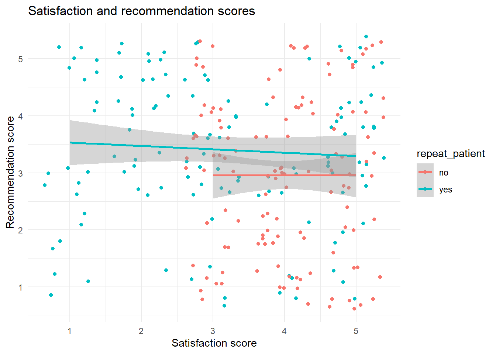

# Data Tidying {#tidy}

## Intended Learning Outcomes {#ilo-tidy}

By the end of this chapter you should be able to:

-   Reshape data between long and wide formats
-   Use pipes to chain together functions

## Walkthrough video {#walkthrough-tidy}

We encourage you to read the workbook and attempt each step on your own before watching the video as this will help consolidate your learning (it may feel harder but making mistakes is informative and will help you learn more in the long-run).

<iframe width="560" height="315" src="https://www.youtube.com/embed/EdyzbHWMl-o" title="YouTube video player" frameborder="0" allow="accelerometer; autoplay; clipboard-write; encrypted-media; gyroscope; picture-in-picture; web-share" allowfullscreen></iframe>

## Set-up {#setup-tidy}

-   Create and save a new R Markdown document named `chapter_3.Rmd`, get rid of the default template text from line 11 onwards.
-   Add the below code to the set-up chunk and then run the code to load the packages and data.You may need to install the packages if you don't have them installed already.


```r
library(tidyverse) 
library(medicaldata)
data("polyps")
data("theoph")
data("laryngoscope")
```

Download the [Data tidying cheat sheet](https://raw.githubusercontent.com/rstudio/cheatsheets/main/tidyr.pdf).

## Data Structures

The data you work with will likely come in many different formats and structures. Some of these structures may be driven by how the software you use outputs the data, but data structures may also differ because of human intervention or attempts at organisation, some of which may not be particularly helpful.

Data cleaning and tidying will likely be the most time consuming and difficult task you perform. Whilst you can create code recipes for analyses and visualisations, as Hadley Whickham puts it, ["every messy dataset is messy in its own way"](https://vita.had.co.nz/papers/tidy-data.pdf), which means that you will often have to solve new problems that are specific to the dataset. Additionally, moving between data structures that are intuitive to read by humans and those that are useful for a computer requires a conceptual shift that only comes with practice.

This is all a verbose way of saying that what lies ahead in this chapter is unlikely to sink in on the first attempt and you will need to practice with different examples (preferably with data you know well) before you truly feel comfortable with it.

First, some terminology.

An <a class='glossary' target='_blank' title='All of the data about a single trial or question.' href='https://psyteachr.github.io/glossary/o#observation'>observation</a> is all the information about a single "thing" in a single condition, such as at one point in time. These things can be patients, sales, participants, feedback questionnaires, or really anything. Observations should have a way to identify them, such as a unique ID or a unique combination of values like ID and time-point

A <a class='glossary' target='_blank' title='(coding): A word that identifies and stores the value of some data for later use; (stats): An attribute or characteristic of an observation that you can measure, count, or describe' href='https://psyteachr.github.io/glossary/v#variable'>variable</a> is one type of information about the observation. For example, if observation is a participant, the variables you might have about the participant are the participant ID, the participant's sex and age, which condition of the experiment they were in, and their score.

A <a class='glossary' target='_blank' title='A single number or piece of data.' href='https://psyteachr.github.io/glossary/v#value'>value</a> is the data for one variable for one observation. For example, the value of the age variable from the observation of a participant might be `23`.

::: {.try data-latex=""}
The dataset `theoph` that you loaded in during set-up is from a study looking at anti-asthma medication. There are 12 participants who were given a dose of the medication and whose plasma was tested at 11 different time points (you can read the full details by running the help documentation `?theoph`). Have a look at this dataset and then answer the following questions:

-   What is `Time`? <select class='webex-select'><option value='blank'></option><option value='x'>Observation</option><option value='answer'>Variable</option><option value='x'>Value</option></select>
-   How many observations are there in this dataset? <input class='webex-solveme nospaces' size='3' data-answer='["132"]'/>
-   What is `79.6`? <select class='webex-select'><option value='blank'></option><option value='x'>Observation</option><option value='x'>Variable</option><option value='answer'>Value</option></select>


<div class='webex-solution'><button>Explain these answers</button>


-   `Time` is a type of information in the dataset. There are five variables, `Subject`, `Wt`, `Dose`, `Time` and `conc`.
-   There are 132 observations, 11 for each of 12 participants for each of the different time points.
-   `79.6` is a value because it is a single data point for one variable for one observation.


</div>

:::

## Reshaping Data

Data tables can be in <a class='glossary' target='_blank' title='A data format where all of the observations about one subject are in the same row' href='https://psyteachr.github.io/glossary/w#wide'>wide</a> format or <a class='glossary' target='_blank' title='A data format where each observation is on a separate row' href='https://psyteachr.github.io/glossary/l#long'>long</a> format (or a mix of the two). Wide data are where all the observations about one thing are in the same row, while long data are where each observation is on a separate row. You often need to convert between these formats to do different types of summaries or visualisation. You may have done something similar using pivot tables in Excel.

<div class="figure" style="text-align: center">

<p class="caption">(\#fig:img-pivot-table)Converting between wide and long formats using pivot tables in Excel.</p>
</div>

### Wide-format data

The `polyps` dataset we've used in the previous chapter is an example of a wide-form dataset. All the observations about each participant are in the same row. Each participant has data from three time-points (`baseline`, `number3m`, `number12m`) which are stored in three separate columns

<div class="kable-table">

<table>
 <thead>
  <tr>
   <th style="text-align:left;"> participant_id </th>
   <th style="text-align:left;"> sex </th>
   <th style="text-align:right;"> age </th>
   <th style="text-align:right;"> baseline </th>
   <th style="text-align:left;"> treatment </th>
   <th style="text-align:right;"> number3m </th>
   <th style="text-align:right;"> number12m </th>
  </tr>
 </thead>
<tbody>
  <tr>
   <td style="text-align:left;"> 001 </td>
   <td style="text-align:left;"> female </td>
   <td style="text-align:right;"> 17 </td>
   <td style="text-align:right;"> 7 </td>
   <td style="text-align:left;"> sulindac </td>
   <td style="text-align:right;"> 6 </td>
   <td style="text-align:right;"> NA </td>
  </tr>
  <tr>
   <td style="text-align:left;"> 002 </td>
   <td style="text-align:left;"> female </td>
   <td style="text-align:right;"> 20 </td>
   <td style="text-align:right;"> 77 </td>
   <td style="text-align:left;"> placebo </td>
   <td style="text-align:right;"> 67 </td>
   <td style="text-align:right;"> 63 </td>
  </tr>
  <tr>
   <td style="text-align:left;"> 003 </td>
   <td style="text-align:left;"> male </td>
   <td style="text-align:right;"> 16 </td>
   <td style="text-align:right;"> 7 </td>
   <td style="text-align:left;"> sulindac </td>
   <td style="text-align:right;"> 4 </td>
   <td style="text-align:right;"> 2 </td>
  </tr>
  <tr>
   <td style="text-align:left;"> 004 </td>
   <td style="text-align:left;"> female </td>
   <td style="text-align:right;"> 18 </td>
   <td style="text-align:right;"> 5 </td>
   <td style="text-align:left;"> placebo </td>
   <td style="text-align:right;"> 5 </td>
   <td style="text-align:right;"> 28 </td>
  </tr>
  <tr>
   <td style="text-align:left;"> 005 </td>
   <td style="text-align:left;"> male </td>
   <td style="text-align:right;"> 22 </td>
   <td style="text-align:right;"> 23 </td>
   <td style="text-align:left;"> sulindac </td>
   <td style="text-align:right;"> 16 </td>
   <td style="text-align:right;"> 17 </td>
  </tr>
  <tr>
   <td style="text-align:left;"> 006 </td>
   <td style="text-align:left;"> female </td>
   <td style="text-align:right;"> 13 </td>
   <td style="text-align:right;"> 35 </td>
   <td style="text-align:left;"> placebo </td>
   <td style="text-align:right;"> 31 </td>
   <td style="text-align:right;"> 61 </td>
  </tr>
</tbody>
</table>

</div>

::: {.try data-latex=""}
Whilst wide-form data is easy to read, it sometimes obfuscates how many variables you actually have in the dataset because the observations are spread over columns. Have a look at the `polyps` dataset and think about how many variables there are thinking about variables as a type of information, rather than as a column:

-   How many variables (types of information) are there in the `polyps` dataset? <input class='webex-solveme nospaces' size='1' data-answer='["6"]'/>


<div class='webex-solution'><button>Explain this answer</button>


There are six variables. Four of them are relatively straightforward: `participant_id`, `sex`, `age`, and `treatment`. The final two are where it gets more complicated. The three columns `baseline`, `number3m`, and `number12m` actually represent two bits of information, the number of polyps (let's call this `polyps_n`), at each time-point (`timepoint`).


</div>

:::

### Tidy data

[^03-intro-to-viz-1]: Just because a table is long doesn't mean it is tidy (see examples [here](https://kiwidamien.github.io/what-is-tidy-data.html)) but they're often used synonymously which we're going to adopt for the purposes of this chapter.

Whilst wide-form data is intuitive for humans to read and enter data into, it can also be a little difficult to work with in R. Instead, we often need to use "<a class='glossary' target='_blank' title='A format for data that maps the meaning onto the structure.' href='https://psyteachr.github.io/glossary/t#tidy-data'>tidy data</a> in long-form [^03-intro-to-viz-1], which is data in a format that makes it easier to combine data from different tables, create summary tables, and visualise your data.

-   Each observation must have its own row
-   Each variable must have its own column
-   Each value must have its own cell

We've already seen an example of tidy data - the `theoph` dataset and the easy way to spot this is that there are multiple rows of data for the same `Subject` rather than all observations being spread out across columns in a single row:

<div class="kable-table">

<table>
 <thead>
  <tr>
   <th style="text-align:left;"> Subject </th>
   <th style="text-align:right;"> Wt </th>
   <th style="text-align:right;"> Dose </th>
   <th style="text-align:right;"> Time </th>
   <th style="text-align:right;"> conc </th>
  </tr>
 </thead>
<tbody>
  <tr>
   <td style="text-align:left;"> 1 </td>
   <td style="text-align:right;"> 79.6 </td>
   <td style="text-align:right;"> 4.02 </td>
   <td style="text-align:right;"> 0.00 </td>
   <td style="text-align:right;"> 0.74 </td>
  </tr>
  <tr>
   <td style="text-align:left;"> 1 </td>
   <td style="text-align:right;"> 79.6 </td>
   <td style="text-align:right;"> 4.02 </td>
   <td style="text-align:right;"> 0.25 </td>
   <td style="text-align:right;"> 2.84 </td>
  </tr>
  <tr>
   <td style="text-align:left;"> 1 </td>
   <td style="text-align:right;"> 79.6 </td>
   <td style="text-align:right;"> 4.02 </td>
   <td style="text-align:right;"> 0.57 </td>
   <td style="text-align:right;"> 6.57 </td>
  </tr>
  <tr>
   <td style="text-align:left;"> 1 </td>
   <td style="text-align:right;"> 79.6 </td>
   <td style="text-align:right;"> 4.02 </td>
   <td style="text-align:right;"> 1.12 </td>
   <td style="text-align:right;"> 10.50 </td>
  </tr>
  <tr>
   <td style="text-align:left;"> 1 </td>
   <td style="text-align:right;"> 79.6 </td>
   <td style="text-align:right;"> 4.02 </td>
   <td style="text-align:right;"> 2.02 </td>
   <td style="text-align:right;"> 9.66 </td>
  </tr>
  <tr>
   <td style="text-align:left;"> 1 </td>
   <td style="text-align:right;"> 79.6 </td>
   <td style="text-align:right;"> 4.02 </td>
   <td style="text-align:right;"> 3.82 </td>
   <td style="text-align:right;"> 8.58 </td>
  </tr>
</tbody>
</table>

</div>

The tidy version of the `polyps` dataset would look like this:

<div class="kable-table">

<table>
 <thead>
  <tr>
   <th style="text-align:left;"> participant_id </th>
   <th style="text-align:left;"> sex </th>
   <th style="text-align:right;"> age </th>
   <th style="text-align:left;"> treatment </th>
   <th style="text-align:left;"> time </th>
   <th style="text-align:right;"> polyps_n </th>
  </tr>
 </thead>
<tbody>
  <tr>
   <td style="text-align:left;"> 001 </td>
   <td style="text-align:left;"> female </td>
   <td style="text-align:right;"> 17 </td>
   <td style="text-align:left;"> sulindac </td>
   <td style="text-align:left;"> baseline </td>
   <td style="text-align:right;"> 7 </td>
  </tr>
  <tr>
   <td style="text-align:left;"> 001 </td>
   <td style="text-align:left;"> female </td>
   <td style="text-align:right;"> 17 </td>
   <td style="text-align:left;"> sulindac </td>
   <td style="text-align:left;"> number3m </td>
   <td style="text-align:right;"> 6 </td>
  </tr>
  <tr>
   <td style="text-align:left;"> 001 </td>
   <td style="text-align:left;"> female </td>
   <td style="text-align:right;"> 17 </td>
   <td style="text-align:left;"> sulindac </td>
   <td style="text-align:left;"> number12m </td>
   <td style="text-align:right;"> NA </td>
  </tr>
  <tr>
   <td style="text-align:left;"> 002 </td>
   <td style="text-align:left;"> female </td>
   <td style="text-align:right;"> 20 </td>
   <td style="text-align:left;"> placebo </td>
   <td style="text-align:left;"> baseline </td>
   <td style="text-align:right;"> 77 </td>
  </tr>
  <tr>
   <td style="text-align:left;"> 002 </td>
   <td style="text-align:left;"> female </td>
   <td style="text-align:right;"> 20 </td>
   <td style="text-align:left;"> placebo </td>
   <td style="text-align:left;"> number3m </td>
   <td style="text-align:right;"> 67 </td>
  </tr>
  <tr>
   <td style="text-align:left;"> 002 </td>
   <td style="text-align:left;"> female </td>
   <td style="text-align:right;"> 20 </td>
   <td style="text-align:left;"> placebo </td>
   <td style="text-align:left;"> number12m </td>
   <td style="text-align:right;"> 63 </td>
  </tr>
</tbody>
</table>

</div>

-   There are now six variables (columns) because there are six different types of information we have for each observation: the participant id, sex, age, treatment condition, time point of the measurement, and the measurement itself (number of polyps).
-   Each row is a participant's polyp measurement at a particular time-point.

The pivot functions allow you to transform a data table from wide to long or long to wide.

### Wide to long

The function `pivot_longer()` converts a wide data table to a longer format by converting the headers from specified columns into the values of new columns, and combining the values of those columns into a new condensed column.

This function has several arguments:

-   `cols`: the columns you want to make long; you can refer to them by their names, like `` c("baseline", "number3m", "number12m") `` or by their numbers, like `c(4, 6, 7)`
-   `names_to`: what you want to call the new columns that the `cols` column header names will go into
-   `values_to`: what you want to call the new column that contains the values in the `cols`

With the pivot functions, it can be easier to show than tell - run the below code and then compare `polyps` with `polyps_tidy` and the pivot code and try to map each argument to what has changed.


```r
polyps_tidy <- polyps %>%
  pivot_longer(cols = c("baseline", "number3m", "number12m"), # columns to make long 
               names_to = "time", # new column name for headers
               values_to = "polyps_n") # new column name for values
```

The long-form dataset makes it possible to use tidyverse functions to flexibly summarize and visualise our dataset. For example, with the wide-form dataset, in order to calculate the mean number of polyps at each time-point, we would need to specify the calculation for each time-point individually:


```r
polyps %>%
  summarize(mean_baseline = mean(baseline),
            mean_3m = mean(number3m),
            mean_12m = mean(number12m, na.rm = TRUE))
```

<div class="kable-table">

<table>
 <thead>
  <tr>
   <th style="text-align:right;"> mean_baseline </th>
   <th style="text-align:right;"> mean_3m </th>
   <th style="text-align:right;"> mean_12m </th>
  </tr>
 </thead>
<tbody>
  <tr>
   <td style="text-align:right;"> 40.95455 </td>
   <td style="text-align:right;"> 38.40909 </td>
   <td style="text-align:right;"> 24.05 </td>
  </tr>
</tbody>
</table>

</div>


However, with the tidy version, not only does the code become more concise (and therefore less error-prone) but it also means that if additional time-points were added to the same dataset, the code doesn't need to change: it will return the calculation of all groups.


```r
polyps_tidy %>%
  group_by(time) %>%
  summarize(mean = mean(polyps_n, na.rm = TRUE))
```

<div class="kable-table">

<table>
 <thead>
  <tr>
   <th style="text-align:left;"> time </th>
   <th style="text-align:right;"> mean </th>
  </tr>
 </thead>
<tbody>
  <tr>
   <td style="text-align:left;"> baseline </td>
   <td style="text-align:right;"> 40.95455 </td>
  </tr>
  <tr>
   <td style="text-align:left;"> number12m </td>
   <td style="text-align:right;"> 24.05000 </td>
  </tr>
  <tr>
   <td style="text-align:left;"> number3m </td>
   <td style="text-align:right;"> 38.40909 </td>
  </tr>
</tbody>
</table>

</div>

An added benefit is that tidy datasets work very well with <code class='package'>ggplot</code> (the below plot would be quite tricky to create with the wide-form dataset):


```r
ggplot(polyps_tidy, aes(x = polyps_n, fill = time)) +
  geom_histogram(show.legend = F, colour = "black") +
  facet_wrap(~time, nrow = 3) +
  scale_fill_viridis_d(option = "E") +
  theme_minimal()
```


::: {.info data-latex=""}
For those of you who are experimental researchers, you may find it easier to remember that each IV and DV should have its own column, rather than a column for each level of the IV.
:::


### Long to wide

Whilst long-form data is practically essential for working in R (particularly if you rely heavily on the tidyverse), there are times when you need a wide-form dataset. If your original dataset was in long-form, we can also go from long to wide format using the `pivot_wider()` function. 

-   `id_cols`: the column(s) that uniquely identify each new row
-   `names_from`: the column(s) that contain your new column headers, the variable you want to spread wider
-   `values_from`: the column that contains the values for the new columns

Again, it's easier to show than tell so run this code and then compare `polyps_tidy` with `polys_wide` (which should look like the original `polyps` dataset).


```r
polyps_wide <- polyps_tidy %>%
  pivot_wider(
  id_cols = c("participant_id", "sex", "age", "treatment"), # identifying column(s)
  names_from = time, # the new column names
  values_from = polyps_n # the new column values
)
```

<table>
<caption>(\#tab:pivot-wider)Data made wider with pivot_wider()</caption>
 <thead>
  <tr>
   <th style="text-align:left;"> participant_id </th>
   <th style="text-align:left;"> sex </th>
   <th style="text-align:right;"> age </th>
   <th style="text-align:left;"> treatment </th>
   <th style="text-align:right;"> baseline </th>
   <th style="text-align:right;"> number3m </th>
   <th style="text-align:right;"> number12m </th>
  </tr>
 </thead>
<tbody>
  <tr>
   <td style="text-align:left;"> 001 </td>
   <td style="text-align:left;"> female </td>
   <td style="text-align:right;"> 17 </td>
   <td style="text-align:left;"> sulindac </td>
   <td style="text-align:right;"> 7 </td>
   <td style="text-align:right;"> 6 </td>
   <td style="text-align:right;"> NA </td>
  </tr>
  <tr>
   <td style="text-align:left;"> 002 </td>
   <td style="text-align:left;"> female </td>
   <td style="text-align:right;"> 20 </td>
   <td style="text-align:left;"> placebo </td>
   <td style="text-align:right;"> 77 </td>
   <td style="text-align:right;"> 67 </td>
   <td style="text-align:right;"> 63 </td>
  </tr>
  <tr>
   <td style="text-align:left;"> 003 </td>
   <td style="text-align:left;"> male </td>
   <td style="text-align:right;"> 16 </td>
   <td style="text-align:left;"> sulindac </td>
   <td style="text-align:right;"> 7 </td>
   <td style="text-align:right;"> 4 </td>
   <td style="text-align:right;"> 2 </td>
  </tr>
  <tr>
   <td style="text-align:left;"> 004 </td>
   <td style="text-align:left;"> female </td>
   <td style="text-align:right;"> 18 </td>
   <td style="text-align:left;"> placebo </td>
   <td style="text-align:right;"> 5 </td>
   <td style="text-align:right;"> 5 </td>
   <td style="text-align:right;"> 28 </td>
  </tr>
  <tr>
   <td style="text-align:left;"> 005 </td>
   <td style="text-align:left;"> male </td>
   <td style="text-align:right;"> 22 </td>
   <td style="text-align:left;"> sulindac </td>
   <td style="text-align:right;"> 23 </td>
   <td style="text-align:right;"> 16 </td>
   <td style="text-align:right;"> 17 </td>
  </tr>
  <tr>
   <td style="text-align:left;"> 006 </td>
   <td style="text-align:left;"> female </td>
   <td style="text-align:right;"> 13 </td>
   <td style="text-align:left;"> placebo </td>
   <td style="text-align:right;"> 35 </td>
   <td style="text-align:right;"> 31 </td>
   <td style="text-align:right;"> 61 </td>
  </tr>
</tbody>
</table>


An example of when wide-format data is required is if you needed to create a scatterplot or conduct a correlation between two levels of a grouping variable so and so you need the data in separate columns:


```r
polyps_wide %>%
  filter(baseline < 200) %>% # remove the outliers
  ggplot(aes(x = baseline, y = number12m, colour = treatment)) +
  geom_point() +
  geom_smooth(method = "lm")
```


## Multi-step tidying {#multistep}

Restructuring data between wide and long-form is arguably one of the most difficult tasks you will need to do whilst coding, because the nature of the problem depends not only on the design of your study but on the idiosyncrasies of the dataset organisation, and the interaction between the two. So, let's run through another example, this time with a slightly more complicated dataset that will require us to create intermediate objects.

For this example, we're going to use the `laryngoscope` dataset about intubation methods - I'd recommend reviewing the help documentation to familiarize yourself with the variables before you go any further (`?laryngoscope`). This dataset is quite large so we're going to reduce the number of variables to just those we need for this example:


```r
laryn_subset <- laryngoscope %>%
  select(age, gender, Randomization:attempt3_S_F)
```

### Adding ID variables

This dataset doesn't originally have any participant ID codes. This is likely because it's in wide-form so we know which data points relate to which participant because they're all on the same row, however, when we start pulling apart and putting the data back together, it can prevent a number of issues to ensure you have a clear ID column for which observations all belong to the same thing.

To add on an ID number, we'll use `mutate()` to create a column where the ID number equals the row number. We'll also move it to be the first column of the dataset using `select()` and `everything()` which then selects the `id` column, and then everything else in the dataset.


```r
laryn_subset <- laryn_subset %>%
  mutate(id = row_number()) %>%
  select(id, everything())
```

### Untidy long-form

Let's think about the variables we have in this dataset now. First, the uncomplicated ones:

- `id`, `age`, `gender`, `Randomization`

We then have eight columns with different information about the intubation attempts. Whilst there are eight columns, there are really four different types of information, or variables:

- `attempt` the attempt number of the intubation, 1-3
- `time` the intubation attempt time in seconds
- `success` whether the intubation attempt was successful
- `method` the method used for the intubation attempt

Let's try the code we used to transform the previous, simpler dataset:


```r
laryn_tidy1 <- laryn_subset %>%
  pivot_longer(cols = starts_with("attempt"), #tidy all variables that start with "attempt"
               names_to = "variable", 
               values_to = "score")
```


```r
head(laryn_tidy1)
```

<div class="kable-table">

<table>
 <thead>
  <tr>
   <th style="text-align:right;"> id </th>
   <th style="text-align:right;"> age </th>
   <th style="text-align:right;"> gender </th>
   <th style="text-align:right;"> Randomization </th>
   <th style="text-align:left;"> variable </th>
   <th style="text-align:right;"> score </th>
  </tr>
 </thead>
<tbody>
  <tr>
   <td style="text-align:right;"> 1 </td>
   <td style="text-align:right;"> 51 </td>
   <td style="text-align:right;"> 0 </td>
   <td style="text-align:right;"> 0 </td>
   <td style="text-align:left;"> attempt1_time </td>
   <td style="text-align:right;"> 29 </td>
  </tr>
  <tr>
   <td style="text-align:right;"> 1 </td>
   <td style="text-align:right;"> 51 </td>
   <td style="text-align:right;"> 0 </td>
   <td style="text-align:right;"> 0 </td>
   <td style="text-align:left;"> attempt1_S_F </td>
   <td style="text-align:right;"> 1 </td>
  </tr>
  <tr>
   <td style="text-align:right;"> 1 </td>
   <td style="text-align:right;"> 51 </td>
   <td style="text-align:right;"> 0 </td>
   <td style="text-align:right;"> 0 </td>
   <td style="text-align:left;"> attempt2_time </td>
   <td style="text-align:right;"> NA </td>
  </tr>
  <tr>
   <td style="text-align:right;"> 1 </td>
   <td style="text-align:right;"> 51 </td>
   <td style="text-align:right;"> 0 </td>
   <td style="text-align:right;"> 0 </td>
   <td style="text-align:left;"> attempt2_assigned_method </td>
   <td style="text-align:right;"> NA </td>
  </tr>
  <tr>
   <td style="text-align:right;"> 1 </td>
   <td style="text-align:right;"> 51 </td>
   <td style="text-align:right;"> 0 </td>
   <td style="text-align:right;"> 0 </td>
   <td style="text-align:left;"> attempt2_S_F </td>
   <td style="text-align:right;"> NA </td>
  </tr>
  <tr>
   <td style="text-align:right;"> 1 </td>
   <td style="text-align:right;"> 51 </td>
   <td style="text-align:right;"> 0 </td>
   <td style="text-align:right;"> 0 </td>
   <td style="text-align:left;"> attempt3_time </td>
   <td style="text-align:right;"> NA </td>
  </tr>
</tbody>
</table>

</div>

This isn't right - we've got multiple different types of information in both the `variable` and `score` columns.  First, let's separate out the attempt from the measurement. This is somewhat straightforward in that the information about which attempt it is is always to the left of the first underscore in the variable name (e.g., `attempt1_time`), so we can use the argument `names_sep` to tell R to split the column at the underscore and put the data from each side into two columns named `attempt` and `measurement`.

If you do have control over your data, this is a key reason why consistent naming conventions are super important. If you have consistent and meaningful uses of capital letters, underscores, and periods in your variable names, you can then use this information to manipulate your data frames far more easily. The `laryn` dataset has used underscores to separate the names bits of information (e.g., `attempt1_time`) but has also used them as generic spaces (e.g., `attempt2_assignment_method`).

What this means is that when we tidy the dataset with the `names_sep` argument, we'll get a warning message:


```r
laryn_tidy2 <- laryn_subset %>%
  pivot_longer(cols = c(attempt1_time:attempt3_S_F),
               names_sep = "_",
               names_to = c("attempt", "measurement"), 
               values_to = "score")
```

```
## Warning: Expected 2 pieces. Additional pieces discarded in 5 rows [2, 4, 5, 7,
## 8].
```

Because we have asked R to separate the variables by an underscore and have only given it two column names, it has discarded the information that comes after the second underscore. This doesn't actually make a great deal of difference to this dataset, the labeling is still relatively meaningful:

<div class="kable-table">

<table>
 <thead>
  <tr>
   <th style="text-align:right;"> id </th>
   <th style="text-align:right;"> age </th>
   <th style="text-align:right;"> gender </th>
   <th style="text-align:right;"> Randomization </th>
   <th style="text-align:left;"> attempt </th>
   <th style="text-align:left;"> measurement </th>
   <th style="text-align:right;"> score </th>
  </tr>
 </thead>
<tbody>
  <tr>
   <td style="text-align:right;"> 1 </td>
   <td style="text-align:right;"> 51 </td>
   <td style="text-align:right;"> 0 </td>
   <td style="text-align:right;"> 0 </td>
   <td style="text-align:left;"> attempt1 </td>
   <td style="text-align:left;"> time </td>
   <td style="text-align:right;"> 29 </td>
  </tr>
  <tr>
   <td style="text-align:right;"> 1 </td>
   <td style="text-align:right;"> 51 </td>
   <td style="text-align:right;"> 0 </td>
   <td style="text-align:right;"> 0 </td>
   <td style="text-align:left;"> attempt1 </td>
   <td style="text-align:left;"> S </td>
   <td style="text-align:right;"> 1 </td>
  </tr>
  <tr>
   <td style="text-align:right;"> 1 </td>
   <td style="text-align:right;"> 51 </td>
   <td style="text-align:right;"> 0 </td>
   <td style="text-align:right;"> 0 </td>
   <td style="text-align:left;"> attempt2 </td>
   <td style="text-align:left;"> time </td>
   <td style="text-align:right;"> NA </td>
  </tr>
  <tr>
   <td style="text-align:right;"> 1 </td>
   <td style="text-align:right;"> 51 </td>
   <td style="text-align:right;"> 0 </td>
   <td style="text-align:right;"> 0 </td>
   <td style="text-align:left;"> attempt2 </td>
   <td style="text-align:left;"> assigned </td>
   <td style="text-align:right;"> NA </td>
  </tr>
  <tr>
   <td style="text-align:right;"> 1 </td>
   <td style="text-align:right;"> 51 </td>
   <td style="text-align:right;"> 0 </td>
   <td style="text-align:right;"> 0 </td>
   <td style="text-align:left;"> attempt2 </td>
   <td style="text-align:left;"> S </td>
   <td style="text-align:right;"> NA </td>
  </tr>
  <tr>
   <td style="text-align:right;"> 1 </td>
   <td style="text-align:right;"> 51 </td>
   <td style="text-align:right;"> 0 </td>
   <td style="text-align:right;"> 0 </td>
   <td style="text-align:left;"> attempt3 </td>
   <td style="text-align:left;"> time </td>
   <td style="text-align:right;"> NA </td>
  </tr>
</tbody>
</table>

</div>

However, if you'd like more precise control over your separation, you can use the `names_pattern` argument. `(.*?)_(.*)` uses two groups of data where the first group is everything until the first underscore `((.*?))` in the column name and the second group is everything after the underscore following the first group `((.*))` (Thank you to [Stack Overflow](https://stackoverflow.com/questions/64150083/using-pivot-longer-in-tidyr-with-a-complex-separator) for this solution!).


```r
laryn_tidy3 <- laryn_subset %>%
  pivot_longer(cols = c(attempt1_time:attempt3_S_F),
               names_pattern = '(.*?)_(.*)',
               names_to = c("attempt", "measurement"), 
               values_to = "score")
```

<div class="kable-table">

<table>
 <thead>
  <tr>
   <th style="text-align:right;"> id </th>
   <th style="text-align:right;"> age </th>
   <th style="text-align:right;"> gender </th>
   <th style="text-align:right;"> Randomization </th>
   <th style="text-align:left;"> attempt </th>
   <th style="text-align:left;"> measurement </th>
   <th style="text-align:right;"> score </th>
  </tr>
 </thead>
<tbody>
  <tr>
   <td style="text-align:right;"> 1 </td>
   <td style="text-align:right;"> 51 </td>
   <td style="text-align:right;"> 0 </td>
   <td style="text-align:right;"> 0 </td>
   <td style="text-align:left;"> attempt1 </td>
   <td style="text-align:left;"> time </td>
   <td style="text-align:right;"> 29 </td>
  </tr>
  <tr>
   <td style="text-align:right;"> 1 </td>
   <td style="text-align:right;"> 51 </td>
   <td style="text-align:right;"> 0 </td>
   <td style="text-align:right;"> 0 </td>
   <td style="text-align:left;"> attempt1 </td>
   <td style="text-align:left;"> S_F </td>
   <td style="text-align:right;"> 1 </td>
  </tr>
  <tr>
   <td style="text-align:right;"> 1 </td>
   <td style="text-align:right;"> 51 </td>
   <td style="text-align:right;"> 0 </td>
   <td style="text-align:right;"> 0 </td>
   <td style="text-align:left;"> attempt2 </td>
   <td style="text-align:left;"> time </td>
   <td style="text-align:right;"> NA </td>
  </tr>
  <tr>
   <td style="text-align:right;"> 1 </td>
   <td style="text-align:right;"> 51 </td>
   <td style="text-align:right;"> 0 </td>
   <td style="text-align:right;"> 0 </td>
   <td style="text-align:left;"> attempt2 </td>
   <td style="text-align:left;"> assigned_method </td>
   <td style="text-align:right;"> NA </td>
  </tr>
  <tr>
   <td style="text-align:right;"> 1 </td>
   <td style="text-align:right;"> 51 </td>
   <td style="text-align:right;"> 0 </td>
   <td style="text-align:right;"> 0 </td>
   <td style="text-align:left;"> attempt2 </td>
   <td style="text-align:left;"> S_F </td>
   <td style="text-align:right;"> NA </td>
  </tr>
  <tr>
   <td style="text-align:right;"> 1 </td>
   <td style="text-align:right;"> 51 </td>
   <td style="text-align:right;"> 0 </td>
   <td style="text-align:right;"> 0 </td>
   <td style="text-align:left;"> attempt3 </td>
   <td style="text-align:left;"> time </td>
   <td style="text-align:right;"> NA </td>
  </tr>
</tbody>
</table>

</div>

### Spreading variables to create tidy data

This still isn't quite right because whilst we have sorted out the names, the `score` variable contains three different types of measurement (the intubation time, whether it was a success or failure, and the assignment method). Instead we need an additional step where we spread these measurements across different variables:


```r
laryn_tidy4 <- laryn_tidy3 %>%
  pivot_wider(id_cols = c("id", "age", "gender", "Randomization", "attempt"),
              names_from = "measurement", 
              values_from = "score")
```

::: {.info data-latex=""}
Technically, you can skip setting the `id_cols` argument, because all of the columns apart from the `names_from` column and the `values_from` column identify the observation (e.g., each observation is identified by the unique combination of `id`, `age`, `gender` etc). You only have to set the `id_cols` argument when this is not the case although it can be a useful exercise to help ensure you understand the structure of your data.
:::

### Correcting factors

Finally, we can also tidy up some of the categorical variables: `gender`, `Randomization` and `S_F` are represented as numerical data but they're actually categories. We could just tell R that this data is a factor and leave the values as they are:


```r
str(laryn_tidy4)

laryn_tidy5 <- laryn_tidy4 %>%
  mutate(gender = as.factor(gender),
         Randomization = as.factor(Randomization),
         S_F = as.factor(S_F))

str(laryn_tidy5)
```


But we might as well take the opportunity to make our dataset more readable. The great thing about working in R is that you don't have to have everything coded numerically as you would in e.g., SPSS. Instead, we can use text labels which means we don't have to remember what 0 and 1 means.


```r
laryn_tidy6 <- laryn_tidy4 %>%
  mutate(gender = factor(gender, 
                         levels = c(0,1),
                         labels = c("female", "male")),
    Randomization = factor(Randomization, 
                                levels = c(0,1), 
                                labels = c("Standard", "AWS")),
         S_F = factor(S_F, 
                      levels = c(0,1), 
                      labels = c("failure", "success")))

str(laryn_tidy6)
```


Now the data are finally in tidy format we can use our tidyverse functions to easily summarize and visualize by different variables.For example, we can calculate the average intubation time for each attempt:


```r
laryn_tidy6 %>%
  group_by(attempt) %>%
  summarize(mean_time =mean(time, na.rm = TRUE))
```

<div class="kable-table">

<table>
 <thead>
  <tr>
   <th style="text-align:left;"> attempt </th>
   <th style="text-align:right;"> mean_time </th>
  </tr>
 </thead>
<tbody>
  <tr>
   <td style="text-align:left;"> attempt1 </td>
   <td style="text-align:right;"> 33.40909 </td>
  </tr>
  <tr>
   <td style="text-align:left;"> attempt2 </td>
   <td style="text-align:right;"> 42.90000 </td>
  </tr>
  <tr>
   <td style="text-align:left;"> attempt3 </td>
   <td style="text-align:right;"> 21.33333 </td>
  </tr>
</tbody>
</table>

</div>

Or we could visualize the numberof success and failures on each attempt:


```r
laryn_tidy6 %>%
  filter(!is.na(S_F)) %>% # remove NAs from plot
  ggplot(aes(x = S_F)) +
  geom_bar() +
  facet_wrap(~ attempt)
```


## Pipes {#pipes}

::: {style="width: 200px; float: right;"}

:::

We've used pipes `%>%` throughout this course but this type of data processing is where they really start to shine, as they can significantly reduce the amount of code you write.

As a recap, a pipe takes the result of the previous function and sends it to the next function as its first argument, which means that you do not need to create intermediate objects. Below is all the code we've used in this chapter, and in the process we created multiple objects. This can get very confusing in longer scripts.


```r
# read in data
data("laryngoscope")

# select subset of data
laryn_subset <- laryngoscope %>%
  select(age, gender, Randomization:attempt3_S_F)

# add ID column
laryn_subset <- laryn_subset %>%
  mutate(id = row_number()) %>%
  select(id, everything())

# create untidy long-form data
laryn_tidy3 <- laryn_subset %>%
  pivot_longer(cols = c(attempt1_time:attempt3_S_F),
               names_pattern = '(.*?)_(.*)',
               names_to = c("attempt", "measurement"), 
               values_to = "score")

# finalise tidy data by spreading variables
laryn_tidy4 <- laryn_tidy3 %>%
  pivot_wider(id_cols = c("id", "age", "gender", "Randomization", "attempt"),
              names_from = "measurement", 
              values_from = "score")


# correct factors
laryn_tidy6 <- laryn_tidy4 %>%
  mutate(gender = factor(gender, 
                         levels = c(0,1),
                         labels = c("female", "male")),
    Randomization = factor(Randomization, 
                                levels = c(0,1), 
                                labels = c("Standard", "AWS")),
         S_F = factor(S_F, 
                      levels = c(0,1), 
                      labels = c("failure", "success")))
```

::: {.warning data-latex=""}
You *can* give each object the same name and keep replacing the old data object with the new one at each step. This will keep your environment clean, but it makes debugging code much harder.
:::

For longer series of steps like the one above, using pipes can eliminate many intermediate objects. This also makes it easier to add an intermediate step to your process without having to think of a new table name and edit the table input to the next step (which is really easy to accidentally miss).


```r
data("laryngoscope")

laryn_tidy <-  laryngoscope %>%
  select(age, gender, Randomization:attempt3_S_F) %>%
  mutate(id = row_number()) %>%
  select(id, everything()) %>%
  pivot_longer(cols = c(attempt1_time:attempt3_S_F),
               names_pattern = '(.*?)_(.*)',
               names_to = c("attempt", "measurement"), 
               values_to = "score") %>%
  pivot_wider(id_cols = c("id", "age", "gender", "Randomization", "attempt"),
              names_from = "measurement", 
              values_from = "score")%>%
  mutate(gender = factor(gender, 
                         levels = c(0,1),
                         labels = c("female", "male")),
    Randomization = factor(Randomization, 
                                levels = c(0,1), 
                                labels = c("Standard", "AWS")),
         S_F = factor(S_F, 
                      levels = c(0,1), 
                      labels = c("failure", "success")))
```

You can read the code above like this:

1. Start with the dataset `laryngoscope` **and then**

2. Select the columns we're interested in with `select()` **and then**

3. Add on an ID column with `mutate()` **and then**

4. Move the ID column to the start of the dataset with `select()` **and then**

5. Reshape the data longer with `pivot_longer()` **and then**

6.  Reshape the data wider with `pivot_wider()` **and then**

7. Set categorical variables to factors using `mutate()` and `factor()` and update the text labels.

Don't feel like you always need to get all of your data wrangling code into a single pipeline. You should make intermediate objects whenever you need to break up your code because it's getting too complicated or if you need to debug something.

::: {.info data-latex=""}
You can debug a pipe by highlighting from the beginning to just before the pipe you want to stop at. Try this by highlighting from `laryn_tidy <-` to the end of the `pivot_longer` function (just before the next pipe) and typing command-enter (mac) or control-enter (PC). What does `laryn_tidy` look like now?
:::

## Exercises

As noted, reshaping data is one of the most difficult tasks to learn because every dataset is different. To help you practice, here are a few more examples that you can work through on your own.

-   In the set-up code chunk, load the <code class='package'>tidyverse</code> then load the two data files in using `read_csv()` and name the objects `wide1` and `wide2`


```r
library(tidyverse)
wide1 <- read_csv("https://psyteachr.github.io/ads-v1/data/wide_exercise-1.csv")
wide2 <- read_csv("https://psyteachr.github.io/ads-v1/data/wide_exercise-2.csv")
```

The two datasets represent simulated data from a patient satisfaction survey. We'll do them one at a time, as they differ in complexity.

### Survey 1

`wide1` has data from 50 patients who were asked five questions about their most recent experience at a health centre. The results from this questionnaire are typically reported as a single overall satisfaction score, which is calculated by taking the mean of the five responses. Additionally, the survey also records whether the patient was attending the clinic for the first time, or as a repeat patient.

-   Use your method of choice to look at the dataset and familiarise yourself with its structure and data.


<div class='webex-solution'><button>Solution</button>


You can click on the object to view it in the viewing pane or you could use any of the following:


```r
str(wide1)
summary(wide1)
head(wide1)
```


</div>


As noted, it's important to think through what your tidied data should look like. Often, the problem with data wrangling in R isn't actually the code, it's a lack of understanding of the data that's being worked on.

1.  How many **variables** should the long-form version of `wide` have? <input class='webex-solveme nospaces' size='1' data-answer='["4"]'/>
2.  How many **observations** should the long-form version of `wide1` have? <input class='webex-solveme nospaces' size='3' data-answer='["250"]'/>


<div class='webex-solution'><button>Explain these answers</button>


1.  There should be four variables, as there are 4 types of data: patient id, whether they are a repeat patient, the question they were asked, and their response.
2.  There will be 250 observations or rows of data because each patient will have 5 rows of data (one per question) and there are 50 patients (50 \* 5 = 250).


</div>


### Tidy 1

Transform `wide1` to long-form using `pivot_longer()` and store it in an object named `tidy1`


<div class='webex-solution'><button>Solution</button>

```r
tidy1 <- wide1 %>%
  pivot_longer(cols = q1:q5,
               names_to = "question", 
               values_to = "response")
```


</div>

### Survey 2

`wide2` also has data from 50 patients, however, there are now two measures included in the questionnaire. There are still five questions that relate to satisfaction, but there are also five questions that relate to whether the patient would recommend the medical practice to a friend. Both measures are typically reported by calculating an overall mean for each of the five items.

-   Use your method of choice to look at the dataset and familiarize yourself with its structure and data.

This is not as simple as the first exercise because there's actually two potential ways you might tidy this data, depending on what you want to do with it and how you conceptualize the two different measurements. It's important to recognize that many of your coding problems will not have just one solution.

#### Tidy 2a

For the first option, we're going to treat the "satisfaction" and "recommendation" measurements as two categories of the same variable. This will be a fully long-form data set with five variables `id`, `repeat_patient`, `question` (the question number), `category` (whether it's `sat` or `rec`), and `response` (the numerical rating).

-   How many **observations** should the fully long-form version of `wide2` have? <input class='webex-solveme nospaces' size='3' data-answer='["500"]'/>


<div class='webex-solution'><button>Explain this answer</button>


There will be 500 rows of data because each participant will have 10 rows: 5 for the satisfaction questions and five for the recommendation questions.


</div>


Transform `wide2` to full long-form using `pivot_longer()` and store it in an object named `tidy2a`.


<div class='webex-solution'><button>Hint 1</button>


`data %>% pivot_longer()`


</div>


<div class='webex-solution'><button>Hint 2</button>


`names_to  = c("col1", "col2")`


</div>


<div class='webex-solution'><button>Solution</button>

```r
tidy2a <- wide2 %>%
  pivot_longer(cols = q1_sat:q5_rec,
               names_to = c("question", "category"), 
               names_sep = "_",
               values_to = "response")
```


</div>

#### Tidy 2b

The second option is to treat the satisfaction and recommendation scores as two distinct variables. This only makes sense if the satisfaction and recommendation scores for each question number are related to each other (e.g., q1 is about the same thing for both questions), making them part of the same observation.

This version should also have five variables, but it won't be fully long-form, it'll be a slight mix of the two that we're going to call "semi-long". The variables in the semi-long version will be `id`, `repeat`, `question` (the question number), `sat` (the response for the satisfaction question), and `rec` (the response for the recommendation question).

-   How many **observations** should the semi-long version of `wide2` have? <input class='webex-solveme nospaces' size='3' data-answer='["250"]'/>


<div class='webex-solution'><button>Explain this answer</button>


There will be 250 rows of data because, just like `tidy1`, each participant will have 5 rows, one for each of the five questions. The different responses to the satisfaction and recommendation questions are in different variables.


</div>


This will take multiple steps - you can create different objects or use a pipeline.


<div class='webex-solution'><button>Hint 1</button>


You can reuse the code from `tidy2a`, you just need to add on an extra line that makes the data slightly wider.


</div>


<div class='webex-solution'><button>Hint 2</button>


`data %>% pivot_longer() %>% pivot_wider()`


</div>


<div class='webex-solution'><button>Solution</button>

```r
tidy2b <- wide2 %>%
  pivot_longer(cols = q1_sat:q5_rec,
               names_to = c("question", "category"), 
               names_sep = "_",
               values_to = "response") %>%
  pivot_wider(names_from = "category", values_from = "response")
```


</div>

### Analysis and visualisation

Using `group_by()` and `summarize()`, calculate the mean score for each participant for both satisfaction and recommendation. Do this for both versions of the dataset so that you can see how the structure of the dataset changes the approach you need to take.


<div class='webex-solution'><button>Solution</button>

```r
tidy2a %>%
  group_by(id, category) %>%
  summarize(mean = mean(response))

tidy2b %>%
  group_by(id) %>%
  summarize(mean_satisfaction = mean(sat),
            mean_rec = mean(rec))
```


</div>

Replicate the following:

#### Plot 1

Scatterplot showing the relationship between satisfaction and recommendation scores, by whether the patient is a repeat patient.


<div class='webex-solution'><button>Hint</button>


`geom_jitter()`


</div>





<div class='webex-solution'><button>Solution</button>

```r
ggplot(tidy2b, aes(x = sat, y = rec, colour = repeat_patient)) +
  geom_jitter() +
  geom_smooth(method = "lm") +
  labs(x = "Satisfaction score", y = "Recommendation score", title = "Satisfaction and recommendation scores") +
  theme_minimal()
```


</div>

#### Plot 2

Boxplots showing satisfaction and recommends scores for new and repeat patients separately.


<div class='webex-solution'><button>Solution</button>

```r
ggplot(tidy2a, aes(x = repeat_patient, y = response, fill = repeat_patient)) +
  geom_boxplot(show.legend = FALSE) +
  facet_wrap(~category)+
  theme_bw() +
  scale_fill_brewer(palette = "Dark2")
```


</div>

#### Plot 3

Histogram showing the distribution of all responses, across questions and categories.


<div class='webex-solution'><button>Solution</button>

```r
ggplot(tidy2a, aes(x = response)) +
  geom_histogram(binwidth = 1, colour = "black", fill = "Grey") +
  labs(x = "Responses across all questions and categories") +
  theme_bw()
```


</div>

### Your data

If you have a wide-form dataset of your own, try and tidy it into long-form and if you get stuck or you just want to check your solution, post it on the All of Us Research Academy Help and Discussion forum - just remember to be careful about sharing confidential data if it's your own dataset.

If your head hurts a bit at this point, rest assured it's absolutely normal. As we said at the start, reshaping and tidying data is a conceptual leap and there's no shortcut to the fact it just takes a bit of time and practice with different data sets - you will get there eventually!

## Glossary {#glossary-tidy}

<table class="table" style="margin-left: auto; margin-right: auto;">
 <thead>
  <tr>
   <th style="text-align:left;"> term </th>
   <th style="text-align:left;"> definition </th>
  </tr>
 </thead>
<tbody>
  <tr>
   <td style="text-align:left;"> [long](https://psyteachr.github.io/glossary/l.html#long){class="glossary" target="_blank"} </td>
   <td style="text-align:left;"> A data format where each observation is on a separate row </td>
  </tr>
  <tr>
   <td style="text-align:left;"> [observation](https://psyteachr.github.io/glossary/o.html#observation){class="glossary" target="_blank"} </td>
   <td style="text-align:left;"> All of the data about a single trial or question. </td>
  </tr>
  <tr>
   <td style="text-align:left;"> [tidy data](https://psyteachr.github.io/glossary/t.html#tidy-data){class="glossary" target="_blank"} </td>
   <td style="text-align:left;"> A format for data that maps the meaning onto the structure. </td>
  </tr>
  <tr>
   <td style="text-align:left;"> [value](https://psyteachr.github.io/glossary/v.html#value){class="glossary" target="_blank"} </td>
   <td style="text-align:left;"> A single number or piece of data. </td>
  </tr>
  <tr>
   <td style="text-align:left;"> [variable](https://psyteachr.github.io/glossary/v.html#variable){class="glossary" target="_blank"} </td>
   <td style="text-align:left;"> (coding): A word that identifies and stores the value of some data for later use; (stats): An attribute or characteristic of an observation that you can measure, count, or describe </td>
  </tr>
  <tr>
   <td style="text-align:left;"> [wide](https://psyteachr.github.io/glossary/w.html#wide){class="glossary" target="_blank"} </td>
   <td style="text-align:left;"> A data format where all of the observations about one subject are in the same row </td>
  </tr>
</tbody>
</table>


## Further resources {#resources-tidy}

-   [Data tidying cheat sheet](https://raw.githubusercontent.com/rstudio/cheatsheets/main/tidyr.pdf)
-   [Tidy Data](http://vita.had.co.nz/papers/tidy-data.html)
-   [Chapter 12: Tidy Data](http://r4ds.had.co.nz/tidy-data.html) in *R for Data Science*
-   [Chapter 18: Pipes](http://r4ds.had.co.nz/pipes.html) in *R for Data Science*
