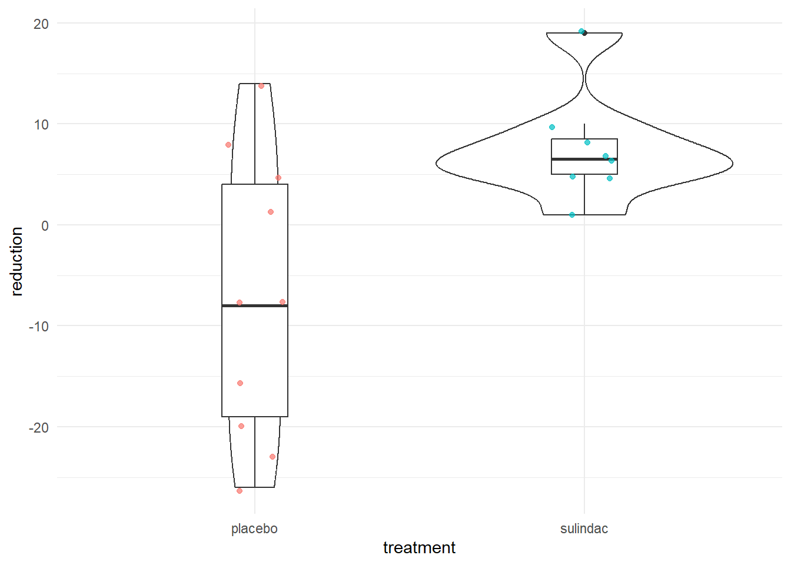

# Comparing Means {#analysis1}

## Intended Learning Outcomes {#ilo-analysis}

By the end of this chapter you should be able to:

* Perform one-sample, independent, and paired-samples t-tests
* Perform one-way and factorial ANOVAs with post-hoc comparisons
* Perform non-parametric two-group comparisons

The following two chapters will give you a whistle-stop tour of some basic and common statistical tests and how to perform them in R. Importantly, this isn't a statistics course, it's a programming course, so we're not going to go into detail about the theory behind each statistical test and when and why to use them. We've included links to number of excellent statistic resources in the Further Resources section if you'd like to do a deeper dive.

These chapters will likely cause you less trouble than those on data wrangling and tidying and that's because when it comes to R (or any programming language really), analyzing your data is generally much easier than getting the data in the right format for that analysis. For that reason, this chapter will also contain a little bit of wrangling and tidying to help consolidate the links between those tasks and the analyses that might need them. 

## Walkthrough video {#walkthrough-analysis}

We encourage you to read the workbook and attempt each step on your own before watching the video as this will help consolidate your learning (it may feel harder but making mistakes is informative and will help you learn more in the long-run).

## Set-up {#setup-analysis1}

* Create and save a new R Markdown document named `chapter_5.Rmd`, get rid of the default template text from line 11 onwards.
* Add the below code to the set-up chunk and then run the code to load the packages and data.You may need to install the packages if you don't have them installed already.


```r
library(tidyverse)   
library(broom)
library(afex)
library(emmeans)
library(gapminder)
library(medicaldata)
data("polyps")
data("gapminder")
data("laryngoscope")
```

## Comparing two means

We're going to use the `polyps` dataset to run a number of different t-tests. You may find it useful to familiarize yourself with the dataset before proceeding further. As a first step, we'll create a new variable `reduction` which is the difference in the number of polyps at baseline compared to 12 months after treatment began - a higher number reflects a greater reduction in polpys (i.e., a positive number is a good thing). Additionally, to avoid any issues, we're also just going to use a complete dataset, so we only include participants who have data for all time-points.


```r
polyps <- polyps %>%
  drop_na(number12m) %>% # drop missing values
  mutate(reduction = baseline - number12m)
```

### One-sample t-test

We can perform a one-sample t-test on the new `reduction` variable to determine whether the reduction in polyps after treatment is significantly different to zero.

First, let's visualize the data using a simple boxplot. Because we've only got one, we set the x variable to `x = ""`.


```r
ggplot(polyps, aes(x = "", y = reduction)) +
  geom_boxplot() +
  labs(x = NULL, y = "Reduction in polyps")
```


This visualization makes it clear there are a couple of outliers in the data. There's arguments for whether you should retain or remove these values; we won't get into the theoretical weeds, we'll just show you the code for each option.

- `mu` is the true value of the mean, i.e., the value you want to compare your data to
- `alternative` specifies the direction of the alternative hypothesis, you can choose between `two.sided`, `greater`, or `less`. We'll set this test to `greater` because it would be reasonable to hypothesize that the reduction in polyps after treatment should be more than zero.
- the function `tidy()` comes from the <code class='package'>broom</code> package and takes the somewhat messy output produced by the base R functions and tidies it into a table which is easier to work with.
- `conf.high` will be displayed as `Inf` because we have specified a one-tailed test.


```r
# keep the outliers, i.e., use the full dataset as is
t.test(x = polyps$reduction,
       mu = 0,
       alternative = "greater")%>%
  tidy()
```

<div class="kable-table">

<table>
 <thead>
  <tr>
   <th style="text-align:right;"> estimate </th>
   <th style="text-align:right;"> statistic </th>
   <th style="text-align:right;"> p.value </th>
   <th style="text-align:right;"> parameter </th>
   <th style="text-align:right;"> conf.low </th>
   <th style="text-align:right;"> conf.high </th>
   <th style="text-align:left;"> method </th>
   <th style="text-align:left;"> alternative </th>
  </tr>
 </thead>
<tbody>
  <tr>
   <td style="text-align:right;"> 19.85 </td>
   <td style="text-align:right;"> 1.301766 </td>
   <td style="text-align:right;"> 0.1042795 </td>
   <td style="text-align:right;"> 19 </td>
   <td style="text-align:right;"> -6.516709 </td>
   <td style="text-align:right;"> Inf </td>
   <td style="text-align:left;"> One Sample t-test </td>
   <td style="text-align:left;"> greater </td>
  </tr>
</tbody>
</table>

</div>


```r
# remove the outliers

polyps_outliers <- polyps %>%
  filter(reduction < 100) # keep only those values less than 100

t.test(x = polyps_outliers$reduction, 
       mu = 0,
       alternative = "greater")%>%
  tidy()
```

<div class="kable-table">

<table>
 <thead>
  <tr>
   <th style="text-align:right;"> estimate </th>
   <th style="text-align:right;"> statistic </th>
   <th style="text-align:right;"> p.value </th>
   <th style="text-align:right;"> parameter </th>
   <th style="text-align:right;"> conf.low </th>
   <th style="text-align:right;"> conf.high </th>
   <th style="text-align:left;"> method </th>
   <th style="text-align:left;"> alternative </th>
  </tr>
 </thead>
<tbody>
  <tr>
   <td style="text-align:right;"> -0.6666667 </td>
   <td style="text-align:right;"> -0.2155182 </td>
   <td style="text-align:right;"> 0.5840361 </td>
   <td style="text-align:right;"> 17 </td>
   <td style="text-align:right;"> -6.047827 </td>
   <td style="text-align:right;"> Inf </td>
   <td style="text-align:left;"> One Sample t-test </td>
   <td style="text-align:left;"> greater </td>
  </tr>
</tbody>
</table>

</div>


There's no significant difference in the number of polyps after treatment according to this test, but of course, we've included the data from both the control and treatment group in this analysis.

You can use the function `do()` combined with `group_by()` to perform this test on different groups. For example, we can run the one-sample t-test on both `treatment` groups separately and if we do this we see that the reduction in polyps is significantly different to zero but only for the sulindac condition.


```r
polyps_outliers %>% 
  group_by(treatment) %>%
  do(                               
    t.test(.$reduction, # the . replaces the name of the dataset because we've used a pipe
           mu = 0,
           alternative = "greater") %>%  
      tidy()                        
  )
```

<div class="kable-table">

<table>
 <thead>
  <tr>
   <th style="text-align:left;"> treatment </th>
   <th style="text-align:right;"> estimate </th>
   <th style="text-align:right;"> statistic </th>
   <th style="text-align:right;"> p.value </th>
   <th style="text-align:right;"> parameter </th>
   <th style="text-align:right;"> conf.low </th>
   <th style="text-align:right;"> conf.high </th>
   <th style="text-align:left;"> method </th>
   <th style="text-align:left;"> alternative </th>
  </tr>
 </thead>
<tbody>
  <tr>
   <td style="text-align:left;"> placebo </td>
   <td style="text-align:right;"> -7.300 </td>
   <td style="text-align:right;"> -1.659234 </td>
   <td style="text-align:right;"> 0.9342791 </td>
   <td style="text-align:right;"> 9 </td>
   <td style="text-align:right;"> -15.365002 </td>
   <td style="text-align:right;"> Inf </td>
   <td style="text-align:left;"> One Sample t-test </td>
   <td style="text-align:left;"> greater </td>
  </tr>
  <tr>
   <td style="text-align:left;"> sulindac </td>
   <td style="text-align:right;"> 7.625 </td>
   <td style="text-align:right;"> 4.077034 </td>
   <td style="text-align:right;"> 0.0023536 </td>
   <td style="text-align:right;"> 7 </td>
   <td style="text-align:right;"> 4.081698 </td>
   <td style="text-align:right;"> Inf </td>
   <td style="text-align:left;"> One Sample t-test </td>
   <td style="text-align:left;"> greater </td>
  </tr>
</tbody>
</table>

</div>


### Independent samples t-test

The same `t.test()` function can be used to perform other types of t-tests, we just need to include different arguments. In this example, we conduct an independent t-test to determine whether the reduction in polyps is significantly different between the two groups.

First, we'll visualize this difference using a violin-boxplot (try running this plot with the original dataset `polyps` to see what a difference removing the outliers makes):


```r
ggplot(polyps_outliers, aes(x = treatment, y = reduction)) +
  geom_violin() +
  geom_boxplot(width = .2) +
  geom_jitter(alpha = .7, width = .1, aes(colour = treatment)) +
  theme_minimal() +
  guides(color = "none")
```



Now we'll run the t-test, again using `t.test()`:

- There are two different ways of specifying your variables, you can use the `object$variable` notation or specify the dataset. It is entirely personal preference which one you use.
- `alternative` = "greater" is the alternative that x has a larger mean than y. x is the first level of your grouping variable and y is the second. In this case, placebo is the first group and sulindac is the second, so if we hypothesize that our treatment group will have a higher reduction than the placebo group, we actually need to specify `less`, because that's the hypothesis that our first group will have a lower mean than our second group. This regularly breaks my brain.
- `var.equal` is whether the variances of the two groups are equal. If set to TRUE, the test performed will be the standard Student's independent t-test. If set to FALSE (the default in R which is not the case in all stats programs), it will run a Welch t-test (see [this paper by Delacre et al.](https://www.rips-irsp.com/articles/10.5334/irsp.82/) that argues why the Welch test should be the default)


```r
# specify data set 
t.test(reduction ~ treatment, 
       data = polyps_outliers,
       alternative = "less",
       var.equal = TRUE) %>% 
  tidy()

# call variables
t.test(polyps_outliers$reduction ~ polyps_outliers$treatment, 
       alternative = "less",
       var.equal = TRUE) %>% 
  tidy()
```

<div class="kable-table">

<table>
 <thead>
  <tr>
   <th style="text-align:right;"> estimate </th>
   <th style="text-align:right;"> estimate1 </th>
   <th style="text-align:right;"> estimate2 </th>
   <th style="text-align:right;"> statistic </th>
   <th style="text-align:right;"> p.value </th>
   <th style="text-align:right;"> parameter </th>
   <th style="text-align:right;"> conf.low </th>
   <th style="text-align:right;"> conf.high </th>
   <th style="text-align:left;"> method </th>
   <th style="text-align:left;"> alternative </th>
  </tr>
 </thead>
<tbody>
  <tr>
   <td style="text-align:right;"> -14.925 </td>
   <td style="text-align:right;"> -7.3 </td>
   <td style="text-align:right;"> 7.625 </td>
   <td style="text-align:right;"> -2.858966 </td>
   <td style="text-align:right;"> 0.005684 </td>
   <td style="text-align:right;"> 16 </td>
   <td style="text-align:right;"> -Inf </td>
   <td style="text-align:right;"> -5.810756 </td>
   <td style="text-align:left;"> Two Sample t-test </td>
   <td style="text-align:left;"> less </td>
  </tr>
</tbody>
</table>

</div><div class="kable-table">

<table>
 <thead>
  <tr>
   <th style="text-align:right;"> estimate </th>
   <th style="text-align:right;"> estimate1 </th>
   <th style="text-align:right;"> estimate2 </th>
   <th style="text-align:right;"> statistic </th>
   <th style="text-align:right;"> p.value </th>
   <th style="text-align:right;"> parameter </th>
   <th style="text-align:right;"> conf.low </th>
   <th style="text-align:right;"> conf.high </th>
   <th style="text-align:left;"> method </th>
   <th style="text-align:left;"> alternative </th>
  </tr>
 </thead>
<tbody>
  <tr>
   <td style="text-align:right;"> -14.925 </td>
   <td style="text-align:right;"> -7.3 </td>
   <td style="text-align:right;"> 7.625 </td>
   <td style="text-align:right;"> -2.858966 </td>
   <td style="text-align:right;"> 0.005684 </td>
   <td style="text-align:right;"> 16 </td>
   <td style="text-align:right;"> -Inf </td>
   <td style="text-align:right;"> -5.810756 </td>
   <td style="text-align:left;"> Two Sample t-test </td>
   <td style="text-align:left;"> less </td>
  </tr>
</tbody>
</table>

</div>

### Paired-samples t-test

The paired-samples t-test throws up our first real need for data wrangling. Let's take a quick detour and use the `gampinder` dataset (again take a moment to familiarize yourself with the dataset using the help documentation). The `gapminder` dataset is in tidy format: each country has multiple rows of data, one for each year in the dataset. This means that it is easy to conduct a paired-samples t-test. For example, could compare life expectancy between 1997 and 2007.

As always, let's visualize it first:


```r
gapminder %>%
  filter(year %in% c(1997, 2007)) %>% # just pull out the two years we're interested in
  ggplot(aes(x = year, y = lifeExp)) +
  geom_violin() +
  geom_boxplot(width = .2)
```

```
## Warning: Continuous x aesthetic
## i did you forget `aes(group = ...)`?
```


Well that doesn't look right does it. The issue here is that year is coded as a numeric variable and we've tried to create a plot that requires a categorical variable on the x-axis. In order to get out plot to work, we need to change year to a factor:


```r
gapminder <- gapminder %>%
  mutate(year = as.factor(year))
```

That's better. 


```r
gapminder %>%
  filter(year %in% c(1997, 2007)) %>% 
  ggplot(aes(x = year, y = lifeExp)) +
  geom_violin() +
  geom_boxplot(width = .2)
```


Now we can run the t-test to look at life expectancy between 1997 and 2007 collapsing across all countries:


```r
gapminder %>%
  filter(year %in% c(1997, 2007)) %>% 
  t.test(lifeExp ~ year, 
         data = ., # the . replaces the dataset because we've piped in the data
         paired = TRUE) %>%
  tidy()
```

<div class="kable-table">

<table>
 <thead>
  <tr>
   <th style="text-align:right;"> estimate </th>
   <th style="text-align:right;"> statistic </th>
   <th style="text-align:right;"> p.value </th>
   <th style="text-align:right;"> parameter </th>
   <th style="text-align:right;"> conf.low </th>
   <th style="text-align:right;"> conf.high </th>
   <th style="text-align:left;"> method </th>
   <th style="text-align:left;"> alternative </th>
  </tr>
 </thead>
<tbody>
  <tr>
   <td style="text-align:right;"> -1.992746 </td>
   <td style="text-align:right;"> -8.195187 </td>
   <td style="text-align:right;"> 0 </td>
   <td style="text-align:right;"> 141 </td>
   <td style="text-align:right;"> -2.473458 </td>
   <td style="text-align:right;"> -1.512035 </td>
   <td style="text-align:left;"> Paired t-test </td>
   <td style="text-align:left;"> two.sided </td>
  </tr>
</tbody>
</table>

</div>

Or use `group_by()` and `do()` to split it by continent:


```r
gapminder %>%
  filter(year %in% c(1997, 2007)) %>% 
  group_by(continent) %>%
  do(                               
    t.test(lifeExp ~ year, 
           data = .,
           alternative = "less",
           paired = TRUE) %>%  
      tidy()                        
  )
```

<div class="kable-table">

<table>
 <thead>
  <tr>
   <th style="text-align:left;"> continent </th>
   <th style="text-align:right;"> estimate </th>
   <th style="text-align:right;"> statistic </th>
   <th style="text-align:right;"> p.value </th>
   <th style="text-align:right;"> parameter </th>
   <th style="text-align:right;"> conf.low </th>
   <th style="text-align:right;"> conf.high </th>
   <th style="text-align:left;"> method </th>
   <th style="text-align:left;"> alternative </th>
  </tr>
 </thead>
<tbody>
  <tr>
   <td style="text-align:left;"> Africa </td>
   <td style="text-align:right;"> -1.207769 </td>
   <td style="text-align:right;"> -1.922156 </td>
   <td style="text-align:right;"> 0.0300905 </td>
   <td style="text-align:right;"> 51 </td>
   <td style="text-align:right;"> -Inf </td>
   <td style="text-align:right;"> -0.1551191 </td>
   <td style="text-align:left;"> Paired t-test </td>
   <td style="text-align:left;"> less </td>
  </tr>
  <tr>
   <td style="text-align:left;"> Americas </td>
   <td style="text-align:right;"> -2.457640 </td>
   <td style="text-align:right;"> -11.815866 </td>
   <td style="text-align:right;"> 0.0000000 </td>
   <td style="text-align:right;"> 24 </td>
   <td style="text-align:right;"> -Inf </td>
   <td style="text-align:right;"> -2.1017852 </td>
   <td style="text-align:left;"> Paired t-test </td>
   <td style="text-align:left;"> less </td>
  </tr>
  <tr>
   <td style="text-align:left;"> Asia </td>
   <td style="text-align:right;"> -2.707970 </td>
   <td style="text-align:right;"> -14.035916 </td>
   <td style="text-align:right;"> 0.0000000 </td>
   <td style="text-align:right;"> 32 </td>
   <td style="text-align:right;"> -Inf </td>
   <td style="text-align:right;"> -2.3811653 </td>
   <td style="text-align:left;"> Paired t-test </td>
   <td style="text-align:left;"> less </td>
  </tr>
  <tr>
   <td style="text-align:left;"> Europe </td>
   <td style="text-align:right;"> -2.143433 </td>
   <td style="text-align:right;"> -15.844473 </td>
   <td style="text-align:right;"> 0.0000000 </td>
   <td style="text-align:right;"> 29 </td>
   <td style="text-align:right;"> -Inf </td>
   <td style="text-align:right;"> -1.9135762 </td>
   <td style="text-align:left;"> Paired t-test </td>
   <td style="text-align:left;"> less </td>
  </tr>
  <tr>
   <td style="text-align:left;"> Oceania </td>
   <td style="text-align:right;"> -2.529500 </td>
   <td style="text-align:right;"> -20.317269 </td>
   <td style="text-align:right;"> 0.0156543 </td>
   <td style="text-align:right;"> 1 </td>
   <td style="text-align:right;"> -Inf </td>
   <td style="text-align:right;"> -1.7434379 </td>
   <td style="text-align:left;"> Paired t-test </td>
   <td style="text-align:left;"> less </td>
  </tr>
</tbody>
</table>

</div>

Because we've run multiple tests, we might also want to add on a column that has p-values corrected for multiple comparisons, and tidy up the table whilst we're at it.

- We use `select()` to just retain the columns we want, and rename a few of them at the same time.
- `mutate()` adds on a new column using the function `p.adjust` to calculate an adjusted p-value. You can specify multiple different methods - full details via the [help documentation](https://stat.ethz.ch/R-manual/R-devel/library/stats/html/p.adjust.html). Importantly, in order for this to work, you have to include `ungroup()` first, otherwise `p.adjust` will be performed by groups (i.e., it won't consider them all at once, which is the entire point).


```r
gapminder %>%
  filter(year %in% c(1997, 2007)) %>% 
  group_by(continent) %>%
  do(                               
    t.test(lifeExp ~ year, 
           data = .,
           paired = TRUE) %>%  
      tidy()                        
  ) %>%
  select(continent, 
         "lifeExp_diff" = estimate,
         p.value,
         "df" = parameter,
         conf.low, 
         conf.high) %>%
  ungroup() %>%
  mutate(p.adjusted = p.adjust(p.value, method = "bonferroni"))
```

<div class="kable-table">

<table>
 <thead>
  <tr>
   <th style="text-align:left;"> continent </th>
   <th style="text-align:right;"> lifeExp_diff </th>
   <th style="text-align:right;"> p.value </th>
   <th style="text-align:right;"> df </th>
   <th style="text-align:right;"> conf.low </th>
   <th style="text-align:right;"> conf.high </th>
   <th style="text-align:right;"> p.adjusted </th>
  </tr>
 </thead>
<tbody>
  <tr>
   <td style="text-align:left;"> Africa </td>
   <td style="text-align:right;"> -1.207769 </td>
   <td style="text-align:right;"> 0.0601809 </td>
   <td style="text-align:right;"> 51 </td>
   <td style="text-align:right;"> -2.469216 </td>
   <td style="text-align:right;"> 0.0536778 </td>
   <td style="text-align:right;"> 0.3009047 </td>
  </tr>
  <tr>
   <td style="text-align:left;"> Americas </td>
   <td style="text-align:right;"> -2.457640 </td>
   <td style="text-align:right;"> 0.0000000 </td>
   <td style="text-align:right;"> 24 </td>
   <td style="text-align:right;"> -2.886920 </td>
   <td style="text-align:right;"> -2.0283596 </td>
   <td style="text-align:right;"> 0.0000000 </td>
  </tr>
  <tr>
   <td style="text-align:left;"> Asia </td>
   <td style="text-align:right;"> -2.707970 </td>
   <td style="text-align:right;"> 0.0000000 </td>
   <td style="text-align:right;"> 32 </td>
   <td style="text-align:right;"> -3.100958 </td>
   <td style="text-align:right;"> -2.3149812 </td>
   <td style="text-align:right;"> 0.0000000 </td>
  </tr>
  <tr>
   <td style="text-align:left;"> Europe </td>
   <td style="text-align:right;"> -2.143433 </td>
   <td style="text-align:right;"> 0.0000000 </td>
   <td style="text-align:right;"> 29 </td>
   <td style="text-align:right;"> -2.420111 </td>
   <td style="text-align:right;"> -1.8667556 </td>
   <td style="text-align:right;"> 0.0000000 </td>
  </tr>
  <tr>
   <td style="text-align:left;"> Oceania </td>
   <td style="text-align:right;"> -2.529500 </td>
   <td style="text-align:right;"> 0.0313087 </td>
   <td style="text-align:right;"> 1 </td>
   <td style="text-align:right;"> -4.111422 </td>
   <td style="text-align:right;"> -0.9475775 </td>
   <td style="text-align:right;"> 0.1565433 </td>
  </tr>
</tbody>
</table>

</div>

Now we've seen how the paired-samples test works,let's return to the `polyps` dataset. The problem is that this dataset is wide-form and in order to run the test we need the grouping variable (time point) in one column and the measurement (number of polyps in a separate column). Therefore, in order to run the t-test, we will first need to tidy the dataset as we did in chapter 3.


```r
polyps_tidy <- polyps_outliers %>%
  pivot_longer(cols = c("baseline", "number3m", "number12m"), # columns to make long 
               names_to = "time", # new column name for headers
               values_to = "polyps_n") # new column name for values
```

We can then run the paired t-test on the tidied data. It will take time and practice with different datasets to learn when and where you need to reshape data for analysis but you will get there!


```r
polyps_tidy %>%
  filter(time %in% c("baseline", "number12m")) %>%
  t.test(polyps_n ~ time, data = ., paired = TRUE) %>%
  tidy()
```

<div class="kable-table">

<table>
 <thead>
  <tr>
   <th style="text-align:right;"> estimate </th>
   <th style="text-align:right;"> statistic </th>
   <th style="text-align:right;"> p.value </th>
   <th style="text-align:right;"> parameter </th>
   <th style="text-align:right;"> conf.low </th>
   <th style="text-align:right;"> conf.high </th>
   <th style="text-align:left;"> method </th>
   <th style="text-align:left;"> alternative </th>
  </tr>
 </thead>
<tbody>
  <tr>
   <td style="text-align:right;"> -0.6666667 </td>
   <td style="text-align:right;"> -0.2155182 </td>
   <td style="text-align:right;"> 0.8319279 </td>
   <td style="text-align:right;"> 17 </td>
   <td style="text-align:right;"> -7.193001 </td>
   <td style="text-align:right;"> 5.859668 </td>
   <td style="text-align:left;"> Paired t-test </td>
   <td style="text-align:left;"> two.sided </td>
  </tr>
</tbody>
</table>

</div>


## Comparing more than two means

We often have more than two means to compare. One approach is to use Analysis of Variance (ANOVA) techniques. There are numerous ways to perform ANOVA in R, in this course, we're going to use the <code class='package'>afex</code> package but just be aware that if you Google for help, you might see different approaches.

### One-way ANOVA

Let's use the `gapminder` dataset to look at life expectancy by continent in 2007. First, we'll create an object that just has the data we need and visualize it.


```r
# filter the data to just 2007 values
gapminder_2007 <- gapminder %>%
  filter(year == 2007)

# visualize with a boxplot
ggplot(gapminder_2007, aes(x = continent, y = lifeExp, fill = continent)) +
  geom_boxplot(alpha = .6) +
  scale_fill_viridis_d(option = "E") +
  guides(fill = "none") +
  theme_minimal() 
```


It looks like there should be a significant difference with these groups. To run the ANOVA, we use the `aov_ez()` function from the `afex` package. 


```r
lifeExp_anova <- aov_ez(id = "country", #unique identifier in this case, country name
       dv = "lifeExp",
       between = "continent",
       es = "pes", # desired effect size, set to partial eta squared
       type = 3, # type of sums of squares to use
       include_aov = TRUE, # set to true to allow post hoc-comparisons
       data = gapminder_2007) 
```

```
## Contrasts set to contr.sum for the following variables: continent
```

Just like with the t-tests, we can use `tidy()` to make the output easier to work with.

Run the below code to transform the output. Don't worry about the warning message, it is just telling you it doesn't know how to automatically rename the columns so it will keep the original names.


```r
lifeExp_anova$anova_table %>% tidy()
```

```
## Warning in tidy.anova(.): The following column names in ANOVA output were not
## recognized or transformed: num.Df, den.Df, MSE, ges
```

<div class="kable-table">

<table>
 <thead>
  <tr>
   <th style="text-align:left;"> term </th>
   <th style="text-align:right;"> num.Df </th>
   <th style="text-align:right;"> den.Df </th>
   <th style="text-align:right;"> MSE </th>
   <th style="text-align:right;"> statistic </th>
   <th style="text-align:right;"> ges </th>
   <th style="text-align:right;"> p.value </th>
  </tr>
 </thead>
<tbody>
  <tr>
   <td style="text-align:left;"> continent </td>
   <td style="text-align:right;"> 4 </td>
   <td style="text-align:right;"> 137 </td>
   <td style="text-align:right;"> 54.68012 </td>
   <td style="text-align:right;"> 59.714 </td>
   <td style="text-align:right;"> 0.6354987 </td>
   <td style="text-align:right;"> 0 </td>
  </tr>
</tbody>
</table>

</div>

To run post-hoc tests on the groups, we use the `emmeans` function from the `emmeans` package. This function computes all possible pairwise comparison t-tests and applies a correction to the p-value.


```r
# calculate the comparisons
posthoc <-emmeans(lifeExp_anova, pairwise ~ continent, adjust = "bonferroni")

# pull out the table of comparisons and tidy it up into a table
posthoc_contrasts <- posthoc$contrasts %>% tidy()
```

<div class="kable-table">

<table>
 <thead>
  <tr>
   <th style="text-align:left;"> term </th>
   <th style="text-align:left;"> contrast </th>
   <th style="text-align:right;"> null.value </th>
   <th style="text-align:right;"> estimate </th>
   <th style="text-align:right;"> std.error </th>
   <th style="text-align:right;"> df </th>
   <th style="text-align:right;"> statistic </th>
   <th style="text-align:right;"> adj.p.value </th>
  </tr>
 </thead>
<tbody>
  <tr>
   <td style="text-align:left;"> continent </td>
   <td style="text-align:left;"> Africa - Americas </td>
   <td style="text-align:right;"> 0 </td>
   <td style="text-align:right;"> -18.802081 </td>
   <td style="text-align:right;"> 1.799652 </td>
   <td style="text-align:right;"> 137 </td>
   <td style="text-align:right;"> -10.4476233 </td>
   <td style="text-align:right;"> 0.0000000 </td>
  </tr>
  <tr>
   <td style="text-align:left;"> continent </td>
   <td style="text-align:left;"> Africa - Asia </td>
   <td style="text-align:right;"> 0 </td>
   <td style="text-align:right;"> -15.922446 </td>
   <td style="text-align:right;"> 1.645756 </td>
   <td style="text-align:right;"> 137 </td>
   <td style="text-align:right;"> -9.6748498 </td>
   <td style="text-align:right;"> 0.0000000 </td>
  </tr>
  <tr>
   <td style="text-align:left;"> continent </td>
   <td style="text-align:left;"> Africa - Europe </td>
   <td style="text-align:right;"> 0 </td>
   <td style="text-align:right;"> -22.842561 </td>
   <td style="text-align:right;"> 1.695350 </td>
   <td style="text-align:right;"> 137 </td>
   <td style="text-align:right;"> -13.4736554 </td>
   <td style="text-align:right;"> 0.0000000 </td>
  </tr>
  <tr>
   <td style="text-align:left;"> continent </td>
   <td style="text-align:left;"> Africa - Oceania </td>
   <td style="text-align:right;"> 0 </td>
   <td style="text-align:right;"> -25.913462 </td>
   <td style="text-align:right;"> 5.328377 </td>
   <td style="text-align:right;"> 137 </td>
   <td style="text-align:right;"> -4.8632935 </td>
   <td style="text-align:right;"> 0.0000312 </td>
  </tr>
  <tr>
   <td style="text-align:left;"> continent </td>
   <td style="text-align:left;"> Americas - Asia </td>
   <td style="text-align:right;"> 0 </td>
   <td style="text-align:right;"> 2.879635 </td>
   <td style="text-align:right;"> 1.960658 </td>
   <td style="text-align:right;"> 137 </td>
   <td style="text-align:right;"> 1.4687088 </td>
   <td style="text-align:right;"> 1.0000000 </td>
  </tr>
  <tr>
   <td style="text-align:left;"> continent </td>
   <td style="text-align:left;"> Americas - Europe </td>
   <td style="text-align:right;"> 0 </td>
   <td style="text-align:right;"> -4.040480 </td>
   <td style="text-align:right;"> 2.002467 </td>
   <td style="text-align:right;"> 137 </td>
   <td style="text-align:right;"> -2.0177507 </td>
   <td style="text-align:right;"> 0.4557009 </td>
  </tr>
  <tr>
   <td style="text-align:left;"> continent </td>
   <td style="text-align:left;"> Americas - Oceania </td>
   <td style="text-align:right;"> 0 </td>
   <td style="text-align:right;"> -7.111380 </td>
   <td style="text-align:right;"> 5.433900 </td>
   <td style="text-align:right;"> 137 </td>
   <td style="text-align:right;"> -1.3087065 </td>
   <td style="text-align:right;"> 1.0000000 </td>
  </tr>
  <tr>
   <td style="text-align:left;"> continent </td>
   <td style="text-align:left;"> Asia - Europe </td>
   <td style="text-align:right;"> 0 </td>
   <td style="text-align:right;"> -6.920115 </td>
   <td style="text-align:right;"> 1.865380 </td>
   <td style="text-align:right;"> 137 </td>
   <td style="text-align:right;"> -3.7097607 </td>
   <td style="text-align:right;"> 0.0030058 </td>
  </tr>
  <tr>
   <td style="text-align:left;"> continent </td>
   <td style="text-align:left;"> Asia - Oceania </td>
   <td style="text-align:right;"> 0 </td>
   <td style="text-align:right;"> -9.991015 </td>
   <td style="text-align:right;"> 5.384889 </td>
   <td style="text-align:right;"> 137 </td>
   <td style="text-align:right;"> -1.8553798 </td>
   <td style="text-align:right;"> 0.6569106 </td>
  </tr>
  <tr>
   <td style="text-align:left;"> continent </td>
   <td style="text-align:left;"> Europe - Oceania </td>
   <td style="text-align:right;"> 0 </td>
   <td style="text-align:right;"> -3.070900 </td>
   <td style="text-align:right;"> 5.400253 </td>
   <td style="text-align:right;"> 137 </td>
   <td style="text-align:right;"> -0.5686585 </td>
   <td style="text-align:right;"> 1.0000000 </td>
  </tr>
</tbody>
</table>

</div>


### Factorial ANOVA

Factorial ANOVAs can also be specified using the same functions. For example, in the `gapminder` dataset we could run a mixed two-way ANOVA looking at life expectancy by continent and by year. Again we start by creating an object with the data we need and visualizing it:


```r
# create a subset of the data with filter
gapminder_noughties <- gapminder %>%
  filter(year %in% c(2002, 2007))

# visualize the data

ggplot(gapminder_noughties, aes(x = continent, y = lifeExp, color = year, group = year)) +
  geom_jitter(alpha = .2, width = .1) +
  stat_summary(geom = "point", fun = "mean", size = 2) +
  stat_summary(geom = "line", fun = "mean") +
  theme_minimal() +
  scale_colour_brewer(palette = "Dark2")
```


And then we run the ANOVA. The code is much the same as the one-way variant with the addition of the `within` argument to represent our repeated-measures variable. If we had multiple between or within subject variables, you would specify these as `between = c("var1", "var2")`.


```r
lifeExp_year <- aov_ez(id = "country", 
       dv = "lifeExp",
       between = "continent",
       within = "year",
       es = "pes", # desired effect size, set to partial eta squared
       type = 3, # type of sums of squares to use
       include_aov = TRUE, # set to true to allow post hoc-comparisons
       data = gapminder_noughties) 
```

```
## Contrasts set to contr.sum for the following variables: continent
```

```r
lifeExp_year$anova_table %>% tidy()
```

```
## Warning in tidy.anova(.): The following column names in ANOVA output were not
## recognized or transformed: num.Df, den.Df, MSE, ges
```

<div class="kable-table">

<table>
 <thead>
  <tr>
   <th style="text-align:left;"> term </th>
   <th style="text-align:right;"> num.Df </th>
   <th style="text-align:right;"> den.Df </th>
   <th style="text-align:right;"> MSE </th>
   <th style="text-align:right;"> statistic </th>
   <th style="text-align:right;"> ges </th>
   <th style="text-align:right;"> p.value </th>
  </tr>
 </thead>
<tbody>
  <tr>
   <td style="text-align:left;"> continent </td>
   <td style="text-align:right;"> 4 </td>
   <td style="text-align:right;"> 137 </td>
   <td style="text-align:right;"> 110.5629222 </td>
   <td style="text-align:right;"> 60.11622 </td>
   <td style="text-align:right;"> 0.6358851 </td>
   <td style="text-align:right;"> 0.000000 </td>
  </tr>
  <tr>
   <td style="text-align:left;"> year </td>
   <td style="text-align:right;"> 1 </td>
   <td style="text-align:right;"> 137 </td>
   <td style="text-align:right;"> 0.5591717 </td>
   <td style="text-align:right;"> 53.22558 </td>
   <td style="text-align:right;"> 0.0019512 </td>
   <td style="text-align:right;"> 0.000000 </td>
  </tr>
  <tr>
   <td style="text-align:left;"> continent:year </td>
   <td style="text-align:right;"> 4 </td>
   <td style="text-align:right;"> 137 </td>
   <td style="text-align:right;"> 0.5591717 </td>
   <td style="text-align:right;"> 1.60383 </td>
   <td style="text-align:right;"> 0.0002356 </td>
   <td style="text-align:right;"> 0.176822 </td>
  </tr>
</tbody>
</table>

</div>

The interaction isn't significant although the main effects are so again we can run post-hoc tests to find where the differences are (let's ignore that we already know this from the one-way ANOVA we just did):


```r
# perform contrasts for the main effect of year
posthoc_year <- emmeans(lifeExp_year, 
                             pairwise ~ year, 
                             adjust = "bonferroni")

contrasts_year <- posthoc_year$contrasts %>%
  tidy()

# perform contrasts for the main effect of continent
posthoc_continent <- emmeans(lifeExp_year, 
                             pairwise ~ continent, 
                             adjust = "bonferroni")

contrasts_continent <- posthoc_continent$contrasts %>%
  tidy()
```

Whilst it's not strictly appropriate given the interaction wasn't significant, if you wanted to look at all pairwise comparisons for the interaction effect, you use the notation `pairwise ~ IV1 | IV2`:


```r
# run the tests
posthoc_factorial <- emmeans(lifeExp_year, 
                             pairwise ~ year| continent, 
                             adjust = "bonferroni")

# tidy up the output of the tests
contrasts_factorial <- posthoc_factorial$contrasts %>%
  tidy()
```

Note that because there are two factors, we could also reverse the order of the IVs. Above, we get the results contrasting 2002 and 2007 for each continent. Instead, we could look at the difference between continents in each year.

Run the below code and look at the output of contrast_factorial and contrasts_factorial2 carefully making sure you understand how to interpret the results. You will find it useful to refer to the interaction plot we made earlier.


```r
# run the tests
posthoc_reversed <- emmeans(lifeExp_year, 
                             pairwise ~ continent| year, 
                             adjust = "bonferroni")

# tidy up the output of the tests
contrasts_reversed <- posthoc_reversed$contrasts %>%
  tidy()
```

## Non-parametric options

Finally, you may also need to compare groups where the data are non-parametric. This might be because they violate an assumption of normality or linearity, or it could be that you're working with ordinal data from, for example, Likert scales. 

In the `polyps` dataset, one option (not a particularly sophisticated option I'll admit but it will suffice for showing the code) might be to conduct a Wilcoxon Rank Sum test (also known as a Mann-Whitney U test) on the `reduction` variable so that the data are transformed into ranks.


```r
wilcox.test(reduction ~ treatment, 
            data = polyps) %>% 
  tidy()
```

```
## Warning in wilcox.test.default(x = c(14, -23, -26, 5, -8, 274, -8, 1, -16, :
## cannot compute exact p-value with ties
```

<div class="kable-table">

<table>
 <thead>
  <tr>
   <th style="text-align:right;"> statistic </th>
   <th style="text-align:right;"> p.value </th>
   <th style="text-align:left;"> method </th>
   <th style="text-align:left;"> alternative </th>
  </tr>
 </thead>
<tbody>
  <tr>
   <td style="text-align:right;"> 24 </td>
   <td style="text-align:right;"> 0.0568632 </td>
   <td style="text-align:left;"> Wilcoxon rank sum test with continuity correction </td>
   <td style="text-align:left;"> two.sided </td>
  </tr>
</tbody>
</table>

</div>

Performing this test will produce a warning about not being able to compute exact p-values when there are ties in the data (that is, more than one data point has the same rank) and instead an approximation is being used. If you'd like a deep dive into the maths behind this, you might find this [Stack Overflow thread](https://stats.stackexchange.com/questions/597782/why-does-r-say-cannot-compute-exact-p-values-with-ties-when-i-can-do-it-with-p) helpful.

The same function can be used for the repeated-measures Wilcoxon Signed Ranks test:


```r
polyps_tidy %>%
  filter(time %in% c("baseline", "number12m")) %>%
  wilcox.test(polyps_n ~ treatment, 
            data = .) %>% 
  tidy()
```

```
## Warning in wilcox.test.default(x = c(77, 63, 5, 28, 35, 61, 12, 7, 7, 15, :
## cannot compute exact p-value with ties
```

<div class="kable-table">

<table>
 <thead>
  <tr>
   <th style="text-align:right;"> statistic </th>
   <th style="text-align:right;"> p.value </th>
   <th style="text-align:left;"> method </th>
   <th style="text-align:left;"> alternative </th>
  </tr>
 </thead>
<tbody>
  <tr>
   <td style="text-align:right;"> 255 </td>
   <td style="text-align:right;"> 0.0026073 </td>
   <td style="text-align:left;"> Wilcoxon rank sum test with continuity correction </td>
   <td style="text-align:left;"> two.sided </td>
  </tr>
</tbody>
</table>

</div>

## Further resources {#resources-analysis1}

As noted, this isn't a statistics course and our purpose here isn't to do a deep dive on statistical tests and theory. Instead, we aim to provide a basic overview of statistical analysis in R because once you have the basics, the coding you'll need to use for more complex additional tests is very similar. Once you've completed this course we'd recommend consulting some specific statistical resources to help guide you on the analyses you want to conduct.

- [Learning statistics with R by Danielle Navarro](https://learningstatisticswithr.com/)
- [Learning statistical models through simulation in R](https://psyteachr.github.io/stat-models-v1/)
- [R for health data science](https://argoshare.is.ed.ac.uk/healthyr_book/)
- [Introduction to Modern Statistics](https://openintro-ims.netlify.app/index.html)
- [Statistical inference via data science](https://moderndive.com/)


