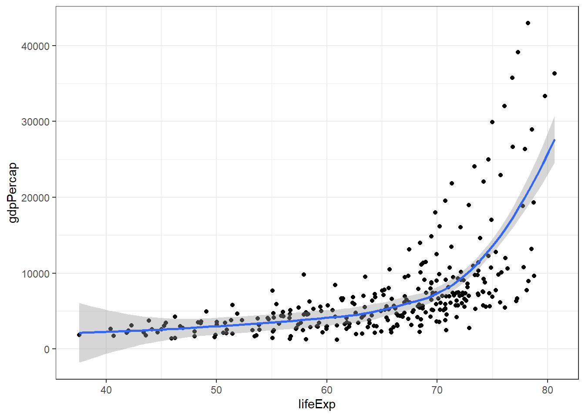
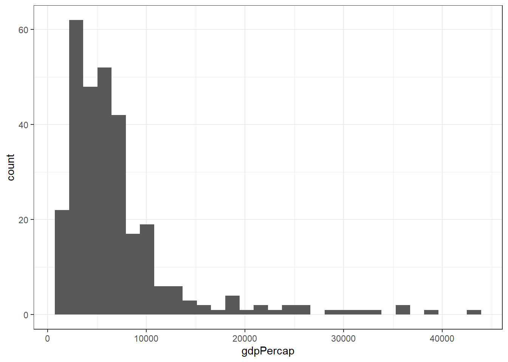
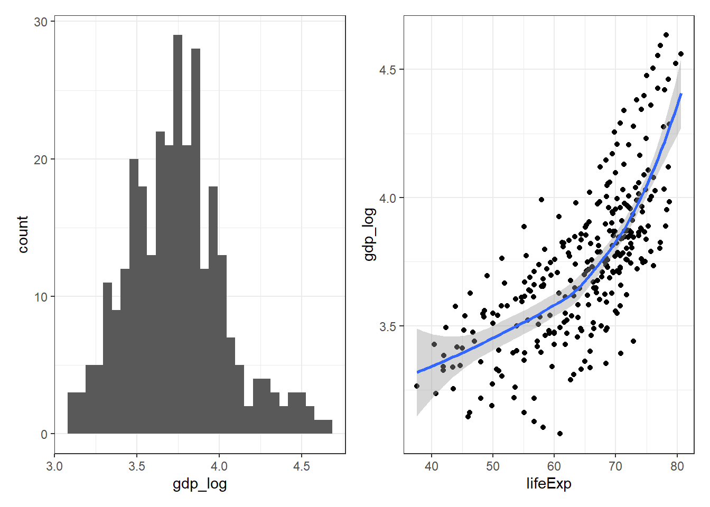
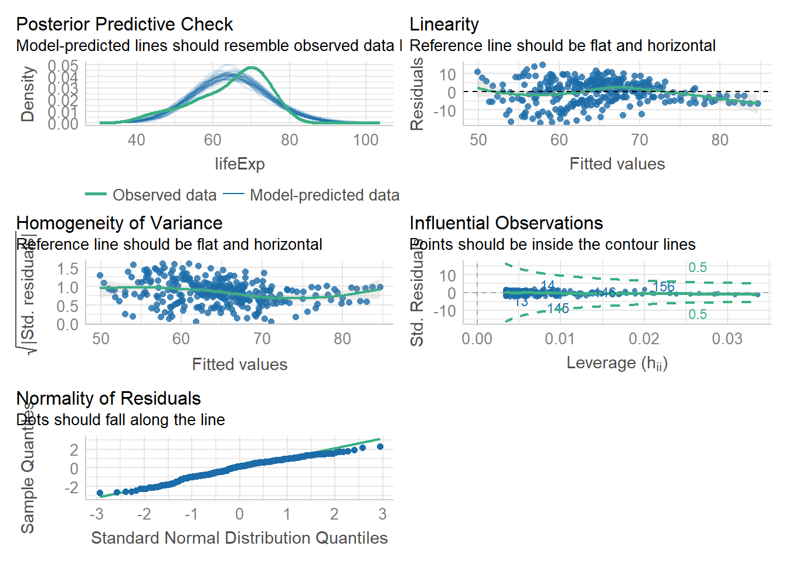

# Correlation and Regression {#analysis2}

## Intended Learning Outcomes {#ilo-analysis2}

By the end of this chapter you should be able to:

* Perform and visualize Pearson and Spearman correlations
* Construct simple and multiple linear and logistic regression models

As with Comparing Means, this chapter is unlikely to cover everything you want to know about regression, particularly if you use advanced techniques for your own research. Instead, it will give you the basic coding skills you need to understand how such models are constructed from a programming perspective, and point you towards additional resources that have a heavier focus on statistical theory.

## Walkthrough video {#walkthrough-analysis2}

We encourage you to read the workbook and attempt each step on your own before watching the video as this will help consolidate your learning (it may feel harder but making mistakes is informative and will help you learn more in the long-run).

## Set-up {#setup-analysis2}

* Create and save a new R Markdown document named `chapter_6.Rmd`, get rid of the default template text from line 11 onwards.
* Add the below code to the set-up chunk and then run the code to load the packages and data.You may need to install the packages if you don't have them installed already.


```r
library(tidyverse)   
library(broom)
library(psych)
library(easystats)
library(gapminder)
library(medicaldata)
data("polyps")
data("opt")
data("gapminder")
```


## Correlation

As with ANOVA, there are a huge number of packages and functions you can use to perform correlations. In this course, we're going to use the <code class='package'>correlation</code> package which is part of the [easystats](https://easystats.github.io/easystats/) framework which tries to provide a unifying framework for analysis similar to how the tidyverse is a collection of packages for data wrangling and visualization.

Once again we'll be jumping between different datasets that best fit the analysis technique we are demonstrating so do take the time to familiarize yourself with the variables before you get started.

First, we'll use the `gapminder` dataset and look at the relationship between life expectancy and GDP per capita in the Americas. For good measure let's first calculate some descriptive statistics about our two variables before we progress to looking at the relationship between them. Rather than use `summarise()`, we'll use the `describe()` function from the <code class='package'>psych</code> package which very easily produces a range of descriptive stats:


```r
descriptives <- gapminder %>%
  filter(continent == "Americas") %>%
  select(lifeExp, gdpPercap) %>%
  describe()
```

We can then visualize the relationship:


```r
gapminder %>%
  filter(continent == "Americas") %>%
  ggplot(aes(x = lifeExp, y = gdpPercap)) +
  geom_point() +
  geom_smooth()
```

```
## `geom_smooth()` using method = 'loess' and formula = 'y ~ x'
```



We can see quite a clear relationship between life expectancy and GDP, however, we can also see from the scatterplot and the skew stats that it's not a linear relationship, GDP is positively skewed, a fact that becomes even clearer if we visualize GDP with a histogram:


```r
gapminder %>%
  filter(continent == "Americas") %>%
  ggplot(aes(x = gdpPercap)) +
  geom_histogram()
```

```
## `stat_bin()` using `bins = 30`. Pick better value with `binwidth`.
```



There are different approaches to dealing with this skew, we'll show you two but other options are available and in addition to researching different theoretical approaches, it's worth looking at the help documentation for each analysis function to see all the options for more advanced analysis techniques. First, we could conduct a Spearman's correlation which is suitable for non-linear relationships as it transforms the data into ranks. 

The `correlation()` function from the <code class='package'>easystats</code> <code class='package'>correlation</code> package is a very nice function for performing correlations. Not only does it contain a huge number of options and types of correlation analysis (look at the help documentation), but it has been built to work well with the <code class='package'>tidyverse</code> which means that you can pipe into it and the output it produces is already tidy:


```r
spearman_results <- gapminder %>%
  filter(continent == "Americas") %>%
  correlation(select = "lifeExp", select2 = "gdpPercap", method = "spearman")

spearman_results
```

<div class="kable-table">

<table>
 <thead>
  <tr>
   <th style="text-align:left;"> Parameter1 </th>
   <th style="text-align:left;"> Parameter2 </th>
   <th style="text-align:right;"> rho </th>
   <th style="text-align:right;"> CI </th>
   <th style="text-align:right;"> CI_low </th>
   <th style="text-align:right;"> CI_high </th>
   <th style="text-align:right;"> S </th>
   <th style="text-align:right;"> p </th>
   <th style="text-align:left;"> Method </th>
   <th style="text-align:right;"> n_Obs </th>
  </tr>
 </thead>
<tbody>
  <tr>
   <td style="text-align:left;"> lifeExp </td>
   <td style="text-align:left;"> gdpPercap </td>
   <td style="text-align:right;"> 0.7529151 </td>
   <td style="text-align:right;"> 0.95 </td>
   <td style="text-align:right;"> 0.6975748 </td>
   <td style="text-align:right;"> 0.7993259 </td>
   <td style="text-align:right;"> 1111870 </td>
   <td style="text-align:right;"> 0 </td>
   <td style="text-align:left;"> Spearman correlation </td>
   <td style="text-align:right;"> 300 </td>
  </tr>
</tbody>
</table>

</div>

You may also wish to apply a log transformation to the GDP data. Not only will this fix the skew but it's potentially more appropriate to look at the relationship between relative differences in GDP rather than absolute. We can produce the log transformation by using the functions `mutate()` and `log()`


```r
gapminder <- gapminder %>%
  mutate(gdp_log = log10(gdpPercap))

# histogram of log transformed GDP
gapminder %>%
  filter(continent == "Americas") %>%
  ggplot(aes(x = gdp_log)) +
  geom_histogram()

# scatteplot of log GDP and life expectancy
gapminder %>%
  filter(continent == "Americas") %>%
  ggplot(aes(x = lifeExp, y = gdp_log)) +
  geom_point() +
  geom_smooth() 
```


```
## `stat_bin()` using `bins = 30`. Pick better value with `binwidth`.
## `geom_smooth()` using method = 'loess' and formula = 'y ~ x'
```


It's not perfect but it's much better than it was and is much closer to a linear relationship (we'll assess whether this is really the case later) so we can use a Pearson correlation:


```r
pearson_results <- gapminder %>%
  filter(continent == "Americas") %>%
  correlation(select = "lifeExp", select2 = "gdpPercap", method = "pearson")

pearson_results
```

<div class="kable-table">

<table>
 <thead>
  <tr>
   <th style="text-align:left;"> Parameter1 </th>
   <th style="text-align:left;"> Parameter2 </th>
   <th style="text-align:right;"> r </th>
   <th style="text-align:right;"> CI </th>
   <th style="text-align:right;"> CI_low </th>
   <th style="text-align:right;"> CI_high </th>
   <th style="text-align:right;"> t </th>
   <th style="text-align:right;"> df_error </th>
   <th style="text-align:right;"> p </th>
   <th style="text-align:left;"> Method </th>
   <th style="text-align:right;"> n_Obs </th>
  </tr>
 </thead>
<tbody>
  <tr>
   <td style="text-align:left;"> lifeExp </td>
   <td style="text-align:left;"> gdpPercap </td>
   <td style="text-align:right;"> 0.5583655 </td>
   <td style="text-align:right;"> 0.95 </td>
   <td style="text-align:right;"> 0.4751696 </td>
   <td style="text-align:right;"> 0.6316663 </td>
   <td style="text-align:right;"> 11.61878 </td>
   <td style="text-align:right;"> 298 </td>
   <td style="text-align:right;"> 0 </td>
   <td style="text-align:left;"> Pearson correlation </td>
   <td style="text-align:right;"> 300 </td>
  </tr>
</tbody>
</table>

</div>

## Regression

### Linear regression

Constructing a regression model is a great example of the fact that when it comes to R, data cleaning and wrangling is by far the most difficult task you face. To construct a simple linear regression model use the function `lm()` (linear model):

* The formula is expressed as `outcome by predictor` so in this case, we're predicting life expectancy from GDP
* We use the notation `data = .` because we're piping in a filtered dataset to the function. If you wanted to run the regression on the full dataset, you'd remove the first two lines of pipes and just have `data = gapminder`
* `lm()` constructs the model whilst `summary()` summarizes the results.


```r
mod1 <- gapminder %>%
  filter(continent == "Americas") %>%
  lm(formula = lifeExp ~ gdp_log, data = .)

summary(mod1)
```

```
## 
## Call:
## lm(formula = lifeExp ~ gdp_log, data = .)
## 
## Residuals:
##     Min      1Q  Median      3Q     Max 
## -17.221  -4.761   1.184   4.736  15.006 
## 
## Coefficients:
##             Estimate Std. Error t value Pr(>|t|)    
## (Intercept)  -19.068      4.824  -3.953 9.65e-05 ***
## gdp_log       22.377      1.285  17.412  < 2e-16 ***
## ---
## Signif. codes:  0 '***' 0.001 '**' 0.01 '*' 0.05 '.' 0.1 ' ' 1
## 
## Residual standard error: 6.591 on 298 degrees of freedom
## Multiple R-squared:  0.5043,	Adjusted R-squared:  0.5026 
## F-statistic: 303.2 on 1 and 298 DF,  p-value: < 2.2e-16
```

You can also pass the model summary to `tidy()` to pass the model stats to a tidy table:


```r
summary(mod1) %>%
  tidy()
```

<div class="kable-table">

<table>
 <thead>
  <tr>
   <th style="text-align:left;"> term </th>
   <th style="text-align:right;"> estimate </th>
   <th style="text-align:right;"> std.error </th>
   <th style="text-align:right;"> statistic </th>
   <th style="text-align:right;"> p.value </th>
  </tr>
 </thead>
<tbody>
  <tr>
   <td style="text-align:left;"> (Intercept) </td>
   <td style="text-align:right;"> -19.06798 </td>
   <td style="text-align:right;"> 4.823726 </td>
   <td style="text-align:right;"> -3.952957 </td>
   <td style="text-align:right;"> 9.65e-05 </td>
  </tr>
  <tr>
   <td style="text-align:left;"> gdp_log </td>
   <td style="text-align:right;"> 22.37744 </td>
   <td style="text-align:right;"> 1.285209 </td>
   <td style="text-align:right;"> 17.411526 </td>
   <td style="text-align:right;"> 0.00e+00 </td>
  </tr>
</tbody>
</table>

</div>

It looks like we have significant model where GDP predicts life expectancy. This probably isn't a shock to anyone but let's check that our use of the linear model was really appropriate by assessing the model performance.

### Model performance

The <code class='package'>performancee</code> package is also part of the <code class='package'>easystats</code> framework and provides a number of elegant and simple functions for assessing model performance. If you use any type of modelling in your research, we strongly recommended checking out the performance help documentation and [website](https://easystats.github.io/performance/index.html) for more information on what it can do.

You can test the assumptions of your model separately using functions like `check_heteroscedasticity()`, however, there's a single comprehensive function `check_model()` that provides an overview:

**If you get the error `Error: The RStudio 'Plots' window is too small to show this set of plots. Please make the window larger.` literally resize the bottom right window pane by dragging it with your cursor and then re-run the code.


```r
check_model(mod1)
```



It's not perfect, you can still see the influence of the skew, but it's good enough and we'll leave the in-depth theoretical debates about model performance to the statisticians!

### Multiple regression

Adding additional variables to your regression model is extremely simple. For this analysis, let's use the `polyps` dataset and as before, we'll remove the extreme outliers. This time, we're going to construct a model to see if we can predict the number of polyps after 12 months as a function of the baseline number of polyps (it's reasonable to assume that people with a baseline high number of polyps are going to have more polyps after treatment than those who started with a low number, even if the treatment is successful) and which treatment group they were in.

First, let's visualize this relationship.


```r
polyps_outliers <- polyps %>%
  filter(baseline < 100) # keep only those values less than 100

polyps_outliers %>%
  ggplot(aes(x = baseline, y = number12m, colour = treatment)) +
  geom_point() +
  geom_smooth(method ="lm")
```

```
## `geom_smooth()` using formula = 'y ~ x'
```

```
## Warning: Removed 2 rows containing non-finite values (`stat_smooth()`).
```

```
## Warning: Removed 2 rows containing missing values (`geom_point()`).
```


Now, construct and summarize the model adding in two predictors:


```r
mod2 <-lm(number12m ~ baseline + treatment, data = polyps_outliers)
summary(mod2)
```

```
## 
## Call:
## lm(formula = number12m ~ baseline + treatment, data = polyps_outliers)
## 
## Residuals:
##      Min       1Q   Median       3Q      Max 
## -16.1177  -7.6670  -0.9539   6.7388  20.5473 
## 
## Coefficients:
##                   Estimate Std. Error t value Pr(>|t|)    
## (Intercept)        14.0733     5.1018   2.759  0.01463 *  
## baseline            0.7537     0.1421   5.305 8.82e-05 ***
## treatmentsulindac -17.8498     5.2023  -3.431  0.00371 ** 
## ---
## Signif. codes:  0 '***' 0.001 '**' 0.01 '*' 0.05 '.' 0.1 ' ' 1
## 
## Residual standard error: 10.37 on 15 degrees of freedom
##   (2 observations deleted due to missingness)
## Multiple R-squared:  0.794,	Adjusted R-squared:  0.7665 
## F-statistic:  28.9 on 2 and 15 DF,  p-value: 7.156e-06
```

If you want to specify as interaction term, you can do so using the notation `predictor1:predictor2`:


```r
mod3 <-lm(number12m ~ baseline + treatment + baseline:treatment, data = polyps_outliers)
summary(mod3)
```

```
## 
## Call:
## lm(formula = number12m ~ baseline + treatment + baseline:treatment, 
##     data = polyps_outliers)
## 
## Residuals:
##      Min       1Q   Median       3Q      Max 
## -16.7752  -6.5608   0.4709   4.6696  20.8654 
## 
## Coefficients:
##                            Estimate Std. Error t value Pr(>|t|)    
## (Intercept)                 15.2399     5.3496   2.849 0.012881 *  
## baseline                     0.7113     0.1526   4.660 0.000368 ***
## treatmentsulindac          -24.1491     9.2957  -2.598 0.021064 *  
## baseline:treatmentsulindac   0.3709     0.4513   0.822 0.424934    
## ---
## Signif. codes:  0 '***' 0.001 '**' 0.01 '*' 0.05 '.' 0.1 ' ' 1
## 
## Residual standard error: 10.49 on 14 degrees of freedom
##   (2 observations deleted due to missingness)
## Multiple R-squared:  0.8034,	Adjusted R-squared:  0.7613 
## F-statistic: 19.08 on 3 and 14 DF,  p-value: 3.241e-05
```

### Prediction

Once we have constructed our models, we can the model to predict new values. For example, let's create a table of data from new patients where we have their baseline number of polyps and which treatment condition they're due to receive. 


```r
new_patients <- tibble(
  participant_id = 1:10,
  baseline = c(20, 25, 30, 35, 40, 45, 50, 55, 60, 65),
  treatment = c("sulindac", "placebo", "sulindac", "placebo", "sulindac", "placebo", "sulindac", "placebo", "sulindac", "placebo")
)
```

We can then use `mutate()` and `predict()` to create a new variable `predicted_12m` that uses the model constructed in `mod2` to predict how many polyps these number patients would have at 12 months, taking into account their baseline and treatment group. Note that in order for the `predict()` function to work, you need to have data on all predictors entered in the original model (in this case baseline and treatment).


```r
new_patients <- new_patients %>%
  mutate(predicted_12m = predict(mod2, new_patients))

new_patients
```

<div class="kable-table">

<table>
 <thead>
  <tr>
   <th style="text-align:right;"> participant_id </th>
   <th style="text-align:right;"> baseline </th>
   <th style="text-align:left;"> treatment </th>
   <th style="text-align:right;"> predicted_12m </th>
  </tr>
 </thead>
<tbody>
  <tr>
   <td style="text-align:right;"> 1 </td>
   <td style="text-align:right;"> 20 </td>
   <td style="text-align:left;"> sulindac </td>
   <td style="text-align:right;"> 11.29743 </td>
  </tr>
  <tr>
   <td style="text-align:right;"> 2 </td>
   <td style="text-align:right;"> 25 </td>
   <td style="text-align:left;"> placebo </td>
   <td style="text-align:right;"> 32.91576 </td>
  </tr>
  <tr>
   <td style="text-align:right;"> 3 </td>
   <td style="text-align:right;"> 30 </td>
   <td style="text-align:left;"> sulindac </td>
   <td style="text-align:right;"> 18.83441 </td>
  </tr>
  <tr>
   <td style="text-align:right;"> 4 </td>
   <td style="text-align:right;"> 35 </td>
   <td style="text-align:left;"> placebo </td>
   <td style="text-align:right;"> 40.45273 </td>
  </tr>
  <tr>
   <td style="text-align:right;"> 5 </td>
   <td style="text-align:right;"> 40 </td>
   <td style="text-align:left;"> sulindac </td>
   <td style="text-align:right;"> 26.37139 </td>
  </tr>
  <tr>
   <td style="text-align:right;"> 6 </td>
   <td style="text-align:right;"> 45 </td>
   <td style="text-align:left;"> placebo </td>
   <td style="text-align:right;"> 47.98971 </td>
  </tr>
  <tr>
   <td style="text-align:right;"> 7 </td>
   <td style="text-align:right;"> 50 </td>
   <td style="text-align:left;"> sulindac </td>
   <td style="text-align:right;"> 33.90837 </td>
  </tr>
  <tr>
   <td style="text-align:right;"> 8 </td>
   <td style="text-align:right;"> 55 </td>
   <td style="text-align:left;"> placebo </td>
   <td style="text-align:right;"> 55.52669 </td>
  </tr>
  <tr>
   <td style="text-align:right;"> 9 </td>
   <td style="text-align:right;"> 60 </td>
   <td style="text-align:left;"> sulindac </td>
   <td style="text-align:right;"> 41.44535 </td>
  </tr>
  <tr>
   <td style="text-align:right;"> 10 </td>
   <td style="text-align:right;"> 65 </td>
   <td style="text-align:left;"> placebo </td>
   <td style="text-align:right;"> 63.06367 </td>
  </tr>
</tbody>
</table>

</div>

### Logistic regression

Constructing a logistic regression model follows a very similar syntax but uses the function `glm()` (generalized linear model) rather than `lm()` as we've used previously. For this model, we'll use the `opt` dataset to see if we can predict whether a patient has chlamydia. First, let's create a reduced dataset of the variable we want to include in the model and check out our variables:


```r
chlamydia_dat <- opt %>%
  select(PID, Age, Black, White,Nat.Am, Asian, Hisp, Education, Chlamydia) 

summary(chlamydia_dat)
```

```
##       PID              Age        Black     White     Nat.Am    Asian    
##  Min.   :100034   Min.   :16.00   No :451   No :588   No :573   No :816  
##  1st Qu.:200501   1st Qu.:22.00   Yes:372   Yes:235   Yes:250   Yes:  7  
##  Median :202717   Median :25.00                                          
##  Mean   :252541   Mean   :25.98                                          
##  3rd Qu.:302208   3rd Qu.:30.00                                          
##  Max.   :402477   Max.   :44.00                                          
##   Hisp         Education   Chlamydia
##     :145   8-12 yrs :479      :444  
##  No :328   LT 8 yrs :154   No :324  
##  Yes:350   MT 12 yrs:190   Yes: 55  
##                                     
##                                     
## 
```

The summary output reveals an interesting quick of this dataset.There's missing data in the chlamydia and Hisp variables but it's not represent as a missing value instead, it's been coded as blank but inexplicably not actually blank, R thinks there is a type of data in the cell otherwise it would show up as `NA`. 

To deal with this we could either convert the blanks to NAs. This dataset is so badly coded that it took several attempts of trial-and-error to figure out what the blank was - it turns out it is three spaces and also "No" is stored as "No " with a space after it. Because we need our outcome to be a binary variable, we can use `droplevels` to get rid of the blank grouping (try removing the call to `droplevels` then run `summary()` to see how the data are represented).


```r
chlamydia_dat2 <- chlamydia_dat %>%
  mutate(Chlamydia = na_if(Chlamydia, "   "),
         Hisp = na_if(Hisp, "   ")) %>%
  droplevels()

summary(chlamydia_dat2)
```

```
##       PID              Age        Black     White     Nat.Am    Asian    
##  Min.   :100034   Min.   :16.00   No :451   No :588   No :573   No :816  
##  1st Qu.:200501   1st Qu.:22.00   Yes:372   Yes:235   Yes:250   Yes:  7  
##  Median :202717   Median :25.00                                          
##  Mean   :252541   Mean   :25.98                                          
##  3rd Qu.:302208   3rd Qu.:30.00                                          
##  Max.   :402477   Max.   :44.00                                          
##    Hisp         Education   Chlamydia 
##  No  :328   8-12 yrs :479   No  :324  
##  Yes :350   LT 8 yrs :154   Yes : 55  
##  NA's:145   MT 12 yrs:190   NA's:444  
##                                       
##                                       
## 
```

We can then construct and summarize our model using `glm()` and `summary()` which tells us that the only significant predictor of having chlamydia from the measures we included is age:


```r
log_mod1 <- glm(formula = Chlamydia ~ Age + Black + White + Nat.Am + Asian + Hisp + Education, family = binomial, data = chlamydia_dat2)

summary(log_mod1)
```

```
## 
## Call:
## glm(formula = Chlamydia ~ Age + Black + White + Nat.Am + Asian + 
##     Hisp + Education, family = binomial, data = chlamydia_dat2)
## 
## Deviance Residuals: 
##     Min       1Q   Median       3Q      Max  
## -0.9148  -0.5964  -0.4600  -0.2546   2.6650  
## 
## Coefficients:
##                     Estimate Std. Error z value Pr(>|z|)   
## (Intercept)          0.14010    1.37969   0.102  0.91912   
## Age                 -0.10035    0.03870  -2.593  0.00951 **
## BlackYes             0.91122    1.03929   0.877  0.38061   
## WhiteYes             0.49145    0.93914   0.523  0.60077   
## Nat.AmYes            0.04426    1.03917   0.043  0.96602   
## AsianYes           -12.59871  882.74399  -0.014  0.98861   
## HispYes             -0.09363    0.69314  -0.135  0.89255   
## EducationLT 8 yrs   -1.08588    0.78482  -1.384  0.16648   
## EducationMT 12 yrs   0.16801    0.41405   0.406  0.68491   
## ---
## Signif. codes:  0 '***' 0.001 '**' 0.01 '*' 0.05 '.' 0.1 ' ' 1
## 
## (Dispersion parameter for binomial family taken to be 1)
## 
##     Null deviance: 246.23  on 310  degrees of freedom
## Residual deviance: 224.21  on 302  degrees of freedom
##   (512 observations deleted due to missingness)
## AIC: 242.21
## 
## Number of Fisher Scoring iterations: 13
```

## Further resources {#resources-analysis1}

There's so much more you can do in R when it comes to analysis techniques that we can't claim to have even begun to scratch the surface here. What's important is that from a coding perspective, you now have all the *programming* skill and knowledge you need to extend and expand your analytic workflows in R: from here on out, it's down to statistical theory and knowledge to take you further (which is why this course stops here, because Emily knows her limits).

If you have specific analytic techniques you'd like to use in R, please let us know ahead of the second office hour and we'll collate extra resources specific to your needs to help support your goals and Javan will also answer any questions you have about analytic techniques using the *All of Us* Researcher Workbench.

- [easystats](https://easystats.github.io/easystats/)
- [Learning statistics with R by Danielle Navarro](https://learningstatisticswithr.com/)
- [Learning statistical models through simulation in R](https://psyteachr.github.io/stat-models-v1/)
- [R for health data science](https://argoshare.is.ed.ac.uk/healthyr_book/)
- [Introduction to Modern Statistics](https://openintro-ims.netlify.app/index.html)
- [Statistical inference via data science](https://moderndive.com/)


